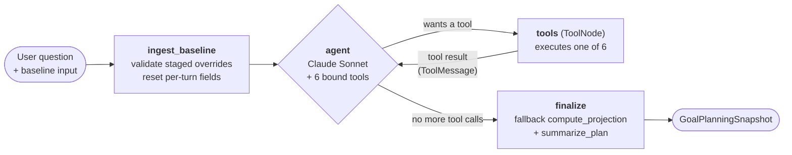
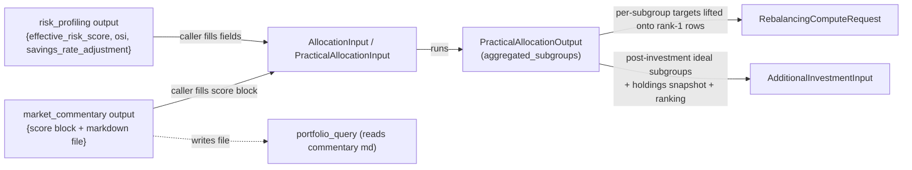

# AI_Agents — Architecture Walkthrough

> A narrative handoff doc for the `AI_Agents/` package itself: how each agent thinks, what it takes in, what it gives back, and how they relate. File paths are pinned so you can jump to the code; the prose carries the *why*. If a diagram contradicts the code, trust the code — and tell me, so I can fix the diagram. *(Last reconciled with the code: 2026-07-26.)*
>
> This doc is the **inside-the-package** view: what actually runs inside each agent. How chat requests reach the agents (HTTP → `ChatBrain` → the owning domain's module service) is covered by the `CLAUDE.md` layer under `app/` — start at `app/domains/ai_engine/CLAUDE.md`. This doc picks up after a domain service has called into `AI_Agents/src/`.

---

## How to read this

You're a Python engineer trying to understand why a recommendation came out the way it did, or to extend an agent without breaking the others. You don't need to memorise every file. You **do** need to understand:

1. There are two very different kinds of agents — **deterministic engines** (pure-Python math) and **LLM-driven** (Claude + structured output). They have different debuggability and different testing expectations.
2. Agents are **peers by default** — they don't import each other. Two blessed exceptions are documented (allocation chains).
3. The agents that look most like AI are usually the simplest. The agents that look like plain pipelines are usually where the product logic lives.

Skim section 2 (the map), read section 3 (the two kinds), and use section 5 (per-agent walkthrough) as a reference when you're actually digging into one.

---

## 1. Why this doc exists

A lot of this code was written with Claude in the loop. That's productive, but it has a failure mode: things get more abstract than they need to be, with multi-step pipelines that look intimidating until you realise each step is doing one small thing. After a few months even the person who built it can stare at `step4_long_term.py` and not remember which phase does what.

This doc is the antidote. For each agent it answers four questions:

- **What does it take in?** (the input contract)
- **What does it give back?** (the output contract)
- **How does it think?** (the step-by-step shape of the work)
- **Where is the LLM, if anywhere?** (so you know which parts are deterministic and reproducible vs. probabilistic)

If you ever sit down to "just quickly understand X", start with that agent's row in section 5.

---

## 2. The map

```mermaid
flowchart TB
    Replace the Shared subgraph (ARCHITECTURE.md:40-43) with all four shared pieces, drop the two arbitrary `Common` edges (lines 80-81), and say in the caption why shared-module edges aren't drawn:

    subgraph Shared["📦 Shared foundation — src/"]
        FP["financial_primitives/<br/>TVM, annuity, inflation, FY dates"]
        Common["common.py<br/>format_inr_indian, read_text_bom_aware,<br/>risk categories"]
        Persona["persona.py<br/>build_system_prompt — the PI voice"]
        RR["reasoned_reply.py<br/>thinking-first forced tool use"]
    end

Keep `FP --> CFE` (real, and single-consumer). Delete `Common --> PQ` and `Common --> AA`, and add one sentence after the "solid arrows are real Python imports" paragraph:

> Edges out of the *Shared foundation* box are omitted on purpose: any agent may import `common.py`, `persona.py` and `reasoned_reply.py`, so drawing them would cross the whole diagram. Today `common.py` is imported by market_commentary, Rebalancing, asset_allocation_pydantic, portfolio_query, risk_profiling and cashflow_statement; `persona.py` by market_commentary, portfolio_query, risk_profiling, asset_allocation_pydantic's rationale step and the cashflow summarizer; `reasoned_reply.py` by market_commentary's document generator and chat_qa. The "agents are peers except where a solid arrow exists" rule is about *agent-to-agent* edges, not these.

Do NOT use the originally proposed `Common -.->|"imported by 7 modules"| Shared` (a node cannot meaningfully point at its own enclosing subgraph, and the count is wrong — 6 agent packages / 11 files), and do NOT add `Persona --> CFE`: the persona importer is `cashflow_statement/summarizer.py` at the package root, while the `CFE` node is `cashflow_statement/engine`, which imports neither persona nor common.

Adjacent (optional, same section): section 4's `common.py` table says "Three things in it" but omits `read_text_bom_aware` (common.py:27), which is imported by market_commentary/chat_qa.py:9, market_commentary/main.py:15 and portfolio_query/{orchestrator.py:37,skill_executor.py:5}.

    subgraph Intent["🎯 Intent layer"]
        IC[intent_classifier<br/>Claude Haiku + structured output]
    end

    subgraph Profile["🧍 Client profile"]
        RP[risk_profiling<br/>scoring + Haiku summary]
    end

    subgraph Macro["🌐 Market context"]
        MC["market_commentary<br/>web-search → extract → write Reference_docs/<br/>+ Sonnet Q&A (chat_qa)"]
    end

    subgraph Allocate["📊 Allocation"]
        AA["asset_allocation_pydantic<br/>7-step goal-based pipeline"]
        PA["practical_asset_allocation<br/>holdings-aware wrapper"]
    end

    subgraph Rebal["⚖️ Rebalancing"]
        RB["Rebalancing<br/>6-step tax-aware trade engine"]
    end

    subgraph Fresh["💸 Fresh money"]
        AINV["additional_investment<br/>deficit-fill / bucket split → BUY list"]
    end

    subgraph Plan["📅 Goal planning"]
        CFE["cashflow_statement/engine<br/>8-stage projection pipeline"]
        CFA["cashflow_statement/agent<br/>LangGraph + 6 tools"]
    end

    subgraph Query["💬 Portfolio Q&A"]
        PQ["portfolio_query<br/>Haiku + skill markdown + guardrails"]
    end

    FP --> CFE
    Common --> PQ
    Common --> AA

    RP -.->|"effective_risk_score<br/>(wired by caller)"| AA
    MC -.->|"score block (designed input,<br/>NOT wired — engine table defaults used)"| AA
    MC -->|"writes market_commentary_latest.md"| RefDocs[(Reference_docs/)]
    RefDocs -->|"read by"| PQ

    AA -->|"steps 1-3, 5, helpers"| PA
    PA -->|"run_practical_allocation"| RB
    PA -.->|"post-investment ideal + holdings<br/>(wired by caller)"| AINV
    CFE --> CFA
```

The solid arrows are real Python imports. The dotted arrows are **caller-wired** dependencies: the data is structurally needed, but the agent doesn't reach across the package to fetch it — the app layer (the owning domain's service) fills the fields in. The dashed dependence on `Reference_docs/` is even looser: it's a **file** contract, not an import contract.

If you remember one thing: **agents are peers, except where this diagram shows a solid arrow.** Adding new arrows is a design decision, not a refactor.

---

## 3. The two kinds of agents

Sorting the agents by how they actually work is the single most useful mental model:

| Kind | Agents | What it means |
|---|---|---|
| **Deterministic engine** | `asset_allocation_pydantic`, `practical_asset_allocation`, `Rebalancing`, `additional_investment`, `cashflow_statement/engine`, `risk_profiling` (scoring half), `financial_primitives` | Pure Python. Same input → same output, byte for byte. Excel-parity for the cashflow engine. These are where the *product math* lives. Debug them with unit tests. Reading the code answers "why this number" definitively. |
| **LLM-driven** | `intent_classifier`, `market_commentary` (extraction, doc-gen, and the `chat_qa` Q&A), `portfolio_query`, `cashflow_statement/agent` (LangGraph — **not on the production path**; exercised only by its own tests and `scripts/probe_cashflow_statement.py`. The production goal-planning turn calls the engine directly via `compute_full_projection` and does its LLM work in the app layer: a Haiku action detector in `goal_planning_engine/chat.py` plus the shared answer-formatter), `risk_profiling` (summary half), the optional rationale step in `asset_allocation_pydantic` | Claude via `langchain-anthropic` is the load-bearing piece — Haiku for most calls, Sonnet for the cashflow agent node and market-commentary Q&A. Outputs are constrained by structured-output schemas or prompt-encoded house rules, but they're not byte-stable. Debug them by reading prompts in `prompts.py` and looking at recent runs. |

This split matters because the failure modes are different:

- **A deterministic engine gives a "wrong" answer** → it's a bug in the math or in the input shape. The fix is reproducible. Write a regression test.
- **An LLM-driven agent gives a "wrong" answer** → it's usually the prompt, the input context, or a structured-output schema that lets a bad value through. The fix is harder to make reproducible. Add to the eval set in `chat_eval/`.

The LLM-driven agents are mostly **thin** — `intent_classifier` is one classification call, `portfolio_query` is one skill-driven call. The deterministic engines are where the surface area is.

---

## 4. Shared foundation

These pieces aren't agents — they're support: one numeric library and three shared modules.

### `financial_primitives/` — the numeric kernel

Pure-function library, no LLM, no I/O, fully unit-tested. It's the only thing that should be doing TVM math anywhere in `AI_Agents/`.

| File | What's in it |
|---|---|
| [time_value.py](../../src/financial_primitives/time_value.py) | PV / FV / NPV / IRR |
| [annuity.py](../../src/financial_primitives/annuity.py) | Annuity factors via `numpy_financial` |
| [inflation.py](../../src/financial_primitives/inflation.py) | Real-vs-nominal conversions |
| [dates.py](../../src/financial_primitives/dates.py) | Indian FY helpers, EOMONTH math, `ROUND_THOUSAND` |
| [retirement.py](../../src/financial_primitives/retirement.py) | Retirement corpus closed-form |
| [xirr.py](../../src/financial_primitives/xirr.py) | XIRR (365-day year convention) |
| [twr.py](../../src/financial_primitives/twr.py) | Time-weighted return |

Consumers today: `cashflow_statement/engine/` (inflation, retirement, dates, annuity) plus three app-layer services — `app/domains/portfolio/services/benchmark_service.py` and `app/domains/mutual_funds/services/xirr_service.py` (both on `xirr.py`), and `app/domains/portfolio/services/twr_service.py` (on `twr.py`). **Don't engineer it for hypothetical consumers** — extend only when a real caller appears (`AI_Agents/src/CLAUDE.md` makes this an explicit rule) — but grep all four before changing a kernel signature.

### `common.py` — cross-agent utilities

In /Users/Amoul/Documents/AILAX_AI_Financial_advisor/ailax/Prozpr_Backend/AI_Agents/Reference_docs/Tech_reference_docs/ARCHITECTURE.md:

1) Line 140 — change "Three things in it:" to "Four things in it:".

2) Add this row to the table (place it first, matching source order in common.py):

| `read_text_bom_aware(path)` | Read a runtime text artifact whatever encoding it was written in: sniffs a UTF-16 LE/BE or UTF-8 BOM, decodes as UTF-8 otherwise. The runtime files these agents read — the market-commentary cache, `portfolio_query`'s `portfolio_query.md` skill and `guardrails.md` — may be produced by PowerShell on Windows (UTF-16 LE + BOM), and bare `Path.read_text()` both blows up on byte 0xff and falls back to the OS locale (cp1252). **Never read one of those files without this.** Callers: `portfolio_query/orchestrator.py`, `portfolio_query/skill_executor.py`, `market_commentary/main.py`, `market_commentary/chat_qa.py`. |

3) Line 150 — the existing sentence must be narrowed, because the app layer re-exports only three of the four (`app/domains/ai_engine/common.py` re-exports `RISK_CATEGORIES`, `category_for_effective_risk_score`, `format_inr_indian`, and NOT `read_text_bom_aware`). Replace:

"The app layer re-imports these via [`app/domains/ai_engine/common.py`](../../../app/domains/ai_engine/common.py) so there's exactly one source of truth."

with:

"The app layer re-imports the three risk/money helpers via [`app/domains/ai_engine/common.py`](../../../app/domains/ai_engine/common.py) so there's exactly one source of truth. `read_text_bom_aware` is not re-exported there — it has no app-layer caller today; agents under `src/` import it directly with `from common import read_text_bom_aware`."

4) After editing the .md, regenerate the viewer: `python3 -m scripts.build_reference_docs`. ARCHITECTURE.html:325 carries the same stale line and is GENERATED — do not hand-edit it (rule in AI_Agents/Reference_docs/CLAUDE.md).

| Symbol | What it does |
|---|---|
| `format_inr_indian(amount)` | Rupee → Indian notation (`123456` → `"₹1.23 lakh"`, `22600000` → `"₹2.26 crore"`). Used wherever an LLM-driven agent is about to see a rupee number, so the model **copies** the formatted string rather than reinventing the lakh/crore conversion (Haiku gets this wrong if you let it — frequently drops an order of magnitude). |
| `RISK_CATEGORIES` | Tuple of the five canonical risk-category names: `Conservative`, `Moderately Conservative`, `Moderate`, `Moderately Aggressive`, `Aggressive`. The app layer re-imports it; no parallel copy to keep in sync. |
| `category_for_effective_risk_score(score)` | Maps a 1.0–10.0 `effective_risk_score` to one of those five categories using band midpoints (`2.125 / 4.375 / 6.625 / 8.875`). |

Rule: every rupee number that touches an LLM prompt has a sibling `_indian` string. The formatter does that conversion deterministically; the prompt then tells the LLM "use the `_indian` form verbatim".

The app layer re-imports these via [`app/domains/ai_engine/common.py`](../../../app/domains/ai_engine/common.py) so there's exactly one source of truth.

### `persona.py` and `reasoned_reply.py` — shared LLM plumbing

Two more src-level shared modules (added after `common.py`; same rule — keep them small):

- [`persona.py`](../../src/persona.py) — the single source of truth for Ask PI's customer-facing voice. Any agent building a free-text prompt calls `build_system_prompt(...)`; the app layer re-exports it via `app/domains/ai_engine/persona.py`. Imported by `market_commentary`, `portfolio_query`, `risk_profiling`, `asset_allocation_pydantic`'s rationale step, and the cashflow summarizer.
- [`reasoned_reply.py`](../../src/reasoned_reply.py) — the forced-tool-use reply schema for free-text surfaces: the *thinking* field is declared FIRST (load-bearing — the model reasons before it drafts), then discarded; it is never shown to the customer. Used by `market_commentary`'s document generator and `chat_qa`.

---

## 5. Per-agent walkthrough

Each subsection gives you the same four answers: input → output, how it thinks, where the LLM is. Skim the column you need.

### 5.1 `intent_classifier/` — what is the user asking?

- **In:** `ClassificationInput` (question + conversation history + optional active intent).
- **Out:** `ClassificationResult` (one of 8 intents, confidence, reasoning, optional `out_of_scope_subreason`).
- **How it thinks:** [classifier.py](../../src/intent_classifier/classifier.py) builds an LCEL chain over Claude Haiku with structured output. The system prompt in [prompts.py](../../src/intent_classifier/prompts.py) enumerates the eight intents and gives examples; reasoning is capped at ~12 words so it can't eat the token budget. The chain returns a parsed `ClassificationResult`. That's it — one model call.
- **LLM:** Claude Haiku, structured output, Anthropic prompt caching on the system prompt.
- **The eight intents** are the enum in [models.py](../../src/intent_classifier/models.py): `asset_allocation`, `goal_planning`, `stock_advice`, `portfolio_query`, `general_market_query`, `rebalancing`, `additional_investment`, `out_of_scope`. **The enum is the source of truth.** If a doc says any other count, trust the enum.
- **Out-of-scope has sub-reasons.** `OutOfScopeSubreason` (same `models.py`): `gibberish`, `identity_or_meta`, `security_or_credentials`, `chat_summary`, `off_topic`, `other`. The app layer picks a different canned/tailored reply per sub-reason.
- **Why no imports of other agents:** the classifier returns a label, nothing else. Routing — what to actually do with `asset_allocation` — happens outside `src/`, in `app/domains/ai_engine`'s FLOWS table.

### 5.2 `risk_profiling/` — how much risk can this client take?

- **In:** `RiskProfileInput` (age, income, assets, debt, occupation, stated risk willingness, etc.).
- **Out:** a `dict` with `step_name`, `inputs`, `calculations`, `output`. The `output` block carries `effective_risk_score` and the `risk_summary` paragraph. The shape is intentionally open — the app layer indexes into it and persists `calculations`/`output` as JSON.
- - **How it thinks:** [scoring.py](../../src/risk_profiling/scoring.py) is pure Python. Risk *capacity* is anchored on age (clamped to [20, 90], then interpolated between the anchors 20→10 … 90→1), nudged by half the net-asset score's distance from 5 (expense coverage, current debt, property owned), then clamped to [1, 10]. The final score is `0.7 × risk_willingness + 0.3 × risk_capacity` — **stated willingness carries the larger weight, and it arrives as an already-computed input**, not something `scoring.py` derives (see the willingness note below). The OSI and the savings-rate adjustment are computed alongside and written into `calculations` for downstream consumers (the allocation input builder reads both), but neither enters the score. Then [main.py](../../src/risk_profiling/main.py) appends a Haiku-generated summary paragraph via an LCEL chain. Then [main.py](../../src/risk_profiling/main.py) appends a Haiku-generated summary paragraph via an LCEL chain.
- **LLM:** Haiku, but only for the prose summary. **The score itself is fully deterministic.** If a customer disputes their score, reading `scoring.py` answers the question. The LLM is doing PR, not arithmetic.
- **Downstream:** the `effective_risk_score` is one of the fields `asset_allocation_pydantic`'s `AllocationInput` expects. The caller (bridge) wires it across — `risk_profiling` does not import allocation, nor vice versa.

> **⚠️ Orphaned-on-purpose: [`willingness.py`](../../src/risk_profiling/willingness.py).** This module exports `compute_risk_willingness` — the canonical scorer for the **4-question customer risk-willingness questionnaire** (Q1 investment preference, Q2 investment experience, Q3 investment focus, Q4 drop reaction → 1–10 float via `min(mean(Q1,Q3,Q4), lift, Q2_cap)`). It's re-exported from [`__init__.py`](../../src/risk_profiling/__init__.py) but **nothing in the repo calls it today**.
>
> Why it matters: `scoring.py` consumes `risk_willingness` as an *already-computed* float on `RiskProfileInput`. Today that value is sourced from the app layer — [`derive_risk_willingness`](../../../app/domains/profile/services/_effective_risk/inputs.py) reads it off `RiskProfile.risk_willingness`, falling back to [`risk_willingness_from_risk_level`](../../../app/domains/profile/services/_effective_risk/calculation.py) for legacy `risk_level` integers. Neither path goes through the Q1–Q4 logic in `willingness.py`.
>
> **When you wire up the customer-facing risk questionnaire**, `compute_risk_willingness` is the canonical scorer to use. **Do not** reinvent the Q1–Q4 mapping in the app layer or the frontend — the bands, the lift rule, and the experience cap are product decisions encoded here. Wire the questionnaire input through this function, persist the returned `risk_willingness` onto `RiskProfile`, and the existing scoring flow continues to work unchanged.

### 5.3 `market_commentary/` — what does the macro picture look like right now?

- **In:** none. The agent goes and gets the data itself.
- **Out:** `MacroSnapshot` (14 indicators + `data_gaps` + `document_md`). Also persisted to disk:
  - [Reference_docs/market_commentary_latest.json](../market_commentary_latest.json)
  - [Reference_docs/market_commentary_latest.md](../market_commentary_latest.md)
- **How it thinks:** [main.py](../../src/market_commentary/main.py) drives a two-pass flow. Pass 1 — `run_websearch_extraction` (`main.py`) — a Claude call with Anthropic **web search** enabled gathers current values and extracts them into a structured `MacroSnapshot` (no HTML scraping; the retired scraper lives in `_archive/`). Pass 2 — `generate_document` in [document_generator.py](../../src/market_commentary/document_generator.py) — turns the snapshot into the markdown commentary via forced tool-use (`reasoned_reply`).
- **Caching:** the JSON snapshot is a TTL cache (`MARKET_COMMENTARY_CACHE_MAX_AGE_SEC`, wired by the app layer); the `.md` is regenerated only when missing or older than the JSON — the document is a deterministic function of the snapshot (`run_from_cache`). If live data fails entirely, the pipeline falls back to the cached snapshot and tags `data_gaps` with `ALL_LIVE_DATA_FAILED`.
- **LLM:** Haiku for extract + generate. There is also a third surface: [chat_qa.py](../../src/market_commentary/chat_qa.py) — a **Sonnet** Q&A sub-agent that answers customer questions over the commentary (forced tool-use via `reasoned_reply`). **It is dormant in production:** nothing under `app/` calls it (the app imports the `market_commentary` package, whose `__init__.py` re-exports `answer_question`, but no code path invokes it). The market-query chat flow ([flow.py](../../../app/domains/ai_engine/services/flow.py) `flow_market`) runs the commentary agent for the macro doc, then lets `general_chat` write the reply with its own Haiku call. `chat_qa` is exercised only by `chat_eval/` and its own test — treat it as a staged surface, not a live one.
- **The persistence is the contract.** [Reference_docs/market_commentary_latest.md](../market_commentary_latest.md) is what `portfolio_query` reads. No Python import connects the two agents — the file is the interface. **If you change the file's shape, you break `portfolio_query` silently.**

### 5.4 `asset_allocation_pydantic/` — the goal-based allocation engine

This is the most important deterministic engine. Sit with this one.

- **In:** `AllocationInput` — client profile, goals (each with horizon + target corpus), `effective_risk_score`, OSI, savings-rate adjustment, a `market_commentary` score block, and a target `corpus` (total investable). The risk and market fields come from the two agents named above; the caller wires them in.
- - **Out:** `GoalAllocationOutput` — seven fields: `client_summary`, `bucket_allocations` (emergency, short-term, medium-term, long-term, each carrying its own optional `rationale` / `goal_rationales` prose), `aggregated_subgroups`, `future_investments_summary`, `grand_total`, `all_amounts_in_multiples_of_100`, `asset_class_breakdown` (per-asset-class splits). `aggregated_subgroups` rows are **asset-subgroup** names — `short_debt`, `arbitrage`, `arbitrage_plus_income`, `multi_asset`, `low_beta_equities`, `medium_beta_equities`, `high_beta_equities`, `value_equities`, `sector_equities`, `us_equities`, `gold_commodities` (canonical order in [step5_aggregation.py](../../src/asset_allocation_pydantic/steps/step5_aggregation.py)) — **not fund recommendations**. Since `FUND_MAPPING` was dropped, the output commits only to asset class and subgroup: no fund names or ISINs appear, and [Testing/test_no_fund_mapping.py](../../src/asset_allocation_pydantic/Testing/test_no_fund_mapping.py) guards it by rejecting `fund_mapping`/`recommended_fund`/`isin`/`sub_category` keys anywhere in the payload and pinning each subgroup row to exactly its six keys. Fund selection happens downstream in `Rebalancing` / `additional_investment` (see `Prozpr_fund_ranking.csv`).

(Same stale vocabulary at line 219 should be fixed too: `tables.py` no longer holds fund mappings — it holds default market-commentary scores, multi-asset composition tables, and the subgroup→asset-class roll-up `SUBGROUP_TO_ASSET_CLASS`.)
- **How it thinks:** seven steps in [steps/](../../src/asset_allocation_pydantic/steps/), orchestrated by [pipeline.py](../../src/asset_allocation_pydantic/pipeline.py):

  | Step | File | What it does |
  |---|---|---|
  | 1 | [step1_emergency.py](../../src/asset_allocation_pydantic/steps/step1_emergency.py) | Carve out the emergency fund first. Everything below it works on what's left. |
  | 2 | [step2_short_term.py](../../src/asset_allocation_pydantic/steps/step2_short_term.py) | Allocate to goals with horizon < a threshold (instruments lean debt/arbitrage). |
  | 3 | [step3_medium_term.py](../../src/asset_allocation_pydantic/steps/step3_medium_term.py) | Allocate to medium-horizon goals. |
  | 4 | [step4_long_term.py](../../src/asset_allocation_pydantic/steps/step4_long_term.py) | The heaviest step. Multi-phase: `phase1_bounds` (risk-score → equity bounds), `phase4_multi_asset` (multi-asset fund composition), `phase5_equity_subgroups` (large/mid/small/flexi via the slider in [equity_subgroup_slider.py](../../src/asset_allocation_pydantic/equity_subgroup_slider.py)). |
  | 5 | [step5_aggregation.py](../../src/asset_allocation_pydantic/steps/step5_aggregation.py) | Combine the per-bucket results into aggregated subgroup rows. |
  | 6 | [step6_guardrails.py](../../src/asset_allocation_pydantic/steps/step6_guardrails.py) | **Checks only — adjusts nothing.** Validates step 4/5 against the guardrails (subgroup sum vs `total_allocated`; asset-class pcts inside the Phase-1 risk bounds; equity-subgroup shares of `multi_asset.equity_for_subgroups` inside the Phase-5 bounds, within `PHASE5_SHARE_TOLERANCE_PP`; no unmapped subgroup) and returns the violation list. `adjustments_made` is always empty, and `Step6Output` is not passed to step 7 nor carried on `GoalAllocationOutput` — it survives only in the state dict from `run_allocation_with_state`, where the app logs `all_rules_pass` and a violation count. A breach is recorded, never clamped. |
  | 7 | [step7_presentation.py](../../src/asset_allocation_pydantic/steps/step7_presentation.py) | Assemble the final `GoalAllocationOutput`. Optionally calls `rationale_fn` (LLM) here. |

- - **LLM:** only the rationale function at step 7 (via [`_rationale_llm.py`](../../src/asset_allocation_pydantic/steps/_rationale_llm.py)) — and it is **opt-out, not opt-in**. With no `rationale_fn` injected, step 7 falls through to `_rationale_llm.generate_rationales` (Haiku), so the live allocation path — `aa_engine/service.py`, which injects nothing — does make an LLM call per run; any failure degrades silently to deterministic fallback text. Pass `_rationale_llm.no_llm_rationale_fn` to suppress it outright (what the `Master_testing` runner does); the structured numbers are then byte-identical to the LLM path's. **The numbers come from steps 1–6, which never call an LLM.**
- **Static lookups:** - **Static lookups:** [tables.py](../../src/asset_allocation_pydantic/tables.py) holds the Phase-1 risk→asset-class bounds and Phase-5 equity-subgroup bounds, the medium-term equity/debt split, the subgroup→asset-class roll-up, emergency-fund months, and the default market-commentary scores and multi-asset composition used when the caller supplies no view. **No fund mappings** — `FUND_MAPPING` was dropped when the output went asset-class-only (commit b95649a9); specific fund/ISIN picks live in `Rebalancing/` (`Prozpr_fund_ranking.csv`), and allocation only commits to equity/debt/others. The module's local `Testing/test_no_fund_mapping.py` (gitignored, dev machines only) guards this by asserting no `fund_mapping` / `recommended_fund` / `isin` / `sub_category` key appears anywhere in the serialised `GoalAllocationOutput`, and that `aggregated_subgroups` rows carry only subgroup + per-bucket amounts. If a recommended subgroup looks wrong, it's almost always a table issue, not a step issue. If a recommended subgroup looks wrong, it's almost always a table issue, not a step issue.
- **Why pydantic everywhere:** each step has its own `StepNOutput` schema. Step N+1 takes Step N's output as input. This means you can run a single step in isolation in a notebook with the right `StepNOutput` JSON, which is essential for reproducing customer-reported quirks.

### 5.5 `practical_asset_allocation/` — holdings-aware version of the above

This is the first cross-agent import in the package and the only one that mutates the allocation math.

- **In:** `PracticalAllocationInput` — `AllocationInput` plus four scalars: `mf_corpus`, `non_mf_equity_corpus`, `elss_corpus`, `max_non_mf_equity_pct_client_input`.
- **Out:** `PracticalAllocationOutput` — shape-parity with `GoalAllocationOutput` plus one extra `corpus_breakdown` block. Consumers that handle `GoalAllocationOutput` handle this with zero change for the shared seven fields.
- **How it thinks:** Two edits to AI_Agents/Reference_docs/Tech_reference_docs/ARCHITECTURE.md.

Line 228 — replace the parenthetical:
- **How it thinks:** [pipeline.py](../../src/practical_asset_allocation/pipeline.py) (one file on purpose — the models, the orchestrator, and the R157–R222 long-term math together, past 1,000 lines; the math is easier to follow contiguously, so don't split it for tidiness). It calls `asset_allocation_pydantic` steps 1–3 and 5 directly, lifts selected step-4 helpers (`phase1_bounds`, `phase4_multi_asset`, `phase5_equity_subgroups`), and **reimplements step 4 itself** to be holdings-aware:

Line 445 — §8 Landmines item 4, same edit so the two stay consistent:
4. **`practical_asset_allocation/pipeline.py` is one file on purpose.** It is past 1,000 lines and holds the models, the orchestrator, and the R157–R222 long-term math. Don't split it "for tidiness" — the math is easier to follow contiguously.

Deliberately dropped from the originally proposed wording: "splitting has been considered and declined." No doc records such a decision, and `AI_Agents/src/practical_asset_allocation/CLAUDE.md:12` leans the other way ("not yet split into per-step modules"). The supportable justification is the contiguity rationale, not a decision record.. It calls `asset_allocation_pydantic` steps 1–3 and 5 directly, lifts selected step-4 helpers (`phase1_bounds`, `phase4_multi_asset`, `phase5_equity_subgroups`), and **reimplements step 4 itself** to be holdings-aware:
  - ELSS is **frozen** at the customer's existing exposure (SEBI 3-year lock-in means we can't trade it).
  - Non-MF equity (direct stocks / PMS) is **capped by an NFA-banded rule** — the cap scales with the client's net financial assets band. Excess is trimmed.
  - - Equity subgroups run through the **same shared v2 average-based slider** as the upstream module ([equity_subgroup_slider.py](../../src/asset_allocation_pydantic/equity_subgroup_slider.py)) — what differs are the inputs. Practical passes a real `locked_amount` (frozen ELSS + capped non-MF equity) where the ideal engine passes `0`, and measures each subgroup's share against the TOTAL equity pool (MF residual + multi-asset + non-MF equity) rather than the MF residual alone. With nothing locked the slider pins at the flat 8% base, and it only starts sliding down once locked exposure passes 20% of the equity budget — so for a customer with no meaningful locked holdings, practical and ideal apply the same threshold.
- **LLM:** none.
- **Why a separate module:** the original `asset_allocation_pydantic` is what you'd recommend if the customer had no existing holdings. The practical one says "given what they already hold, here's the closest target we can realistically reach without a tax-suicidal rebalancing." If you confuse the two, the recommendation will tell the customer to sell things SEBI won't let them sell.

### 5.6 `Rebalancing/` — what trades to actually do

The bridge from "ideal target" to "transactions you submit".

- **In:** `RebalancingComputeRequest` — corpus, tax state (STCG budget, carryforward losses), and a single homogeneous list of `FundRowInput` rows. Recommended funds carry `rank ≥ 1`; In AI_Agents/Reference_docs/Tech_reference_docs/ARCHITECTURE.md:239, replace "held-but-not-recommended ("BAD") funds carry `rank = 0`, `is_recommended = False`, `target_amount_pre_cap = 0`" with:

held-but-not-recommended ("BAD") funds arrive in two flavours, both `is_recommended = False`: **force-exit** — `rank = FORCE_EXIT_RANK` (9999), `target_amount_pre_cap = 0`; step 2 sets `exit_flag`, step 4 liquidates regardless of tax — and **NEUTRAL** — `rank = 0`, `target_amount_pre_cap = st_value_inr` (the locked ST minimum), so `diff = -lt_value` and only the migratable LT portion ever reads as sellable.. Two things live on the request as **scalars**, not rows, and have special handling:
  - **ELSS** → `practical_allocation_input.elss_corpus`. No trade is ever generated for ELSS (lock-in). [step6_presentation.py](../../src/Rebalancing/steps/step6_presentation.py) emits a frozen `SubgroupSummary` so the customer view still shows ELSS allocation.
  - **Non-MF equity** → `practical_allocation_input.non_mf_equity_corpus`. If the practical engine's NFA cap forces a trim, step 6 emits a single `SELL_DIRECT_STOCKS` trade for `excess_direct_stocks_inr`. No per-stock detail.
- **Out:** `RebalancingComputeResponse` — per-fund rows after step 5, totals, the trade list, warnings, metadata. Also surfaces the upstream `practical_allocation` output verbatim for the customer view.
- **How it thinks:** [pipeline.py](../../src/Rebalancing/pipeline.py) calls `practical_asset_allocation.run_practical_allocation` first (this is why the import edge exists), then lifts per-subgroup targets onto rank-1 fund rows — an overwrite, not a fill: whatever the input builder set there is discarded, and the target is reduced (floored at zero) by the ST value of that subgroup's held-but-not-recommended `rank = 0` rows, because that locked ST is already exposure to the subgroup and skipping the offset double-allocates; the frozen subgroups (`tax_efficient_equities`, `non_mf_equities`) are exempt from the lift entirely — then runs the six steps in [steps/](../../src/Rebalancing/steps/):

  | Step | File | What it does |
  |---|---|---|
  | 1 | [step1_cap_and_spill.py](../../src/Rebalancing/steps/step1_cap_and_spill.py) | Apply per-fund caps; spill the overflow within the subgroup. |
  | 2 | [step2_compare_and_decide.py](../../src/Rebalancing/steps/step2_compare_and_decide.py) | For each fund: target vs. current → buy / sell / hold direction. |
  | 3 | [step3_tax_classification.py](../../src/Rebalancing/steps/step3_tax_classification.py) | Classify each potential sell as STCG vs. LTCG using fund category + holding period (`config.py` thresholds). |
  | 4 | [step4_initial_trades_under_stcg_cap.py](../../src/Rebalancing/steps/step4_initial_trades_under_stcg_cap.py) | First pass: realise sells up to the STCG offset budget. |
  | 5 | [step5_loss_offset_top_up.py](../../src/Rebalancing/steps/step5_loss_offset_top_up.py) | Second pass: use carryforward losses to unlock additional sells. |
  | 6 | [step6_presentation.py](../../src/Rebalancing/steps/step6_presentation.py) | Emit the trade list, the subgroup summary, the customer-view rationale strings (from [rationales.py](../../src/Rebalancing/rationales.py)). |

- **LLM:** none. **This engine is fully deterministic.** Every "why am I being asked to sell this" question has an answer that traces to step 1–5 and the `reason_code` in `rationales.py`.
- **Env knobs:** all caps, thresholds, and tax rates are env-overrideable (see the `REBAL_*` table in [Rebalancing/CLAUDE.md](../../src/Rebalancing/CLAUDE.md)). Useful when SEBI changes a rule and you want to reproduce both worlds.

### 5.7 `cashflow_statement/` — goal planning (engine + agent)

This is the only place we use LangGraph, and the only agent with a real loop.

#### The engine — [engine/pipeline.py](../../src/cashflow_statement/engine/pipeline.py)

- **In:** `GoalPlanningInput` — profile (age, income, expenses), retirement plan, properties (with mortgages), custom goals, one-off events.
- **Out:** `GoalPlanningOutput` — headline status (on-track / shortfall / surplus), per-goal funding, annual cashflow projection, fund-flow summary. Month-by-month rows (`monthly_cashflow`) are emitted **only when `detail_level == "full"`** — otherwise the field is `None`. `detail_level` defaults to `"default"`, and the product goal-planning path (app `input_builder`) passes `"default"`; the REST compute route passes `"full"`.
- **How it thinks:** an 8-stage pipeline, one file per stage:

  | Stage | File | What it does |
  |---|---|---|
  | 1 | [profile.py](../../src/cashflow_statement/engine/profile.py) | Normalise the profile (age in months, current FY, etc.). |
  | 2 | [retirement.py](../../src/cashflow_statement/engine/retirement.py) | Project retirement corpus required + accumulated. |
  | 3 | [mortgages.py](../../src/cashflow_statement/engine/mortgages.py) | Build mortgage amortisation schedules. |
  | 4 | [properties.py](../../src/cashflow_statement/engine/properties.py) | FV / PV property values; net of mortgage. |
  | 5 | [goals_table.py](../../src/cashflow_statement/engine/goals_table.py) | One row per goal, with FV target and PV-discounted corpus required. |
  | 6 | [cashflow.py](../../src/cashflow_statement/engine/cashflow.py) | Month-by-month projection: income, expenses, EMIs, goal payouts. |
  | 7 | [funding.py](../../src/cashflow_statement/engine/funding.py) | Walk the cashflow; split shortfalls proportionally across that month's outflows. **One shared corpus pool**, not per-goal. |
  | 8 | [summary.py](../../src/cashflow_statement/engine/summary.py) | Roll up into headline status + per-goal funding tables. |

- **Time conventions:** all inflation FV math and PV-of-corpus-to-today use **day-precise `EOMONTH(target_date)/365`** — symmetric inflate/discount across every stage. Indian FY runs April–March; `fy_for_date` returns the closing year (April 2026 → FY27). **₹1000 rounding** is applied to FV cashflow anchors only; PV/display fields stay unrounded.
- **Sign conventions:** shortfalls positive, EMI/expense/goal payouts positive magnitudes, `surplus_or_shortfall_today` signed.
- **LLM:** none. The engine is Excel-parity by design.
- **Internal types live in `engine/_types.py`** and are NOT re-exported from `__init__.py`. Cross-boundary types live in [models.py](../../src/cashflow_statement/models.py). If you need to use a type from the app layer, it must be in `models.py`.

#### The agent — [agent/graph.py](../../src/cashflow_statement/agent/graph.py)

This is the only LangGraph usage in the codebase — and, today, **it is not on the production path**: `app/` imports only `cashflow_statement.engine`, `models`, and the package facade for model types (`input_builder.py`), never `agent/`; the live customer conversation runs through the goal-planning chat bridge (`app/domains/cashflow/services/goal_planning_engine/`), which calls `compute_full_projection` directly. Everything below describes how the agent works, not how a customer question is answered. The reason it earns LangGraph: it's a genuine multi-turn loop where the LLM needs to (1) extract structured goals/properties/events from natural language, (2) decide which deterministic tool to call next, (3) see the tool result and decide again, (4) eventually summarise. That's what `StateGraph` + a tool-calling node was built for.

Also worth fixing alongside: §3's LLM-driven row should qualify `cashflow_statement/agent` as not currently on the production path, since every other entry in that row is live.

##### LangChain vs LangGraph — they're different things

This trips people up most often, so worth being explicit:

- **LangChain** is the broader framework. **LCEL chains** (the `prompt | llm | parser` pipes you see in `risk_profiling`, `intent_classifier`, the cashflow `summarizer`) are LangChain's composition primitive — a straight pipeline.
- **LangGraph** is a separate layer that sits *on top of* LangChain. It adds a state machine with named nodes, conditional edges, and tool-calling primitives (`ToolNode`, `InjectedState`, `Command`). LangGraph still uses `ChatAnthropic` under the hood for the actual LLM call.

The rule of thumb:

| Use… | When… | Example |
|---|---|---|
| **LCEL** (LangChain) | Input → prompt → LLM → output. One pass. | `intent_classifier`, `risk_profiling` summary, the cashflow `summarizer` |
| **LangGraph** | The LLM needs to **loop**: call a tool, see the result, decide whether to call another tool, eventually stop. | The cashflow agent — the only such place in this codebase |

If a flow can be expressed as `prompt | llm | parser`, you don't need LangGraph. Reach for LangGraph only when an LLM is genuinely deciding "what do I do next" in a loop.

##### The graph, drawn



Four nodes, defined in `build_graph()` in [graph.py](../../src/cashflow_statement/agent/graph.py):

| Node | What it does |
|---|---|
| `ingest_baseline` | `ingest_baseline` | Resets per-turn audit fields (`actions_taken_this_turn`, `extracted_events_this_turn`), diffs the new baseline against the cached `last_output`, and flags state as `dirty` if anything changed. It also carries an orphan check that applies only to overrides exposing a `property_name`, validated against `current_properties` + `goal_properties` — no current `OverrideSpec` variant (`NumericOverride`, `RateOverride`) has that attribute, so the branch never fires and nothing is dropped today. Goal-name orphans (e.g. a `GoalMutation` naming a deleted custom goal) are never validated here. Resets per-turn audit fields (`actions_taken_this_turn`, `extracted_events_this_turn`). Compares the new baseline's **profile block** against the cached `last_output` (`last_output.input_echo.profile != baseline_input.profile`); on a mismatch it discards the cache (`last_output` set to `None`) and flags state as `dirty` (dropping an orphaned override also sets `dirty`). Note the comparison is profile-only — a changed goal, property, mortgage or one-off event does not by itself invalidate the cached projection, which `compute_projection` short-circuits on whenever state is not `dirty`. |
| `agent` | The LLM. Claude **Sonnet** (`claude-sonnet-4-6` — the `build_graph()` default in `graph.py`; note `nodes.py`'s `AGENT_MODEL_DEFAULT` Haiku constant is bypassed), system prompt = a compact summary of profile + goals + mortgages + one-off cashflows ([nodes.py: `_format_baseline_summary`](../../src/cashflow_statement/agent/nodes.py)). The six tools are *bound* via `.bind_tools(TOOLS)`. The LLM decides whether to call a tool or to finish. |
| `tools` | LangGraph's prebuilt `ToolNode` over the six `@tool`-wrapped functions. Whichever tool the LLM called gets executed; its return value comes back as a `ToolMessage`. |
| `finalize` | End-of-turn cleanup. If the LLM never called `compute_projection`, this runs the engine as a fallback so the snapshot is always populated. Then `summarize_plan` writes the customer-facing `PlanSummary`. |

The only conditional edge is `should_continue` — it inspects the last LLM message for `tool_calls`: yes → loop to `tools` → back to `agent`; no → exit via `finalize`. Recursion is capped at **15 iterations** (`AGENT_RECURSION_LIMIT`); past that the graph errors out and a fallback snapshot is returned with the failure flagged in `error_log`. **The customer always gets something** — never a bare exception.

##### The six tools

All defined in [tools.py](../../src/cashflow_statement/agent/tools.py). Each has a pure-Python `_impl` (unit-testable in isolation) plus a thin `@tool`-decorated wrapper that adapts it to LangGraph's `InjectedState` + `Command` protocol.

| Tool | What the LLM uses it for |
|---|---|
| `extract_financial_event` | Parse free-text ("buy a house in 5 years for ₹1.5 crore") into a structured `ExtractedGoal` / `ExtractedProperty` / `ExtractedCashflow` / `ExtractedMutation`. Delegates to [extractor.py](../../src/cashflow_statement/agent/extractor.py) — a separate Haiku structured-output call. |
| `apply_override` | Stage a what-if parameter change (income, expense, SIP, growth rate). Accumulates across turns until cleared. |
| `clear_overrides` | Undo all or specific overrides. |
| `mutate_goal` | Remove or update an existing goal (including retirement). |
| `compute_projection` | Run the deterministic [engine](../../src/cashflow_statement/engine/pipeline.py). Idempotent (short-circuits if state isn't `dirty` and `last_output` exists). |
| `propose_levers` | Generate up to 3 deterministic recommendations via [levers.py](../../src/cashflow_statement/agent/levers.py) (A/B/C/D/E/F: delay retirement, increase savings, reduce a goal, etc.). The LLM picks which to surface; the lever search and ranking are plain Python. |

##### One turn, end to end

Customer says: *"What if I delay retirement by 3 years?"*

1. **ingest_baseline** — pull in the latest `GoalPlanningInput`, validate that no prior override references a now-deleted goal, reset per-turn audit fields, hand off.
2. **agent (LLM turn 1)** — Claude sees the question + the compact baseline summary in its system prompt. Decides it needs two tools and emits both: `apply_override({key: "retirement_age", value: 63})` and `compute_projection()`.
3. **tools** — `ToolNode` runs both. `apply_override` stages the override onto state. `compute_projection` merges all staged overrides into a fresh `GoalPlanningInput`, runs the 8-stage engine, stashes the result on `last_output`, and returns a bounded "feasibility + top-3 underfunded goals" summary as a `ToolMessage`.
4. **agent (LLM turn 2)** — sees the `ToolMessage`s. Decides it has enough to answer; emits a final assistant message with no tool calls.
5. **finalize** — `last_output` is already populated (skips the fallback compute), runs `summarize_plan` to produce a customer-facing `PlanSummary`.
6. Done. Returns a `GoalPlanningSnapshot` — **in the agent's own tests.** No `app/` caller invokes this graph today: the live goal-planning turn calls the engine directly (`compute_full_projection`) from the chat bridge in `app/domains/cashflow/services/goal_planning_engine/service.py`, and `chat.py` hands the resulting `facts_pack` to the shared answer formatter. `summarize_plan`, the agent nodes, and `agent/prompts.py` never run in production. Read this section for how the graph is wired, not for how a customer question is answered.

That whole sequence is three LLM calls (two agent turns plus `summarize_plan` in `finalize`, which runs every turn) + one engine run. The graph's job is to wire them up so the LLM can decide *during the turn* what to do, instead of you having to hand-write the if/else. The graph's job is to wire them up so the LLM can decide *during the turn* what to do, instead of you having to hand-write the if/else.

##### Other pieces

- **State** ([state.py](../../src/cashflow_statement/agent/state.py)) — `AgentState` TypedDict: `accumulated_overrides`, `captured_goals`, `captured_properties`, `captured_cashflows`, `captured_mutations`; per-turn fields reset on every `ingest_baseline`. **There is no checkpointer**: `get_compiled_graph()` compiles with `checkpointer=None` — each invocation gets fresh state, and the caller passes the full accumulated state back in via `state_update` each turn. (The `thread_id: chat_session_id` config is set but inert; `MemorySaver` appears only in tests.)
- **Extractor** ([extractor.py](../../src/cashflow_statement/agent/extractor.py)) — Haiku structured-output extractor that turns conversation into `GoalPlanningInput` fields. Called from inside `extract_financial_event`.
- **Levers** ([levers.py](../../src/cashflow_statement/agent/levers.py)) — deterministic feasibility levers A/B/C/D/E/F. Pure Python. The LLM picks which to propose via `propose_levers`; the search and ranking are not LLM-driven.
- **Summariser** ([summarizer.py](../../src/cashflow_statement/summarizer.py)) — Haiku **LCEL chain** (LCEL here, not LangGraph — it's a straight prompt-to-summary pipe) that turns `GoalPlanningOutput` into a `PlanSummary`. **All rupee values are pre-formatted to Indian notation before the prompt is built.** The model copies them verbatim and never does its own arithmetic.

**Don't add LangGraph elsewhere without discussion.** The chat brain itself is intentionally hand-written async; LangGraph there would add ceremony without expressive power. The bar for adding it to a second agent is "we have a real tool-calling loop with intermediate state and have tried plain async first."

### 5.8 `portfolio_query/` — answering Q&A about the customer's own portfolio

Triggered by the `portfolio_query` intent.

- **In:** `ClientContext`, `PortfolioContext` (asset-class + sub-category + per-fund detail), the question, optional conversation history.
- **Out:** `PortfolioQueryResponse` — either an `answer` or a `redirect_message`, plus `guardrail_triggered: bool`, plus two telemetry-only fields: `path` (X = out of scope, M = market question, P = portfolio question; the skill tells the model to set it every turn, though only `guardrail_triggered` is schema-required) and `suggested_intent` (usually null). The app layer records `path` on every answered turn and `suggested_intent` only when it names a different module; neither changes the reply and nothing downstream branches on them.
- **How it thinks:** [orchestrator.py](../../src/portfolio_query/orchestrator.py) is the entry point. It loads the market commentary markdown from [Reference_docs/market_commentary_latest.md](../market_commentary_latest.md) (this is why `market_commentary` is upstream — no Python import, just the file), packages it with the client + portfolio context, and runs a **single LLM call** through [skill_executor.py](../../src/portfolio_query/skill_executor.py), which loads:
  - [portfolio_query.md](../../src/portfolio_query/portfolio_query.md) — the system + user prompt skill, with YAML front matter
  - [guardrails.md](../../src/portfolio_query/guardrails.md) — embedded into the system prompt; defines in-scope vs. out-of-scope
- **LLM:** Haiku via [llm_client.py](../../src/portfolio_query/llm_client.py) (a thin `ChatAnthropic` wrapper) with prompt caching and forced tool-use to constrain the output to `PortfolioQueryResponse`.
- **Why "skill" markdown files:** the prompt is long and product-owned; keeping it in `.md` lets non-engineers iterate without touching code. The YAML front matter lets `SkillExecutor` parse out the system/user templates without bespoke string handling.
- **The guardrail layer matters.** If the question drifts into "should I buy X?" territory or asks for things outside the portfolio, the LLM is instructed to set `guardrail_triggered=True` and return a `redirect_message`. The guardrail is not prompt-only: `PortfolioQueryResponse`'s `_enforce_guardrail_contract` validator nulls `answer` whenever the flag is set (and falls back to a default redirect if the LLM left `redirect_message` blank). That backstop is what protects the customer — the chat bridge simply renders `answer or redirect_message` and never inspects the flag.

### 5.9 `additional_investment/` — deploying fresh money

The newest engine (July 2026). "I want to invest another ₹5 lakh — which funds?" lands here.

- **In:** `AdditionalInvestmentInput` — deploy amount + cadence (`LUMPSUM` / `SIP_MONTHLY`), the practical allocation's per-bucket subgroup amounts, optional `current_value_by_subgroup` (the customer's holdings, aggregated to subgroups), `short_term_fulfilled`/`medium_term_fulfilled` flags, the ranked fund list, per-subgroup cap percentages, and `exclude_subgroups`.
- **Out:** `AdditionalInvestmentOutput` — per-subgroup `SubgroupTarget` table, the BUY list (`FundBuy`), `target_bucket` (the funded horizon — in deficit mode a truthful *label*: the dominant horizon of the deployed money), and `deployed_inr` / `undeployed_inr`.
- **How it thinks:** [pipeline.py](../../src/additional_investment/pipeline.py) switches between two split modes, then selects funds:
  - **Deficit-fill** (lumpsum + holdings supplied): the caller runs PAA at *corpus + deploy amount* so each subgroup's `total` is the post-investment ideal; [ratio.py](../../src/additional_investment/ratio.py)'s `compute_deficit_targets` splits the deploy across `max(0, ideal − current)` gaps. If everything is at/above ideal, it falls back to ideal ratios rather than deploying nothing.
  - **Bucket targeting** (SIP, or lumpsum without holdings): `select_target_bucket` picks the nearest unfunded horizon (short → medium → long), and the deploy follows that bucket's subgroup weights.
  - [selection.py](../../src/additional_investment/selection.py) then buys down the fund ranking (rank-1 first, overflow spills), with per-fund caps keyed off the **deploy amount** (not corpus — corpus caps never bind on a small SIP). BUY-only; it never sells.
- **LLM:** none — pure engine. The Haiku extraction of "how much / lumpsum-or-SIP / which category" from the customer's words happens in the app layer (`app/domains/additional_investment`), not here.
- **No peer imports.** The app layer wires in PAA's output rows, the holdings snapshot, and the fund-ranking CSV. Distinct from `Rebalancing`: that engine moves *existing* money (buy+sell, tax-aware); this one only places *new* money.

---

## 6. The data-flow web

These dependencies aren't Python imports — they're **shape contracts** that the app layer (each feature's domain service) wires up. They matter because changing a field on one side breaks the caller silently.



The four things to internalise:

Replace ARCHITECTURE.md line 413 with:

1. **`AllocationInput` is the join point — but only the risk half is actually wired.** It carries fields from both `risk_profiling` and `market_commentary`, and neither of those agents imports allocation; the calling domain service does the joining. Today that joining is one-sided: `app/domains/asset_allocation/services/aa_engine/input_builder.py` fills the risk fields (`effective_risk_score`, `osi`, `savings_rate_adjustment`, `gap_exceeds_3`, read off the persisted `effective_risk_assessments` row), but **no code in `app/` ever sets `market_commentary`** — the symbol `MarketCommentaryScores` does not appear anywhere under `app/`. The field falls through to its `default_factory`, so every production allocation runs on the neutral house view in `asset_allocation_pydantic/tables.py:134` (`DEFAULT_MARKET_COMMENTARY_SCORES`, all 5.0). The engine consumes those scores for real (`steps/step4_long_term.py` phase-2 asset-class percentages and the subgroup/others gates) — it just always sees neutral. Wiring a live view is a caller-side capability nobody has connected yet.

Also fix the two supporting spots in section 6's diagram:
- Line 404: `MC_out -.->|"score block NOT wired — engine defaults used"| AA_in`
- Line 396 (node label): `MC_out["market_commentary output<br/>{MacroSnapshot + markdown file}"]` — the agent's output model (`AI_Agents/src/market_commentary/models.py`) is `MacroSnapshot` (14 macro indicators + `document_md`); it emits **no** 1–10 score block at all, so labelling its output as "{score block + markdown file}" overstates what exists. A `MarketCommentaryScores` block would have to be derived from the snapshot by a caller that does not exist today.

(Note: the `market_commentary` agent's own `CLAUDE.md:3` — "Consumed downstream by `asset_allocation_pydantic/` (caller-supplied score fields)" — and ARCHITECTURE.md line 204 — "The risk and market fields come from the two agents named above; the caller wires them in" — carry the same overstatement and should be corrected in the same pass.)
2. **`market_commentary` writes a file; `portfolio_query` reads it.** No code-level coupling. If you change the file, you change a contract.
3. **`Rebalancing` builds on `practical_asset_allocation`'s output.** It calls `run_practical_allocation` first, then lifts subgroup targets onto rank-1 rows.
4. **`additional_investment` consumes PAA output too — but caller-wired, not imported.** For lumpsum, the app layer runs PAA pinned at *holdings + deploy amount* (`CorpusPin`) and hands the engine both the ideal rows and the current per-subgroup values; the same subgroup vocabulary must hold on both sides or deficits silently misalign.

---

## 7. Conventions

- **`models.py` is the boundary — plus a short, named list of published exceptions.** Top-level pydantic schemas live in `models.py`, and the app layer imports from there and from the documented entry points (`pipeline.py`, `main.py`, `orchestrator.py`, `classifier.py`). It never reaches into `steps/` (one aa_engine test does; production code doesn't). It *does* reach past the boundary in five named places, and all five are part of the published surface — grep `app/` before renaming any of these symbols:
  - `cashflow_statement.engine` → `compute_full_projection` (`goal_planning_engine/service.py`, `cashflow_compute_service.py`) and `ENGINE_VERSION` (`cashflow/routers/cashflow_router.py`). All three are re-exported from `cashflow_statement/__init__.py`; import from the package root, not the subpackage.
  - `asset_allocation_pydantic.tables` → `LONG_TERM_BOUNDARY_MONTHS`, `MEDIUM_TERM_BOUNDARY_MONTHS` (`additional_investment/services/ainv_engine/input_builder.py`).
  - `Rebalancing.config` → `OTHERS_FUND_CAP_PCT` and friends (`ainv_engine/input_builder.py`, `rebal_engine/tax_aging.py`); `Rebalancing.tables` → `cap_pct_for`.
  - `risk_profiling.scoring` → `OSI_MAP` (`profile/services/_effective_risk/calculation.py`).
  - `intent_classifier.prompts` → `OUT_OF_SCOPE_MESSAGE`, `STOCK_ADVICE_MESSAGE` (`intent_classifier_engine.py`, `general_chat_engine.py`).
  Separately, `financial_primitives` is a library, not an agent — the app layer imports `xirr` / `twr_wealth_index` from it directly by design (see §4).
- **One entry point per agent.** `pipeline.py` for engine modules, `main.py` for LCEL-chain modules, `orchestrator.py` for class-based orchestrators. If you find yourself adding a second entry point, you're probably building a second agent.
- **Cross-module imports are forbidden by default.** The only blessed exceptions, listed in [AI_Agents/src/CLAUDE.md](../../src/CLAUDE.md), are:
  - `practical_asset_allocation` → `asset_allocation_pydantic` (steps 1–3, 5, helpers, models).
  - `Rebalancing` → `practical_asset_allocation` (`run_practical_allocation` + its I/O models).
  - (`additional_investment` imports no peer — still exactly two edges.)
- **Shared data flows through the caller, not through imports.** If two agents need to share data, the calling domain service wires it up. Period.
- **Shared src-level modules are exactly three:** `common.py` (INR formatting, risk categories), `persona.py` (the PI voice — `build_system_prompt`), `reasoned_reply.py` (thinking-first forced-tool-use replies). Any agent may import these; keep them small, don't grow dumping grounds, and don't add a fourth without a design discussion.
- **`Reference_docs/` top level is runtime data, not source.** `market_commentary_latest.md` is rewritten on each commentary run. Don't commit fresh outputs from a local run. Hand-authored docs live in the `Tech_reference_docs/` (this doc) and `Logics_reference_docs/` (client-safe thesis docs) subfolders.
- **LangChain only for LLM calls.** All Claude calls go through `langchain-anthropic` (`ChatAnthropic` / LCEL). The only acceptable raw `anthropic` import is exception classes for `except` clauses. No `anthropic.Anthropic().messages.create(...)`.
- **All rupee numbers reaching an LLM are pre-formatted.** `format_inr_indian` produces the `_indian` sibling string. The prompt copies it verbatim. The LLM does not do arithmetic on rupees.
- **`sys.path` injection, not qualified imports.** Once the app layer has called `ensure_ai_agents_path()`, agents are imported as `from Rebalancing.models import ...`, not `from AI_Agents.src.Rebalancing.models import ...`. If you see the qualified form, it's a bug.

---

## 8. Landmines

1. **The intent count keeps growing — trust the enum.** Currently **eight** intents (`additional_investment` joined in July 2026), plus the `OutOfScopeSubreason` sub-enum. Older docs/comments say six or seven. The enum in [models.py](../../src/intent_classifier/models.py) is the only source of truth.

2. **`Reference_docs/market_commentary_latest.md` is a contract.** Two agents depend on its existence and shape. If you regenerate it during testing, do not commit the result. If you change its structure, search for `_load_market_commentary` first.

Apply the proposed fix as written at AI_Agents/Reference_docs/Tech_reference_docs/ARCHITECTURE.md:443:

3. **`asset_allocation_pydantic` step-4 phases are not numbered 1–7.** They're `phase1_bounds`, `phase2_asset_class_pcts`, `phase4_multi_asset`, `phase5_equity_subgroups` — only phase3 is missing, from an earlier refactor. All four are lifted by `practical_asset_allocation`, so they're cross-module symbols (landmine 8). The names are stable now; don't renumber.

Additionally: the identical stale sentence is duplicated in the rendered sibling AI_Agents/Reference_docs/Tech_reference_docs/ARCHITECTURE.html:628. If that HTML is generated from the Markdown, regenerate it; if it is hand-maintained, apply the same edit there so the two do not diverge.

4. **`practical_asset_allocation/pipeline.py` is one file on purpose.** Don't split it "for tidiness" — the R157–R222 math is easier to follow contiguously. Note the file now runs to ~1,050 lines, well past the ~500-line mark at which the design call was to *revisit* the question: the revisit is owed, so if you have a real reason to split, make the case rather than assuming the answer is still no.

Apply the same correction at ARCHITECTURE.md:228, which repeats "single file by design — revisit splitting only past ~500 lines"; suggested: "single file by design — now ~1,050 lines, past the ~500-line mark at which splitting was to be revisited". Then regenerate ARCHITECTURE.html with `python3 -m scripts.build_reference_docs` rather than editing the .html by hand.

5. **`Rebalancing` doesn't have per-stock or per-ELSS rows.** ELSS and non-MF equity are scalars on the request. If you're trying to add a row for either, you're misreading the input contract — re-read [Rebalancing/CLAUDE.md](../../src/Rebalancing/CLAUDE.md).

6. **`cashflow_statement/engine/_types.py` is private.** It's not re-exported from `__init__.py`. If you need a type at the boundary, it goes in [models.py](../../src/cashflow_statement/models.py).

7. **`financial_primitives/` now has four consumers — the rule survives, the count doesn't.** `cashflow_statement/engine/` plus three app-layer services (`portfolio/benchmark_service.py`, `portfolio/twr_service.py`, `mutual_funds/xirr_service.py`). Still don't add abstractions for *hypothetical* consumers — but the kernel is no longer private to one agent, and callers are split across two packages. Grep the whole repo (not just `AI_Agents/`) before changing a signature: `xirr.py` alone has two production callers.

(Note: `ARCHITECTURE.html:636` carries the same stale sentence. Per `AI_Agents/Reference_docs/CLAUDE.md`, do not hand-edit the `.html` — edit the `.md`, then run `python3 -m scripts.build_reference_docs`.)

8. **The blessed cross-module imports are by symbol name, not by package.** `practical_asset_allocation` imports `step1_emergency.run`, `phase1_bounds`, `round_to_100`, etc. by name. **Renaming any of those symbols on the upstream side is a cross-module change.** Grep before renaming.

9. **`risk_profiling` returns a `dict`, not a pydantic model.** This is intentional — the app layer indexes into it as JSON. Don't "fix" it into a pydantic output; you'll break the persistence layer.

10. **`market_commentary`'s indicators come from a web-search extraction, and it degrades silently.** If live retrieval fails wholesale, the pipeline serves the *cached* snapshot and tags `data_gaps` with `ALL_LIVE_DATA_FAILED`. If commentary numbers look off or stale, check `data_gaps` on the snapshot first.

11. **The cashflow agent's model is set in `graph.py`, not `nodes.py`.** `build_graph()` defaults to Sonnet (`claude-sonnet-4-6`) and `get_compiled_graph()` never overrides it — `nodes.py`'s `AGENT_MODEL_DEFAULT` (Haiku) is dead wiring. Change the model in `build_graph()`'s signature or you'll change nothing.

---

## 9. Where to look first when extending

| You want to… | Start here |
|---|---|
| Understand why an allocation came out a certain way | [asset_allocation_pydantic/pipeline.py](../../src/asset_allocation_pydantic/pipeline.py), then walk the seven `StepNOutput` objects in order |
| Understand why a rebalancing trade was generated | [Rebalancing/steps/step6_presentation.py](../../src/Rebalancing/steps/step6_presentation.py) (rationale + reason_code), then trace back through steps 5 → 1 |
| Change an allocation guardrail | [asset_allocation_pydantic/steps/step6_guardrails.py](../../src/asset_allocation_pydantic/steps/step6_guardrails.py) and the lookups in [tables.py](../../src/asset_allocation_pydantic/tables.py) |
| Add or change a tax rule | [Rebalancing/config.py](../../src/Rebalancing/config.py) (env-overrideable knobs) + [Rebalancing/utils.py](../../src/Rebalancing/utils.py) (tax math) |
| Change how a customer-facing rebalancing reason is worded | [Rebalancing/rationales.py](../../src/Rebalancing/rationales.py) (single source of truth — covers both the dev sweep and prod customer view) |
| Adjust the risk-score scale | [risk_profiling/scoring.py](../../src/risk_profiling/scoring.py). Update `customer_test_data.py` cases too. |
| Add a new intent | [intent_classifier/models.py](../../src/intent_classifier/models.py) (enum) + [intent_classifier/prompts.py](../../src/intent_classifier/prompts.py). Then one `flow_*` + one `FLOWS` row in `app/domains/ai_engine/services/flow.py`, and a `run(turn, ctx, prior)` module service in the owning domain — see `app/domains/ai_engine/CLAUDE.md`. |
| Change how fresh money is split or which funds it buys | [additional_investment/ratio.py](../../src/additional_investment/ratio.py) (deficit-fill / bucket split) + [additional_investment/selection.py](../../src/additional_investment/selection.py) (ranking walk, caps) |
| Tune what a customer is told about their goal plan | [goal_planning_engine/chat.py](../../../app/domains/cashflow/services/goal_planning_engine/chat.py) — `_BODY_PROMPT` (the prose brief) and `_DETECT_SYSTEM` (the narrate / counterfactual / clarify routing), plus [overrides.py](../../../app/domains/cashflow/services/goal_planning_engine/overrides.py) for which what-if keys are allowed. The LangGraph agent is **not** on this path. |
| Tune the LangGraph cashflow agent (dev / eval only) | [cashflow_statement/agent/prompts.py](../../src/cashflow_statement/agent/prompts.py) (prose) + [cashflow_statement/agent/tools.py](../../src/cashflow_statement/agent/tools.py) (tool surface) |
| Add a new lever to the cashflow agent | [cashflow_statement/agent/levers.py](../../src/cashflow_statement/agent/levers.py) — deterministic Python, then expose it as a tool |
| Reproduce a customer-reported allocation result | Run [asset_allocation_pydantic/Testing](../../src/asset_allocation_pydantic/Testing) with the customer's `AllocationInput`, or use `Master_testing/` for a parameter sweep |
| Smoke-test the cashflow engine | `python -m cashflow_statement.dev_run` from `src/`, then open [cashflow_statement/Cash_flow.html](../../src/cashflow_statement/Cash_flow.html) |
| See what the chat layer sees | [chat_eval/run_eval.py](../../src/chat_eval/run_eval.py) — replays a YAML question set and dumps JSON/HTML reports |

---

If something here doesn't match the code, the code wins — tell me and I'll fix the doc. The first thing to verify when you're confused is: **am I in a deterministic engine or an LLM-driven agent?** If it's the former, read the steps in order. If it's the latter, read `prompts.py` and the structured-output schema. Those two questions answer 80% of "wait, why is it doing this".
