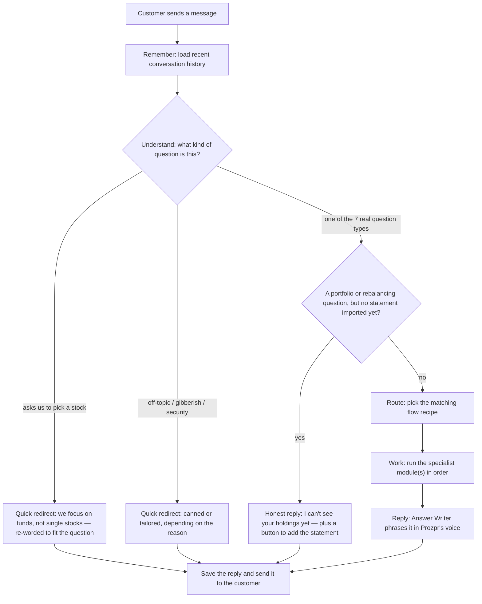
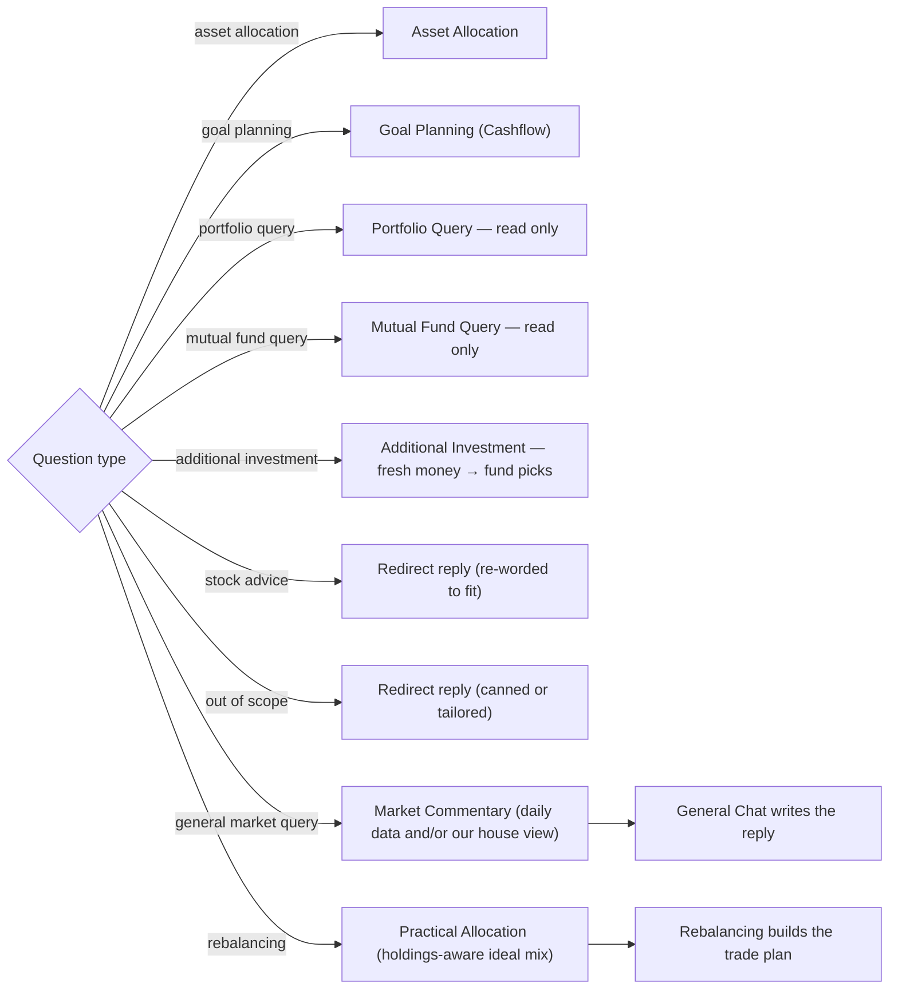
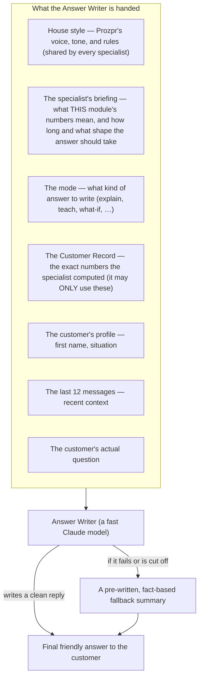
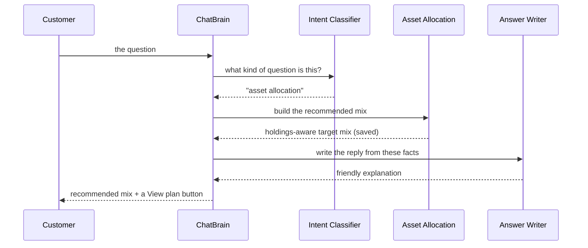
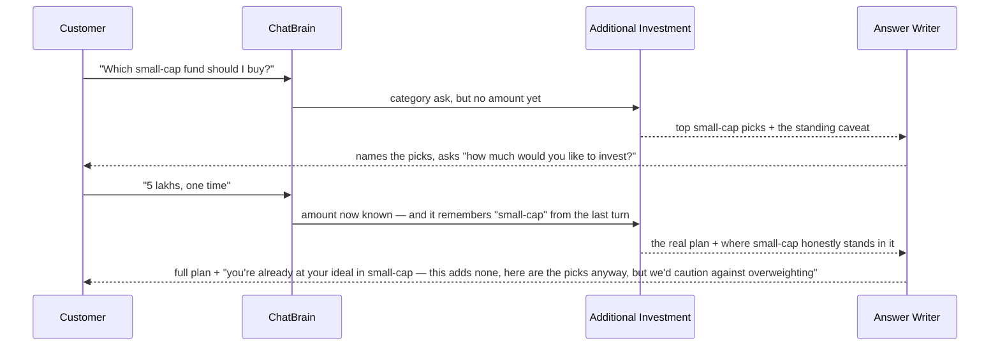

# How the Prozpr AI Chat Works — A Flow Guide

> **Who this is for:** anyone who wants to understand *how a customer's question travels through Prozpr's AI chat* — product, business, operations, QA, or new engineers getting oriented. **No coding knowledge needed.** This document explains the *journey* of a question, not the engineering internals. For the low-level technical view, see `ARCHITECTURE.html` in this same folder. *(Last reconciled with the code: 2026-10-03.)*

---

## 1. The big picture in 30 seconds

Every time a customer sends a message, it goes through the **same five steps**, managed by a single coordinator we call the **ChatBrain**:

1. **Remember** — load the recent conversation so the AI has context.
2. **Understand** — decide *what kind* of question this is (one of nine types).
3. **Route** — send it to the matching "recipe" (we call these **flows**).
4. **Work** — one or more **specialist modules** do the actual thinking.
5. **Reply** — a shared **Answer Writer** turns the result into a friendly, on-brand message, which is saved and sent back.

**Two things worth knowing up front:**

- **Every customer, every message, follows this same path.** There is no "special" or "side door" route for some users — the web chat sends all messages through the ChatBrain. (There are a few internal testing endpoints used by engineers, but no live customer chat ever uses them.)
- **The answer can arrive word-by-word.** There are two ways to ask the same question. One does the whole turn and returns the finished reply in one piece. The other — the one the app uses — streams: the customer watches the answer being typed out as it's written. Either way the customer sees short progress lines ("Looking through your portfolio holdings…") while the specialists work. Both run the *identical* turn — the streaming version is a different delivery pipe, not a different brain.
  - One caveat worth knowing, because it shapes what the app does: **the streamed words are provisional.** In a few cases the finished reply differs from what was streamed — if the AI's answer gets cut off mid-way the system throws it away and substitutes a pre-written factual summary, and a portfolio answer that trips its guardrail is replaced by a polite redirect. So the app paints the streaming text as it arrives, then replaces it with the final version when the turn completes.

---

## 2. Step 1 — Understanding the question

Before the AI can help, it has to figure out **what the customer actually wants**. This is the job of the **Intent Classifier** — a small, fast AI model that reads the new message plus the recent conversation and assigns it exactly **one** of nine labels (called *intents*).

Think of it as a smart receptionist: it doesn't answer the question itself, it just decides *which desk* the question belongs at, and how confident it is.

A few important properties:

- It can **only** ever return one of the nine known labels — it is technically prevented from inventing a new one. This keeps routing predictable.
- It looks at **recent history**, so follow-up questions ("what about with more risk?") are understood in context, not in isolation.
- Two of the nine labels (stock advice and out-of-scope) skip the specialists. The classifier supplies a standard message for them — but for most of these the **Answer Writer** then re-words it so it acknowledges the customer's actual question. See the next section.
- **"Out of scope" is not a shrug.** The receptionist is required to have a positive reason for it — the question is about something Prozpr doesn't handle, it's chatter, or it's an attempt to misuse the assistant. A message that's merely short or vague is *not* enough; those get resolved against what the conversation was already about. ("Try again", "cool, what do I do right now?" are read as follow-ups to the current topic, not answered with the canned "I didn't catch that".)
- **One fixed rule backs it up.** A message that literally asks to *rebalance* (common misspellings included) goes to Rebalancing even if the model labelled it an allocation or portfolio question.
- **It also flags what data the answer will need**, separately from the topic. It flags whether answering needs **current market data** (index levels, valuations), **Prozpr's market view** (our stance, plus what the major fund houses are saying), both, or neither. It's a deliberately separate decision, because the two questions have different answers — someone asking how their portfolio did against the Nifty is asking about *their own returns*, not about the market.

---

## 3. The question types

Here are all nine question types the AI recognises, what the customer is really asking in each, and what happens next.

| Question type (intent) | The customer is asking… | What the AI does |
|---|---|---|
| **Asset allocation** | "How should I invest? What mix is right for me?" | Builds the recommended investment mix and explains it. *Saved.* |
| **Goal planning** | "Can I afford this goal? Can I retire at 55?" | Runs a cashflow projection and tells them if the goal is fundable. *Saved.* |
| **Portfolio query** | "What's in my portfolio? What's my biggest holding?" | Answers factually from their actual holdings. *Read-only; needs an imported statement.* |
| **Mutual fund query** | "What are this fund's returns? How does it compare to peers? Which are the best large-cap funds?" | Answers about **funds themselves** — whether or not the customer owns them — using our own returns data and house view. *Read-only.* |
| **General market query** | "What's happening in the markets right now?" | Pulls fresh market data (and our house view, when asked what we think) and explains it in plain language. |
| **Rebalancing** | "Rebalance my portfolio / swap these funds." | Works out the ideal mix, then the exact buy/sell trades. *Saved; needs an imported statement.* |
| **Additional investment** | "I have ₹5 lakh fresh to invest — which funds?" / "Which small-cap fund should I buy?" | Works out where the new money fits best in their plan and recommends specific funds to buy; category asks get an honest, named-picks answer. *Saved.* |
| **Stock advice** | "Which individual stock should I buy?" | **Polite redirect** — Prozpr advises on funds, not single stocks — *re-worded to fit the customer's question*. |
| **Out of scope** | Off-topic, gibberish, security questions, "summarise this chat" | **Gentle redirect** back to what Prozpr can help with. Each *reason* (gibberish, identity question, security probe, chat-summary ask, off-topic) gets its own appropriate message; general off-topic ones are re-worded to fit the question. |
| *(General chat)* | Catch-all / safety net | A friendly conversational reply. Also writes the final answer for market questions (see below). |

> The last row, **general chat**, isn't something the classifier picks directly. It's the system's safety net and the "writer" used at the end of a market question. (More on this in the gaps section.)

The last two types are special: **no specialist plans anything for them**. But they're not always word-for-word canned. For stock-advice and general off-topic questions, the shared Answer Writer re-words the standard redirect so it briefly acknowledges what the customer actually asked before steering back. Truly unanswerable inputs — gibberish, security probes, identity questions, "summarise this chat" — keep a fixed, pre-written reply: fast and consistent.

---

## 4. Step 2 — Routing to the right specialist

Once the question type is known, the ChatBrain looks it up in a simple table and runs the matching **flow**. A *flow* is just a **recipe**: it lists which specialist module(s) to run, and in what order.

**One check comes first.** Portfolio questions and rebalancing are answered from the customer's own holdings, so if no statement has been imported yet the ChatBrain runs neither: it replies honestly that it can't see their holdings yet, explains how to add their CAMS/KFintech statement (and that they can start with a SIP or a lump sum without one), and the app shows a button to add the statement beside the reply. Every other type — including additional investment, which follows the plan rather than existing holdings — runs as normal. If the check itself fails, the question runs anyway: a broken check never locks a customer out.

Most question types use **one** specialist. Two of them use **two specialists in a chain**, run one after the other:

**Why the two chains exist:**

- **Market questions** need *fresh facts first*. So the **Market Commentary** step gathers the latest market data — and, when the question asks what we think, Prozpr's fund-house view — then hands it to **General Chat**, which writes the actual answer grounded in those facts.
- **Rebalancing** needs a *target* before it can plan trades. So **Practical Allocation** first works out (and saves) the ideal mix *given what the customer already owns*, then **Rebalancing** builds that same kind of holdings-aware target inside its own engine — sized to the mutual funds the customer actually holds — and figures out which funds to buy and sell to get there.

Specialists never reach into each other directly: in the market chain the first step's output is handed forward to General Chat, and in the rebalancing chain each step works from the customer's own saved data. This keeps each specialist independent and easy to reason about.

---

## 5. The specialist modules, explained

Each specialist is a self-contained expert. Here's what each one does *for the customer*, in plain English.

### Intent Classifier (the receptionist)
Reads the question and recent history and labels it as one of the nine types, with a confidence score. It doesn't solve anything — it decides where the question goes. For "stock advice" and "out of scope" it also supplies a standard redirect message — though for most of those, the Answer Writer then re-words it to fit the customer's actual question.

### Asset Allocation
Answers **"what should I invest in?"** It looks at the customer's financial profile — income, savings, goals, time horizons, and risk tolerance — and produces a target **mix of asset classes** (how much in equity, debt, and gold and other assets).

It works goal-by-goal. Short-term goals — those due within two years of the end of the current financial year — are costed at what they will need on the day and funded first, nearest goal first: from money the customer already holds in short-term debt and arbitrage funds, then from their monthly SIP, and only what the SIP can't reach in time comes out of the invested corpus. Goal money sits in safer assets (short-term debt or arbitrage funds); everything else goes into the long-term growth mix. The plan carves out no separate emergency reserve. The customer's **risk score** (calculated separately as part of their profile) is a key input here. Direct shares the customer owns sit outside the plan: allocation, rebalancing and fresh-money advice cover mutual funds only (Goal Planning still counts shares as part of the customer's wealth).

The customer sees the recommended mix explained in plain language, with a **View plan** button that opens the full plan. The mix shown is the holdings-aware version (see *Practical Asset Allocation* below), so it matches what rebalancing works toward. Prozpr's own preference-free mix is **saved** too, so it can be referenced later (rebalancing starts from it).

### Practical Asset Allocation
A more realistic cousin of Asset Allocation that accounts for **what the customer already owns**. The plain version designs a "perfect" mix from scratch; this version starts from the customer's *actual holdings* so it doesn't recommend pointless trades (for example, telling someone to sell and re-buy almost the same thing).

It also applies real-world constraints: tax-saving (ELSS) funds that are locked in for three years are handled carefully, and limits are placed on certain holdings. It runs entirely on fixed rules (no AI guesswork in the maths), and it is the plan a customer's saved investment preferences shape. Customers never ask for it by name: it is the mix an asset-allocation reply shows, it runs as the first step of the rebalancing flow, and Additional Investment runs it to work out how much fresh money the goals need. Crucially, this holdings-aware mix is the **target** that the Rebalancing module aims for.

### Rebalancing
Turns a target mix into an **actual trade plan**. Given the holdings-aware target mix and the customer's current holdings (read from their latest imported statement), it produces the specific list: *buy ₹X of this fund, sell ₹Y of that one*.

It is **tax-aware**. It knows how long each holding has been owned and what tax would apply if sold, and it chooses the order of sales to keep the customer's tax bill as low as possible (for example, favouring holdings that trigger lower tax, and using past losses to offset gains where possible). Trims sell only units held long enough for long-term tax treatment; short-term gains are realised only when a fund is being exited outright. It also keeps the plan practical: each category's money goes to its top one or two ranked funds (two for larger portfolios), trades too small to be worth making are skipped (an exit always goes ahead), and it never sells one debt fund just to buy another. The customer sees a readable summary of the recommended trades, *why* each one is suggested, and the tax impact. On the first answer, when the plan lands far from the customer's ideal mix, the reply bridges the two in one sentence — the plan is a step toward the ideal, and it names what holds it back (typically short-term-gains tax) from the plan's own figures; follow-up answers compare against the plan itself. The recommendation is **saved**.

**Saved preferences already shape this plan** — see *Investment preferences* below. If the customer states a preference mid-conversation (*"increase my equity"*, *"more mid cap"*, *"nothing with a lock-in"*), the reply points them at their preferences page rather than rebuilding the plan on the spot; an opening message that mixes both (*"rebalance me, but more equity"*) gets the plan *and* the pointer. It can still act on things that aren't preferences: *"what if I add ₹5 lakh"* or a corrected tax rate is answered in the same turn. It can also **consolidate** — *"fewer funds"* trims the plan to a target fund count. Asked *"why not fund X?"*, it answers from our research notes on that fund; it does not swap a named fund into the plan.

### Additional Investment
Answers **"I have fresh money — where should it go?"** Given a lumpsum or a monthly SIP amount, it works out where the new money fits best in the customer's plan and recommends specific funds to **buy** (it never sells anything). It doesn't need an imported statement.

Both cadences look after the customer's **short-term goals first**, using the holdings-aware plan's goal funding (nearest goal first). A **SIP** sends the plan's monthly goal share there, and the rest of the SIP follows the long-term mix; when the customer has little or no invested corpus yet, that long-term part takes its split from a full-size version of the same plan. A **lumpsum** first covers whatever the short-term goals still need — in full, as far as the lump sum stretches, since it assumes no future SIP — then compares the customer's actual holdings against their long-term mix and directs the rest into the areas that are *below target* — topping up the gaps rather than spreading it thinly. Within each category the money goes to the top one or two ranked funds (two for larger portfolios). When the customer has saved investment preferences, no goal money is set aside: a SIP follows their stated split entirely, and a lumpsum fills the gaps in that split.

Recommendations are **saved**. A monthly SIP worked out in chat also becomes the customer's monthly investment amount, so their goal plan and Invest page move with it; a lumpsum changes nothing else.

**When the customer names a fund category** ("which small-cap fund should I buy?", "gold funds only"), the reply answers the literal question honestly — it names our **top-rated funds in that category** — and then tells the truth about where that category stands in *their* plan, whichever it is:

- the plan **already buys it** (points at that buy),
- that part of their portfolio was **funded through other funds**,
- they're **already at or above their ideal** there — so this money adds none, with a caution against overweighting,
- it's a category we **never deploy fresh chat money into** (e.g. ELSS, because of its 3-year lock-in — the picks are still named, the policy is stated),
- for a SIP, the plan **places money by the customer's goals** (or by their saved split) — the category picks are named alongside, or
- we simply **don't rank funds in that category** — said plainly, nothing invented.

Every category answer carries the same standing caveat: concentrating in one category isn't what we'd recommend — the plan spreads money across the customer's goals (or follows the split they saved). If they name a category but no amount, the reply gives the picks and asks how much they'd like to invest.

**It also remembers the conversation.** A follow-up like *"small-cap funds only"* after *"I want to invest 5 lakhs"* reuses the ₹5 lakh from earlier — the customer isn't asked again. And it's careful about *which* numbers qualify: a salary, a goal target, or a what-if figure mentioned earlier is **never** mistaken for money to invest; when in doubt, it simply asks.

### Goal Planning (Cashflow)
Answers big life-goal questions: **"Can I retire at 55?"**, **"Can I afford my child's education and a house?"** The customer provides their financial situation (age, income, expenses, savings, existing loans) and describes their goals with target dates and amounts.

The module then projects their finances **month by month and year by year**, working out what they'll have versus what they'll need, and whether each goal is affordable. The chat reply itself is deliberately short: a headline verdict (on track, or a shortfall), one line per goal saying where it stands, and any real caution — written as prose, with a table only when the customer explicitly asks to see several goals or years side by side. The full year-by-year cashflow statement never appears in chat, even if asked for directly: it lives in the Goal Planning screen, and the app renders its chart beside the reply. Retirement is quoted from the customer's own profile — their planned date and age — and a separate "retirement corpus" figure appears only in the rare case where the plan funds retirement as a goal in its own right. Plans can be **saved**.

**It also answers "what if?".** Ask *"what if I retire at 50?"*, *"what if I invest ₹50,000 more a month?"* or *"can I afford a ₹10 lakh trip next June?"* and the module re-runs the whole projection with that change applied, then answers from the re-run — naming the change it modelled so the customer can see it was understood. Only a small set of changes can be explored this way (retirement age, monthly investment, household expenses, a one-off outflow); if the customer clearly wants a what-if but leaves out the number (*"what if I retire earlier?"*), it asks one short question rather than guessing. Anything outside that set — a different return assumption, a brand-new goal — gets an honest answer about the plan as it stands rather than an invented projection. A "what if" is **never saved**: the real plan on the customer's Goal Planning screen is left exactly as it was.

### Portfolio Query
Answers factual questions about the customer's **own portfolio** — "What's my largest holding?", "How is my money split across asset classes?", "How have I done over the last year?" It reads directly from the customer's actual holdings and profile, and folds in Prozpr's own market stance when the question calls for our judgement.

It has built-in **guardrails**: if a question is really asking for stock-picking advice or strays outside what it can responsibly answer, it politely redirects instead. Any question about the customer's saved investment preferences — reading them or changing them — gets a short pointer to their preferences page, with a button to open it. This module is **read-only** — it answers questions but never changes or saves anything.

It can also report **how each individual fund has performed**, annualised, not just the portfolio as a whole — so "rank my funds by return" is answerable. Funds bought too recently to work that out, and holdings that aren't mutual funds, are named as exceptions rather than causing the whole question to be refused.

### Mutual Fund Query
Answers questions about **funds themselves**, whether or not the customer owns them: "what are this fund's returns?", "how does it compare to its peers?", "why do you recommend it?", "which are the best large-cap funds?"

The dividing line from Portfolio Query is **whose funds** the question is about. "The best funds" is a question about the market of funds and comes here; "**my** best funds" is a question about the customer's own holdings and goes to Portfolio Query. A superlative doesn't override a possessive. And a question asking for a *verdict* on what they hold — "do I have the right funds?", "should I stop this SIP?" — is neither: it goes to **Rebalancing**, because answering it means comparing their holdings against what we'd recommend.

It works in two passes: first work out which fund(s) are being asked about (resolving "it" and "that one" from the conversation), then write the answer from data we've assembled — the fund's returns, our own reason for shortlisting it if it's on our list, and peer funds for comparison. When we have no view on a fund, it says so rather than inventing one. **Read-only.**

### Market Commentary
Gathers a current snapshot of the **Indian market** — around 14 macro indicators such as inflation, interest rates, key indices, currency moves, and commodity prices — using AI together with live web search. It distils those numbers into a short plain-English commentary.

In a market-question turn, this commentary is produced first and handed to General Chat to write the final reply. If a saved snapshot from the last day is still current, it is used as-is — no fresh gathering, no wait. Otherwise fresh data is gathered, and if that takes too long (more than ~2 minutes) the system **doesn't make the customer wait**: General Chat is handed no commentary and answers from its own quick web search instead, so the customer still gets an answer.

**The daily snapshot is for market questions only.** A question about the customer's own holdings never gets it: comparing a customer's 26% small-cap *holding* against a "35.5x expensive *valuation*" mixes numbers that are not comparable. Instead the receptionist decides whether answering needs Prozpr's market stance; only then do Portfolio Query and Rebalancing receive Prozpr's own view. Otherwise they get no market view at all, and the AI is told to answer from the customer's holdings and profile and not to speculate about Prozpr's market view.

**Two kinds of market context.** Alongside the daily factual snapshot there is a second, hand-maintained source: Prozpr's monthly **fund-house view** — our qualitative stance on equities, debt and gold, together with the published outlooks of major fund houses (ICICI, HDFC, PPFAS and others). For a market question the receptionist decides which it needs — the numbers (the default), our view, or both. When a customer asks what we think, the market answer **names those fund houses as research sources** — *"our view is cautious on small-caps, and ICICI and Canara flag the same, though PPFAS is more constructive"* — which builds confidence by showing that reputable houses back the view. Prozpr remains the one advising; the houses are cited as outlooks, never as recommendations. Portfolio and rebalancing answers get only Prozpr's own stance, with no fund house named.

### General Chat
The friendly **catch-all writer**. It is the safety net for any turn no specialist owns, and it writes the **final answer for market questions** (using the commentary that Market Commentary just gathered). It reads the question, the conversation history, and any market context — and it can also run a quick **web search of its own** to ground the reply in fresh facts before writing. If the market context happens to be missing or causes a hiccup, it simply answers from the question alone — the conversation never breaks.

### Investment preferences — a standing record, not a module

A customer can tell Prozpr, once, how they want their money invested: a split across equity / debt / commodity, and how much — or none — to put in particular categories (mid cap, gold, sectoral funds, the multi-asset fund). That record is **standing** — it shapes every plan we build from then on, not just the next answer.

Three things are worth being clear about:

- **Preferences live on the preferences page, not in chat.** Chat neither changes the record nor reads it back. Any ask about it — *"what preferences do I have set?"*, *"reset my preferences"*, or an indirect one like *"I want more equity"* while a plan is on screen — gets one consistent reply pointing at the page, plus a button to open it. When the same message also asks something chat can answer (a first *"rebalance my portfolio"*, or *"what if I add ₹5 lakh"*), that part is answered and the pointer closes the reply. This is deliberate: chat handling a stored record it cannot see or write is a large hallucination surface, and one shared message means the wording cannot drift between rebalancing, allocation and additional investment.
- **The plans still follow the record.** Every recommendation is built with the saved preference applied, and the reply says so when a preference shaped it. What we advise and what the customer asked for stay distinguishable: Prozpr's own recommendation is computed preference-free, and the preferences page shows it beside the customer's own split, together with where their holdings sit today.
- **Setting a preference has a cost, and the customer is told before they commit.** When a preference is applied we stop carving out money for near-term goals first (goals due within two years of the end of the current financial year). The whole corpus is invested to the requested shape instead, and a monthly SIP follows the stated split entirely. The preferences page warns a customer who has such goals before they save, and the same fact is attached to the resulting plan.

The preferences page refuses a choice that cannot be built at all — pinned categories that add up to more than their asset class's share, or a multi-asset fund in a split that gives 0% to a class that fund holds. If a saved ask still cannot be met in full once the plan is built — pinned categories that want more room than their asset class has left, or a multi-asset choice larger than the split can fund — the plan says what was trimmed and why. It is never silently ignored.

---

## 6. Step 3 — How the answer gets written (the Answer Formatter)

This is one of the most important — and least visible — parts of the system, and it answers the question *"how is the prompt structured?"*

Here's the key idea: **the specialist modules mostly produce *facts and numbers*, not the final wording.** The polished, on-brand reply the customer reads is written by a shared component, the **Answer Formatter** (the "Answer Writer"). This keeps Prozpr's voice consistent no matter which specialist did the work.

### First, the AI decides *how* to answer (the "mode")

The receptionist in Step 1 already decided *which topic* a question belongs to. But once a customer is inside a topic — say they've just been shown their investment mix — their **follow-up** questions still vary a lot, and each needs a different kind of answer:

- **Explain** — talk about *this* customer's plan or numbers ("why is so much in debt?").
- **Teach** — define a concept in general, then tie it back to their situation ("what's an arbitrage fund?").
- **What-if** — try a hypothetical with a specific value, shown only for comparison and **not** saved ("what if my risk were 7?").
- **Redo** — re-run the plan from scratch with their current saved details. (Internally a re-run is an ordinary compute with a "they've seen this before" flag, so the reply opens by acknowledging the re-run and leads with what changed.)
- **Ask back** — when the customer signals a direction but gives no number ("I can take more risk"), ask a precise follow-up ("your risk is 5.5 — would 7 feel right?").
- **Redirect** — when they want something chat can't change from here (like editing a goal, or their investment preferences — those get a button to the preferences page), point them to the right place instead.

So a follow-up turn really happens in **two steps**: first a quick sorting into one of these *modes*, then the actual writing. For allocation and rebalancing, the very first question about a topic always builds the plan — the specialist doesn't pick a mode first (rebalancing only checks whether the opening message also states a preference, so the reply can add the preferences pointer) — so there the modes only come into play on follow-ups. Goal planning sorts on every turn, the first one included, because a customer's opening question can already be a what-if ("what if I retire at 50?") or too vague to run ("what if I retire earlier?" — earlier than what?).

This sorting step is also where the **boundaries** live. A "what-if" is only allowed on a small, defined set of inputs (things like risk score, total corpus, or tax rate); ask to change anything outside that list and it becomes a polite redirect rather than a made-up answer. (It's the same instinct as the stock-picking and off-topic guardrails — just applied *inside* a topic.)

When a specialist finishes, it hands the Answer Writer a tidy package of ingredients — including the mode it just picked — and the Writer composes the reply from them:

Notice that the Writer's instructions come in **two halves**: a *shared house style* that every specialist uses (so the voice never changes), plus a *module-specific briefing* that only makes sense for that one specialist — an allocation briefing explains what an "equity/debt mix" means, a rebalancing briefing explains what a "buy/sell trade" means. On top of that, for the answers where a customer may ask how or why the approach works, the specialist also hands over a **third piece**: Prozpr's published methodology write-up for that topic, philosophy only, with none of the proprietary thresholds, caps or weights in it. Allocation and rebalancing attach it in *explain* and *teach* mode, goal planning in *explain* mode, additional investment when the customer asks about a fund category, and Mutual Fund Query when it answers about a specific fund. The Writer is told to ground those "how does this work" explanations in that write-up and nothing else, so the reasoning a customer reads is what Prozpr actually publishes rather than the model's general knowledge. The shared half keeps Prozpr sounding like one person across every kind of question; the specific half lets each answer be accurate. The customer never sees any of the three — only the finished reply.

**The rules that keep answers trustworthy:**

- **No making things up.** The Writer is told it may only cite numbers that are in the Customer Record. If it's asked *how* a figure was derived and the underlying rate isn't in it, it describes the result without inventing the method. It is also forbidden from ever *naming* these internal sections to the customer: when it can't answer, it must say what's missing in the customer's own words ("I can't see the returns on each individual fund yet") rather than describing its own plumbing ("that isn't in my Customer Record").
- **Consistent presentation.** Percentages are shown as whole numbers; the customer's first name is used to greet them on a fresh plan, and sparingly after that.
- **A safety net.** If the Writer fails for any reason (an error, an empty reply, or an answer cut off mid-way), the system falls back to a **pre-written, deterministic summary** built straight from the facts — so the customer always gets a coherent answer, never an error page. And no turn runs forever: one that takes longer than three minutes ends with a short "please try again in a moment" reply.

In short: **the receptionist picks the topic, the specialist decides the angle and computes the truth, and the Answer Writer phrases it** — always in the one Prozpr voice.

---

## 7. How the AI remembers the conversation

Prozpr's chat is **session-based** — each conversation is remembered.

- Every turn, the system loads the **most recent ~20 messages** so the AI has context.
- The **receptionist** (classifier) and the **Answer Writer** each read the last ~12 of those messages — enough to stay relevant without being overwhelmed. The receptionist's copy leaves out turns that ended in a stock-advice or out-of-scope redirect, so one refusal doesn't bias how the next question is labelled.
- On the **first** message of a new chat, the system auto-generates a **title** for the conversation.
- If a turn errors before a reply is written, the customer's question stays in the history the AI reads, and the missing reply is filled in with a plain note that the turn failed — so a follow-up like *"try again"* still has something to refer to, and the question doesn't read as one still waiting for an answer. (This note lives only in the AI's view of the conversation, never in the transcript the customer sees; a turn where only the system's apology was written is left out entirely.)

Each customer message is **answered within its own turn** — the AI uses recent history for context, but there's no "reply now, confirm on your next message" handshake. A what-if question is a good example: when a customer asks *"what if my risk were higher?"*, the AI shows the hypothetical result **in that same turn**. It explores the scenario but doesn't save it, and there is no "save it" follow-up step: durably saving an explored scenario is not built (see the gaps section).

---

## 8. Walkthrough examples

The best way to see the flow is to follow real questions through it. Each example below is a **validated path** — it matches what the code actually does.

### Example A — "How should I invest ₹10 lakh for my child's education in 12 years?"

**Path:** understand → *asset allocation* → Asset Allocation module → Answer Writer → saved reply with a button to view the full plan. ✅

### Example B — "What's my biggest holding?"

**Path:** understand → *portfolio query* → Portfolio Query module reads the customer's holdings → factual answer. **Nothing is saved** (read-only). If the question had secretly been "which stock should I buy more of?", the module's guardrail would politely redirect instead. If no statement has been imported yet, the turn stops before the module and asks for one. ✅

### Example C — "What's going on with the Indian markets?"

**Path:** understand → *general market query* (the receptionist flags the daily data) → Market Commentary reuses the last day's saved snapshot if it's still current, otherwise gathers fresh macro data (and if that's too slow, hands over nothing) → General Chat writes the reply using that data, running one quick web search of its own for anything the data doesn't cover → answer. ✅

### Example D — "Rebalance my portfolio."

**Path:** understand → *rebalancing* → Practical Allocation works out the ideal mix given current holdings → Rebalancing builds the tax-aware buy/sell plan → saved reply with the recommended trades. With no statement imported, the turn stops before either step and asks for one. ✅

### Example E — "Which stock should I buy?"

**Path:** understand → *stock advice* → no specialist plans anything; the Answer Writer re-words the standard "we focus on funds, not single stocks" message so it acknowledges the customer's question, then steers back. ✅

### Example F — "I want to invest another ₹5 lakh — which funds?"

**Path:** understand → *additional investment* → the module reads the amount and cadence (₹5 lakh, one-time) from the question → sets aside what the customer's short-term goals still need → compares current holdings against the long-term mix → recommends the top-ranked funds that top up the below-target areas → Answer Writer explains the picks → saved reply. ✅

### Example G — "Which small-cap fund should I buy?" (a two-turn conversation)

**Path (turn 1):** understand → *additional investment* → category named but no amount → reply names the top-rated small-cap funds, gives the caveat, and asks for the amount. **Nothing invented, no dead end.**
**Path (turn 2):** the module reuses the small-cap ask from the previous turn, builds the real plan for ₹5 lakh, and tells the truth about the category — even when the honest answer is "your plan adds nothing here." ✅

---

## 9. What the AI won't do (guardrails)

- **No individual stock-picking.** Prozpr advises on funds and overall strategy, not "buy this specific share." Such requests get a consistent, polite redirect.
- **Stays on financial topics.** Off-topic, gibberish, or security-probing messages get a gentle redirect rather than an answer.
- **No invented numbers.** As described above, the Answer Writer can only use figures the specialist actually computed.
- **No silent failures.** If a step errors or times out, the customer gets a graceful fallback message or a fact-based summary — never a crash.
- **No touching investment preferences.** Chat cannot set, change, clear or read back a customer's investment preferences — that happens on the preferences page, which every such ask points to. The one profile figure a chat answer updates is the monthly SIP: a SIP plan made in chat becomes the customer's monthly investment amount, so their goal plan follows it. A what-if never changes anything.

---

## 10. Known gaps found during this review (team-facing)

> ⚠️ **This section is for the internal team, not customers.** Producing this flow chart doubled as a sanity check of the live code. The architecture is healthy overall (see the verdict below), with one minor product note and one engineering note open.

### What we confirmed is healthy
- **One uniform path for everyone.** Every customer chat message goes through the same ChatBrain turn. No alternate live routes exist.
- **Every question type is handled.** All nine types the receptionist can return map cleanly to either a specialist flow or a redirect reply — nothing falls through the cracks.
- **The two specialist chains run in order.** Market → General Chat hands the gathered data forward; Practical Allocation → Rebalancing runs its two steps in sequence (see Issue 2 for how they connect).
- **Graceful degradation works.** If market data is slow, or the Answer Writer fails, the customer still gets a sensible answer. If the no-statement check fails, the question runs anyway.

### Dormant scaffolding — the "save it" gate
Chat has no two-turn "what-if → save it" path: a what-if is answered in its own turn and never saved. Two pieces of scaffolding for a possible future durable-save flow remain, both inert — an always-False `awaiting_save` field on the turn's context and the unused `chat_session_state` table. Nothing routes on them, so they cannot misroute or trap a conversation. They are kept so a durable-save flow could revive the gate without a migration, and are to be dropped if that flow is abandoned.

### Issue 1 — no dedicated "small talk" lane (minor / product question)
"General chat" exists as a safety net, but the receptionist never routes to it directly — it always picks one of the nine concrete types. Genuinely conversational messages ("thanks!", "what can you help me with?") therefore get sorted into the nearest bucket (often "out of scope"). This is a **product decision**, not a bug — flagging it in case a friendlier catch-all is wanted.

### Issue 2 — the rebalancing chain's first step is not what Rebalancing reads (engineering note)
On every rebalancing turn — follow-ups included — `flow_rebalancing` first runs Practical Allocation, which computes and saves a holdings-aware run (`practical_asset_allocation_runs`). Rebalancing never reads that run: it starts from the latest saved ideal allocation (`asset_allocation_runs`, recomputed when older than 90 days) and runs the practical engine again inside its own pipeline, sized to the mutual funds actually held. The customer-facing answer is unaffected and the saved run stays useful as a record, but for Rebalancing the first step is repeated work, and the comment in `services/flow.py` that says Rebalancing reads it as its target does not match the code.

---

## 11. Glossary

| Term | Plain meaning |
|---|---|
| **ChatBrain** | The coordinator that runs every chat turn — understand, route, work, reply. |
| **Turn** | One round of the conversation: the customer's message in, the AI's reply out. |
| **Intent** | The *type* of question, as labelled by the receptionist (e.g. "asset allocation"). There are nine. |
| **Intent Classifier** | The "receptionist" AI that labels each question. |
| **Flow** | A recipe that says which specialist module(s) to run for a given question type, and in what order. |
| **Module / specialist** | A self-contained expert that does one job (e.g. Rebalancing, Goal Planning). |
| **Answer Formatter / Answer Writer** | The shared component that turns a specialist's facts into the final, on-brand reply. |
| **Customer Record** | The bundle of computed numbers a specialist hands to the Answer Writer — the only figures it's allowed to cite. Named the *facts pack* in the code. |
| **Mode** | The *kind* of answer needed — explain, teach, what-if, redo, ask-back, or redirect. The AI picks it before writing, and it shapes how the reply reads. |
| **Claude / Haiku** | The underlying AI models. "Haiku" is a small, fast model used for the receptionist and the Answer Writer. |
| **Read-only** | A path that answers a question without changing or saving anything (e.g. Portfolio Query). |
| **Saved** | The result is stored so it can be referenced later (e.g. an allocation or rebalancing plan). |

---

*This guide describes the chat flow as built. If the flow changes, please update this document (and re-validate the walkthrough paths in Section 8).*
