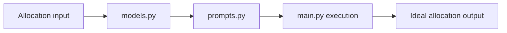

# Ideal Asset Allocation Agent Guide

This module computes target asset allocation using AI prompts and structured models.

## What this folder does
- Defines allocation model structures.
- Runs ideal-allocation orchestration.
- Produces structured allocation recommendations.

## Data Flow

