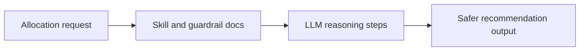

# Allocation Skills Guide

This folder contains instructional skill documents used by the allocation agent.

## What this folder does
- Stores guardrails and recommendation policies.
- Keeps strategy notes reusable across allocation runs.
- Improves consistency of advisory outputs.

## Data Flow

