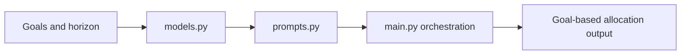

# Goal Based Allocation Agent Guide

This module builds allocation suggestions from customer goals and timelines.

## What this folder does
- Converts goal context into allocation direction.
- Uses prompt and model templates for consistency.
- Returns goal-aware allocation output.

## Data Flow

