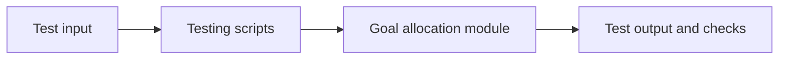

# Goal Allocation Testing Guide

This folder contains local testing assets for goal-based allocation.

## What this folder does
- Stores prompt and model test helpers.
- Supports sample-run verification during development.
- Helps validate behavior before integration.

## Data Flow

