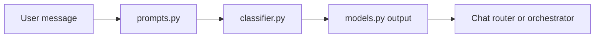

# Intent Classifier Agent Guide

This module detects what the user is asking, so the right AI path is selected.

## What this folder does
- Classifies user query intent.
- Uses prompt rules and typed output models.
- Returns routing-ready intent results.

## Data Flow

