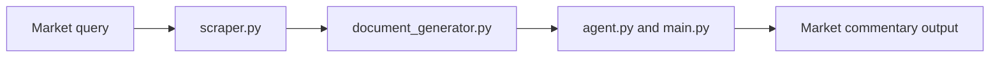

# Market Commentary Agent Guide

This module generates market commentary for advisory conversations.

## What this folder does
- Collects market signals.
- Builds readable market commentary.
- Supports Q&A-style market responses.

## Data Flow

