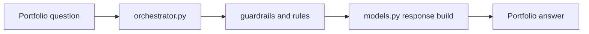

# Portfolio Query Agent Guide

This module answers natural-language questions about portfolio data.

## What this folder does
- Interprets user portfolio questions.
- Applies query guardrails.
- Produces structured portfolio answers.

## Data Flow

