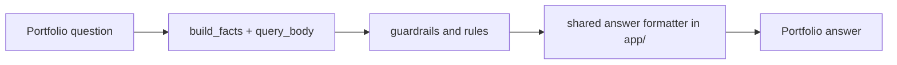

# Portfolio Query Agent Guide

Prepares a portfolio question for answering. It does **not** produce the reply —
the shared answer formatter in `app/domains/ai_engine/answer_formatter` does.

## What this folder does
- Builds the facts pack: market commentary (only when asked for), client profile,
  current portfolio.
- Owns the scope guardrails and the Path X / M / P prompt.

## Data Flow

```mermaid
flowchart LR
    A[Portfolio question] --> B[build_facts + query_body]
    B --> C[guardrails and rules]
    C --> D[shared answer formatter in app/]
    D --> E[Portfolio answer]
```
