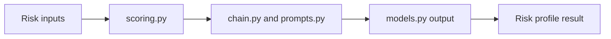

# Risk Profiling Agent Guide

This module estimates customer risk level from profile and behavior inputs.

## What this folder does
- Calculates risk scores.
- Applies prompt-based interpretation.
- Returns a structured risk profile.

## Data Flow

