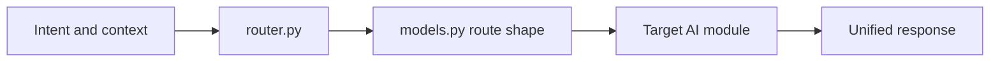

# AI Router Agent Guide

This module routes AI requests to the right specialized agent.

## What this folder does
- Reads intent and context.
- Selects target AI module.
- Returns unified routing output.

## Data Flow

