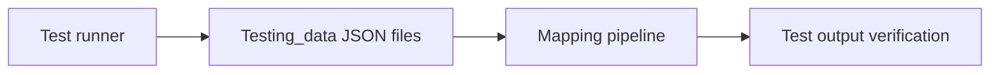

# MF Mapping Testing Data Guide

This folder contains sample customer files for testing mutual-fund mapping logic.

## What this folder does
- Provides realistic test cases.
- Helps validate mapping behavior across customer scenarios.
- Supports repeatable local QA checks.

## Data Flow

