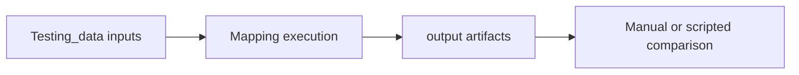

# MF Mapping Test Output Guide

This folder stores output artifacts generated from mapping test runs.

## What this folder does
- Captures expected or actual run outputs.
- Helps compare correctness between versions.
- Supports regression checks for mapping changes.

## Data Flow

