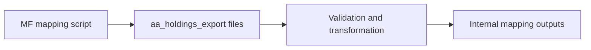

# AA Holdings Export Guide

This folder stores exported holdings files used in AA internal mapping workflows.

## What this folder does
- Keeps generated export files for analysis and mapping checks.
- Supports downstream processing in mutual-fund mapping scripts.
- Helps compare raw exports with transformed outputs.

## Data Flow

