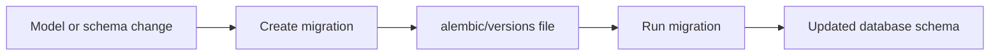

# Migration Versions Guide

This folder is the history log of database structure changes.

## What this folder does
- Stores one migration file per schema change.
- Applies safe upgrade steps between backend versions.
- Keeps production and local DB structures aligned.

## Data Flow

