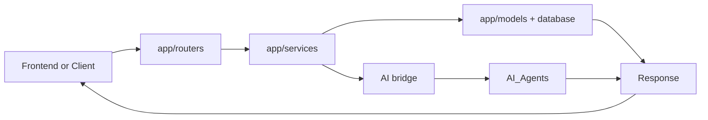

# App Layer Guide

This folder is the heart of the backend. It receives API requests, validates data, runs business logic, connects with AI modules, and returns responses.

## What this folder does
- Runs FastAPI lifecycle and app setup.
- Connects routes, services, schemas, and models.
- Handles data flow between API and database.
- Bridges backend workflows with AI capabilities.

## Main subfolders
- `routers/`: API endpoints.
- `services/`: business logic.
- `models/`: database tables in code.
- `schemas/`: request and response contracts.

## Data Flow

