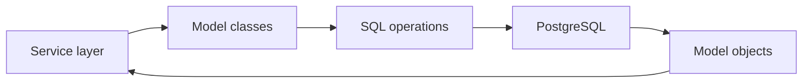

# Models Guide

This folder defines the database layer in code using SQLAlchemy models.

## What this folder does
- Represents database tables and relationships.
- Enables persistent storage for product features.
- Supports service queries and migrations.

## Main domains
- `profile/`: risk, tax, constraints, and investment profile tables.
- `goals/`: goals, contributions, holdings.
- `mf/`: mutual-fund records and snapshots.
- `stocks/`: stock transactions and metadata.

## Data Flow

