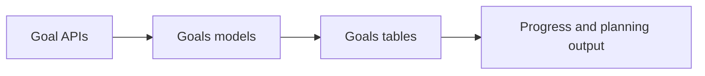

# Goals Models Guide

This folder stores database models for financial goals.

## What this folder does
- Stores goal definitions and priorities.
- Tracks contributions made toward each goal.
- Tracks goal-level holdings.

## Key files
- `financial_goal.py`
- `goal_contribution.py`
- `goal_holding.py`
- `enums.py`

## Data Flow

