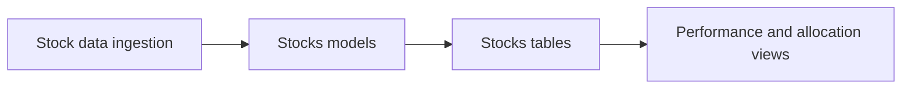

# Stocks Models Guide

This folder stores stock-related database models.

## What this folder does
- Stores stock buy/sell transactions.
- Stores price history and company metadata.
- Supports stock-level analytics in portfolio features.

## Data Flow

