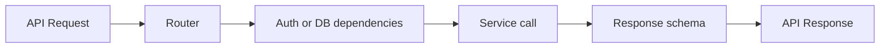

# Routers Guide

This folder contains API entry points. Each router file represents one product area.

## What this folder does
- Defines HTTP routes.
- Validates and parses request payloads.
- Calls service-layer functions.
- Returns structured API responses.

## Common route groups
- Identity: `auth.py`, `onboarding.py`, `profile.py`
- Wealth: `goals.py`, `portfolio.py`, `rebalancing.py`, `ips.py`
- Communication: `chat.py`, `meeting_notes.py`, `notifications.py`
- Integrations: `linked_accounts.py`, `simbanks.py`, `mf_ingest.py`

## Data Flow

