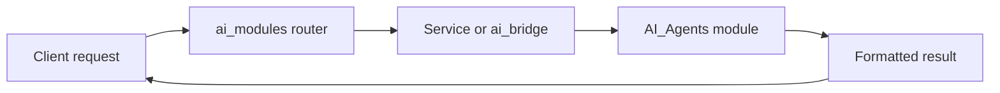

# AI Modules Routers Guide

This folder exposes dedicated APIs for AI capabilities.

## What this folder does
- Hosts AI-specific endpoints.
- Keeps AI testing and integration routes organized.
- Standardizes input and output for AI features.

## Included APIs
- Intent classification
- Market commentary
- Portfolio query
- Asset allocation
- Drift analysis
- Risk profile

## Data Flow

