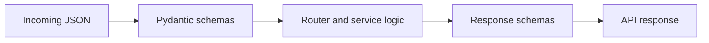

# Schemas Guide

This folder defines request and response contracts for APIs.

## What this folder does
- Validates incoming payloads.
- Shapes outgoing responses.
- Keeps frontend-backend contracts stable.

## Main schema groups
- Feature schemas: auth, chat, goals, portfolio, onboarding.
- `profile/`: profile payloads.
- `ai_modules/`: AI API payloads.
- `ingest/`: ingestion payloads.

## Data Flow

