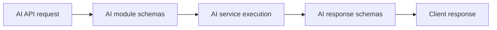

# AI Module Schemas Guide

This folder defines data contracts for AI module APIs.

## What this folder does
- Validates AI endpoint request bodies.
- Standardizes AI response structures.
- Ensures consistent integration between APIs and AI services.

## Data Flow

