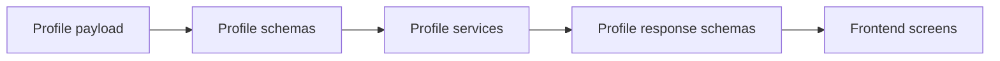

# Profile Schemas Guide

This folder contains profile-specific API contracts.

## What this folder does
- Defines profile create/update/read payloads.
- Validates customer profile details.
- Keeps profile UI and backend in sync.

## Data Flow

