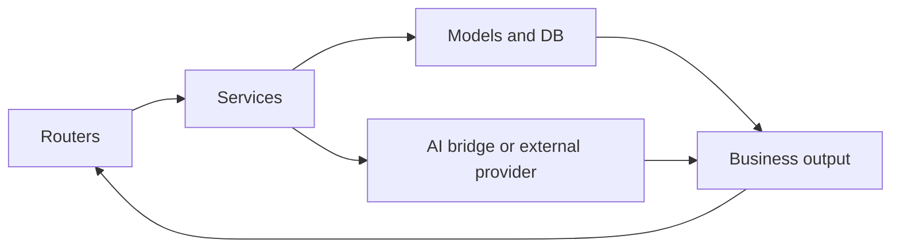

# Services Guide

This folder contains business logic. Routers call services, and services coordinate data, rules, and AI.

## What this folder does
- Implements feature logic for auth, goals, chat, notifications, and portfolio.
- Connects database entities with business decisions.
- Delegates AI operations through specialized modules.

## Key groups
- User and auth: `user_service.py`, `auth_service.py`, `otp_service.py`
- Portfolio and goals: `portfolio_service.py`, `goal_service.py`, `finvu_portfolio_sync.py`
- Chat and AI orchestration: `chat_service.py`, `chat_context.py`, `chat_core/`, `ai_bridge/`

## Data Flow

