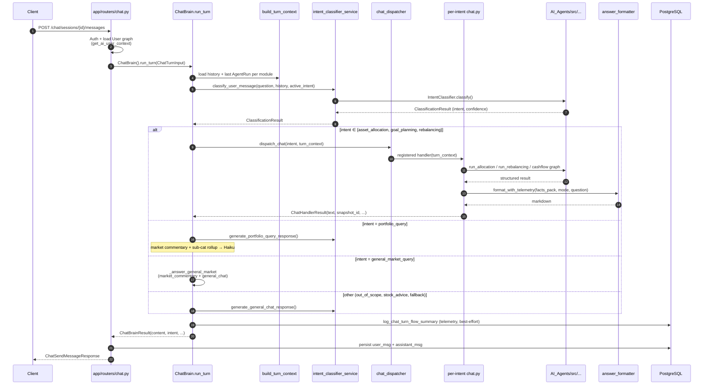

# Prozpr Backend — Architecture Walkthrough

> A narrative handoff doc, written like I'm walking you through the backend at a whiteboard. File paths are pinned so you can jump to the code; the prose carries the *why*. If a diagram contradicts the code, trust the code — and tell me, so I can fix the diagram.

---

## How to read this

You're a Python backend engineer joining the project. You know FastAPI, async, SQLAlchemy. You're new to the LLM/agent side. Your job is to integrate the backend with the frontend and other services — call endpoints, plumb data, occasionally extend the bridge layer.

You don't need to learn every AI module's internals. You **do** need to understand:

1. How a chat request enters and where it ends up,
2. What each AI module takes in and gives back (the I/O contracts),
3. Why the **bridge layer** exists and why you must always go through it,
4. How raw AI output becomes a chat-friendly reply (the answer formatter).

That's what this doc covers, in that order. Skim section 2 (the big picture), read section 4 (the bridge) carefully, and keep section 6 (module contracts) as a reference.

---

## 1. The big picture

```mermaid
flowchart TB
    subgraph Client["📱 Client (web / mobile)"]
        UI[Sends a chat message via HTTPS]
    end

    subgraph HTTP["🌐 HTTP layer — app/routers/"]
        Router["chat.py · send_message<br/>POST /chat/sessions/{id}/messages"]
    end

    subgraph Brain["🧠 Chat orchestrator — app/services/chat_core/"]
        ChatBrain["ChatBrain.run_turn<br/>brain.py"]
    end

    subgraph Bridge["🔌 Bridge layer — app/services/ai_bridge/"]
        IntentSvc[intent_classifier_service]
        Dispatcher[chat_dispatcher<br/>@register]
        Handlers[per-intent chat.py handlers<br/>asset_allocation / goal_planning / rebalancing]
        OtherSvc[market_commentary_service<br/>portfolio_query_service<br/>general_chat_service]
        Formatter[answer_formatter<br/>format_with_telemetry]
    end

    subgraph Agents["🤖 AI modules — AI_Agents/src/"]
        IC[intent_classifier]
        AA[asset_allocation_pydantic<br/>practical_asset_allocation]
        RB[Rebalancing]
        CF[cashflow_statement<br/>engine + LangGraph agent]
        MC[market_commentary]
        PQ[portfolio_query]
        RP[risk_profiling]
    end

    UI --> Router
    Router -->|"ChatTurnInput"| ChatBrain
    ChatBrain -->|"classify_user_message"| IntentSvc
    IntentSvc --> IC
    ChatBrain -->|"branch on intent"| Dispatcher
    Dispatcher --> Handlers
    Handlers --> AA
    Handlers --> RB
    Handlers --> CF
    Handlers -->|"raw facts → markdown"| Formatter
    ChatBrain --> OtherSvc
    OtherSvc --> MC
    OtherSvc --> PQ
    ChatBrain -->|"ChatBrainResult"| Router
    Router -->|"ChatSendMessageResponse"| UI
```

There are four layers, and the boundary between them is the thing to internalise:

- **HTTP layer** (`app/routers/`) — FastAPI routers. They speak HTTP and ORM, nothing else. They never import from `AI_Agents/` and they don't know what an "intent" is.
- **Chat orchestrator** (`app/services/chat_core/`) — turns a single user message into a single assistant message. The one important class is `ChatBrain` in [app/services/chat_core/brain.py](app/services/chat_core/brain.py). It classifies intent, dispatches to a handler, handles timeouts, and writes telemetry. It does **not** know how any AI module works.
- **Bridge layer** (`app/services/ai_bridge/`) — the translator between the ORM/HTTP world and the AI module world. Every call from chat to AI goes through here. This is also where chat replies get their final markdown polish, via the answer formatter.
- **AI modules** (`AI_Agents/src/`) — self-contained agent pipelines. They take pydantic DTOs in, return pydantic DTOs out. They have no opinion on HTTP, ORM, or chat. They're imported through `sys.path` injection rather than as `AI_Agents.src.foo` — see section 9.

If you remember one rule from this doc: **the only path from `app/routers/` or `app/services/chat_core/` into `AI_Agents/` is through `app/services/ai_bridge/`.** Don't shortcut.

---

## 2. A chat turn, end to end

Here's what happens when a user sends a message. Open [app/services/chat_core/brain.py](app/services/chat_core/brain.py) alongside this — the line numbers match the version of `run_turn` at the time of writing.



Now the walkthrough in prose.

**Step 1 — the request lands.** The endpoint is `POST /api/v1/chat/sessions/{session_id}/messages`, in [app/routers/chat.py:159 `send_message`](app/routers/chat.py). JWT auth runs via `get_current_user`; if there's an `X-Family-Member-Id` header, `get_effective_user` swaps the User to the family member being acted on. The dependency `get_ai_user_context` (in [app/dependencies.py](app/dependencies.py)) eager-loads the **whole** User graph — profile, goals, portfolios, holdings, fund metadata — in one query, so the AI side doesn't trigger lazy loads inside async code.

**Step 2 — build the turn input.** The router constructs a `ChatTurnInput` ([app/services/chat_core/types.py](app/services/chat_core/types.py)) and calls `ChatBrain().run_turn(...)`. `ChatBrain` is **stateless**, instantiated per request — concurrent users are fine.

**Step 3 — build the turn context.** Inside `run_turn`, the first thing that happens is `build_turn_context(turn)` in [app/services/chat_core/turn_context.py](app/services/chat_core/turn_context.py). It bundles three things:
- The conversation history (already loaded by the router).
- The **last `ChatAiModuleRun` row per AI module** for this session. This is how follow-up turns work: when a handler runs, it persists an `AgentRun`; the next turn can find the prior run and reuse it (e.g. "save that allocation we just looked at").
- The **active intent** carried over from the previous turn — the classifier uses this to nudge follow-ups toward the same intent.

**Step 4 — classify intent.** `classify_user_message(...)` in [app/services/ai_bridge/intent_classifier_service.py](app/services/ai_bridge/intent_classifier_service.py) hands the question + history + active intent to the intent classifier (Anthropic primary, OpenAI fallback) and gets back a `ClassificationResult`. The seven possible intents are listed in section 5.

**Step 5 — branch on intent.** This is a hand-written `if/elif` block (lines ~185–278 of `brain.py`). For three intents — `asset_allocation`, `goal_planning`, `rebalancing` — the brain lazy-imports the matching chat handler (so the `@register` decorator runs and the handler is in the dispatcher's registry) and calls `dispatch_chat(intent, turn_context)`. For `portfolio_query`, it calls `generate_portfolio_query_response` directly. For `general_market_query`, it runs market commentary + a general-chat reply. Everything else (including `stock_advice` and `out_of_scope`) falls through to `generate_general_chat_response`.

> **Why hand-written and not LangGraph?** Honestly — it grew organically. The branching is shallow, the state per turn is small, and a plain async state machine has been easier to log and debug. If a clear payoff appeared later (richer multi-step orchestration, conversation-spanning state), I'd reconsider, but right now there's no problem to solve.

**Step 6 — timeouts.** Every per-intent handler runs inside `run_handler(...)`, which wraps it in `asyncio.wait_for` with a hard cap (60s by default — `_INTENT_HANDLER_TIMEOUT_S`). If it times out, the user gets a polite "that took longer than expected" message and the underlying coroutine is cancelled. The market commentary helper has its own 120s budget. These caps matter — without them, a hung LLM call would tie up an HTTP connection indefinitely.

**Step 7 — finalize.** `finalize(content, ...)` writes a telemetry row via `log_chat_turn_flow_summary` ([app/services/ai_module_telemetry.py](app/services/ai_module_telemetry.py)), tolerant of failures (5s timeout, errors logged but never crash the response), and returns a `ChatBrainResult`.

**Step 8 — persist and respond.** Back in the router: persist the user message + assistant message in the same DB transaction, commit, and return both to the client wrapped in `ChatSendMessageResponse`.

---

## 3. The seven intents and what each one runs

| Intent | What it means | Where it ends up |
|---|---|---|
| `asset_allocation` | "What allocation should I have?" / first-time recommendation | Lazy-imports [app/services/ai_bridge/asset_allocation/chat.py](app/services/ai_bridge/asset_allocation/chat.py), dispatches via `chat_dispatcher`. The handler decides between *first turn* (run the engine + persist) and *follow-up modes* (narrate / educate / counterfactual / save / recompute / clarify / redirect). |
| `goal_planning` | "Will I retire on time?" / cashflow / funding questions | Lazy-imports [app/services/ai_bridge/goal_planning/chat.py](app/services/ai_bridge/goal_planning/chat.py). Runs the `cashflow_statement` engine and/or the LangGraph agent (see section 7). |
| `rebalancing` | "What trades should I do?" / "How far is my portfolio from target?" | Lazy-imports [app/services/ai_bridge/rebalancing/chat.py](app/services/ai_bridge/rebalancing/chat.py). Runs the deterministic rebalancing engine and renders trades. |
| `portfolio_query` | Factual questions about the user's own holdings | Calls `generate_portfolio_query_response` in [app/services/ai_bridge/portfolio_query_service.py](app/services/ai_bridge/portfolio_query_service.py). Reads market commentary + portfolio rollups + per-fund detail, sends to Haiku via the `portfolio_query.md` skill. |
| `general_market_query` | "How's the Nifty?" / macro questions | Brain handles this directly (`_answer_general_market`): runs `market_commentary` first, then `general_chat` with the macro snapshot as context. |
| `stock_advice` | "Should I buy X?" | Falls through to `general_chat`, which uses the canned `STOCK_ADVICE_MESSAGE` from intent_classifier/prompts. We don't give stock advice. |
| `out_of_scope` | Anything else (gibberish, identity, off-topic, …) | Falls through to `general_chat`, with a canned safe reply. The classifier also returns an `out_of_scope_subreason` (`gibberish` / `identity_or_meta` / `security_or_credentials` / `chat_summary` / `off_topic` / `other`) which we use to tone the reply. |

> ⚠️ The intent enum lives in [AI_Agents/src/intent_classifier/models.py](AI_Agents/src/intent_classifier/models.py). If you add a new intent there, you also need to add a branch in `brain.py` and (usually) a chat handler under `ai_bridge/`. The CLAUDE.md for `intent_classifier` says "six intents"; that's stale — it's currently seven. Trust the enum.

---

## 4. The bridge layer — read this carefully

This is the layer that causes the most coordination problems, so I want to spend time here.

The bridge lives at [app/services/ai_bridge/](app/services/ai_bridge/) and exists for three reasons:

**1. Translation.** ORM models (`User`, `Goal`, `MfHolding`, …) are not the same shape as the AI module DTOs (`AllocationInput`, `RebalancingInput`, `GoalPlanningInput`, …). The bridge has a per-domain `input_builder.py` that takes a User row and builds the right DTO. For example, [app/services/ai_bridge/asset_allocation/input_builder.py](app/services/ai_bridge/asset_allocation/input_builder.py) maps a User into an `AllocationInput` for the allocation pipeline. **If you call an AI module without going through this builder, you'll pass the wrong shape and the pipeline will either reject it or — worse — silently use defaults.**

**2. Async-safety.** Some AI pipelines are sync Python (allocation, rebalancing). The bridge runs them on a worker thread (`asyncio.to_thread`) so the FastAPI event loop isn't blocked. If you call them directly from an async handler without offloading, you'll lock up the server under load.

**3. Reply formatting.** Raw AI output is structured data — dictionaries of numbers, recommended funds, gaps, etc. The customer doesn't read that. The bridge calls `format_with_telemetry` (the **answer formatter** — see section 7) to turn it into chat-friendly markdown with the right tone, tables, and emoji conventions.

### The dispatcher pattern

For the three "first-class" intents (`asset_allocation`, `goal_planning`, `rebalancing`), I use a registry pattern instead of a giant if/elif:

```python
# In app/services/ai_bridge/chat_dispatcher.py
@register("asset_allocation")
async def asset_allocation_chat(turn_context: TurnContext) -> ChatHandlerResult: ...
```

The `ChatBrain` calls `dispatch_chat(intent, turn_context)` and the dispatcher looks up the registered handler. Each handler returns a `ChatHandlerResult` with `text` (the markdown reply) and optional IDs (`snapshot_id`, `goal_allocation_run_id`, `rebalancing_run_id`) — those IDs flow back into the HTTP response so the frontend can fetch the underlying data if it needs to.

> **Important nuance:** these chat handlers are **not** auto-imported by the package's `__init__.py`. Importing `asset_allocation/chat.py` triggers `from app.services.chat_core.turn_context import ...`, which would create an import cycle through `chat_core`. So the brain lazy-imports them inline (`from app.services.ai_bridge.asset_allocation import chat as _aa_chat  # noqa: F401`) only when the matching intent fires. If you add a new first-class intent, you must lazy-import its `chat.py` from `brain.py` too — otherwise its `@register` never runs and the dispatcher will raise.

### Files in `ai_bridge/` you'll actually touch

- [common.py](app/services/ai_bridge/common.py) — `ensure_ai_agents_path()` (sys.path injection — section 9), `build_history_block()` (formats history for LLM context), trace helpers.
- [intent_classifier_service.py](app/services/ai_bridge/intent_classifier_service.py) — `classify_user_message`. Anthropic primary, OpenAI fallback. Strips legacy canned redirects from history before passing to the classifier so old sessions don't anchor it wrong.
- [chat_dispatcher.py](app/services/ai_bridge/chat_dispatcher.py) — the `@register` / `dispatch_chat` registry. Small file (~55 lines). Read it.
- [answer_formatter/formatter.py](app/services/ai_bridge/answer_formatter/formatter.py) — the customer-facing markdown renderer. **Read section 7 before touching this.**
- Per-domain packages — `asset_allocation/`, `goal_planning/`, `rebalancing/`. Each has `service.py` (engine adapter), `chat.py` (handler), `input_builder.py` (ORM → DTO).

### Files in `ai_bridge/` that are LEGACY (don't extend)

- [ailax_flow.py](app/services/ai_bridge/ailax_flow.py) — old allocation "spine" code from before the dispatcher pattern. Not on the active chat path. If you see it referenced in a CLAUDE.md flow that says "build_ailax_spine", that doc is stale.
- [intent_router.py](app/services/ai_bridge/intent_router.py) — predates `chat_dispatcher`. Still exports `classify_action`, used by the per-intent chat handlers for sub-mode classification, but its routing role has been replaced.

---

## 5. AI module I/O contracts

This is the table you'll keep coming back to. **The bridge always calls these via the documented entry point. Don't reach into a module's internals.**

| Module | Entry point | In | Out | LLM? | Notes |
|---|---|---|---|---|---|
| `intent_classifier` | `IntentClassifier.classify(ClassificationInput)` | question + history + optional active_intent | `ClassificationResult` (intent, confidence, reasoning, optional out_of_scope subreason) | Haiku + structured output (LangChain) | Anthropic primary, OpenAI fallback in the bridge service |
| `asset_allocation_pydantic` | `run_allocation(AllocationInput)` in [pipeline.py](AI_Agents/src/asset_allocation_pydantic/pipeline.py) | profile + goals + risk + market scores + corpus | `AllocationResult` (recommended allocation across buckets, rationale) | Mostly pure Python; optional LLM rationale in step 4 | The classic goal-based allocation |
| `practical_asset_allocation` | `run_practical_allocation(...)` in [pipeline.py](AI_Agents/src/practical_asset_allocation/pipeline.py) | same as above + holdings corpus inputs (mf_corpus, non_mf_equity_corpus, elss_corpus, max_non_mf_equity_pct) | `AllocationResult` | Same as above | Wraps `asset_allocation_pydantic` (steps 1–3, 5, helpers). Reimplements step 4 to be holdings-aware. Blessed cross-module import. |
| `Rebalancing` | `run_rebalancing(RebalancingInput)` in [pipeline.py](AI_Agents/src/Rebalancing/pipeline.py) | ideal allocation + current holdings + constraints | `RebalancingComputeResponse` (per-fund buys/sells, rationale) | None — fully deterministic | Tax-aware sell prioritisation under per-fund caps |
| `cashflow_statement` (engine) | `run_cashflow_engine(GoalPlanningInput)` in [engine/pipeline.py](AI_Agents/src/cashflow_statement/engine/pipeline.py) | profile + retirement + properties + goals | `GoalPlanningOutput` (cashflow projections, funding status) | None | 8-stage pure-Python pipeline. Excel-parity baseline. |
| `cashflow_statement` (agent) | `build_cashflow_graph()` in [agent/graph.py](AI_Agents/src/cashflow_statement/agent/graph.py) | conversation turns | extracted goals + projections (via tool calls) | Haiku + **LangGraph** with 6 tools | The only LangGraph usage in the codebase — see section 7 |
| `market_commentary` | `run_market_commentary()` in [main.py](AI_Agents/src/market_commentary/main.py) | none (scrapes live data) | `MacroSnapshot` (14 indicators) + a markdown doc written to `AI_Agents/Reference_docs/market_commentary_latest.md` | Haiku, two-pass (extract + generate) | The output file is part of the contract — `portfolio_query` reads it (see section 8) |
| `portfolio_query` | `PortfolioQueryOrchestrator.answer(...)` in [orchestrator.py](AI_Agents/src/portfolio_query/orchestrator.py) | portfolio context + client profile + question | `PortfolioQueryResponse` (answer + guardrail flag) | Haiku, single call with portfolio_query.md skill | Has in-scope/out-of-scope guardrails |
| `risk_profiling` | `risk_profiling_chain` in [main.py](AI_Agents/src/risk_profiling/main.py) | age, income, assets, debt, goals | risk scores + category + LLM summary paragraph | Deterministic scoring + Haiku summary | Scoring is pure Python; only the summary is LLM-generated |

**Cross-module imports are mostly forbidden.** The only blessed exceptions, documented in [AI_Agents/src/CLAUDE.md](AI_Agents/src/CLAUDE.md):

- `practical_asset_allocation/` imports from `asset_allocation_pydantic/` (steps 1–3, 5, helpers).
- `Rebalancing/` will import `run_practical_allocation` from `practical_asset_allocation/` (Part C of the spec; in progress).

Everything else is independent at the Python-import level. **When two agents need to share data, it's wired through the caller, not via a direct import** — e.g. `asset_allocation_pydantic`'s `AllocationInput` carries fields produced by `risk_profiling`, but the bridge fills them in.

There's also one "file as contract": `market_commentary` writes [AI_Agents/Reference_docs/market_commentary_latest.md](AI_Agents/Reference_docs/), and `portfolio_query` reads it. They don't import each other; the markdown file is the interface. If you're working on either module, don't break that file's shape without coordinating.

---

## 6. The answer formatter — turning facts into chat replies

This is the second-biggest coordination pitfall.

When an AI module finishes — say, the rebalancing engine returns a `RebalancingComputeResponse` — that result is **internal data**, not a chat reply. The customer doesn't want to see `{"fund_X": {"buy_inr": 45000}, ...}`. They want:

> Here's what I'd shift to bring your equity sleeve back to target:
>
> | Fund | Buy | Sell |
> |---|---:|---:|
> | **Parag Parikh Flexi Cap** | **₹45,000** | — |
> | …

That transformation is done by **`format_with_telemetry`** in [app/services/ai_bridge/answer_formatter/formatter.py](app/services/ai_bridge/answer_formatter/formatter.py). It's a shared, mode-aware, Haiku-driven markdown renderer with a strict house style:

- A long `FORMATTER_HOUSE_STYLE` system prompt (read it — it encodes a lot of product decisions: tone, persona "Tilly", emoji vocabulary, table conventions, "bold the numbers not the labels", the Indian rupee notation rule).
- A **FactsPack** input: a flat-ish dict of facts the module computed, including a sibling `_indian` string for every rupee number (e.g. `funding_gap: 22600000, funding_gap_indian: "₹2.26 crore"`). The formatter is forbidden from inventing numbers or computing the lakh/crore conversion itself — it copies the `_indian` string verbatim.
- A **mode**: `compute`, `narrate`, `educate`, `recompute`, `recompute_full`, `counterfactual_explore`, `save_last_counterfactual`. The per-module chat handler picks the mode based on what the customer is asking for.
- Falls back to a deterministic template (`build_fallback_brief` per module) if the LLM call fails — so the customer always gets something coherent.

**The rule: every customer-facing markdown reply from an AI module flows through the answer formatter.** The asset_allocation, goal_planning, and rebalancing chat handlers do this. If you write a new handler, do the same. The two exceptions are `general_chat_service` (which is itself a different LLM call shaping its own output) and the two canned-message paths (`STOCK_ADVICE_MESSAGE`, `OUT_OF_SCOPE_MESSAGE`) — those are static strings.

Why this matters for you: if you find yourself building a JSON-to-text string in a router or a service, stop. Either route through the formatter, or document why you're not.

---

## 7. LangGraph vs plain orchestration — when and why

The only place I use LangGraph is the **cashflow / goal-planning agent** at [AI_Agents/src/cashflow_statement/agent/](AI_Agents/src/cashflow_statement/agent/). Everywhere else — including the chat brain itself — is hand-written async Python with LangChain (`ChatAnthropic` / LCEL) for individual LLM calls.

The reason cashflow gets LangGraph: it's a real **agent loop**. The LLM needs to:
1. Extract goals/properties/events from natural language across multiple turns,
2. Decide which deterministic engine tool to call next (there are six tools, in [agent/tools.py](AI_Agents/src/cashflow_statement/agent/tools.py)),
3. See the tool result and decide what to do next,
4. Eventually compose a summary.

That's exactly the pattern LangGraph's StateGraph + tool-calling node was built for. A hand-written async loop would have re-implemented it badly.

The chat brain, by contrast, is just `if intent == X: call_handler(X)`. There's nothing to gain from wrapping that in a graph — you'd add ceremony without expressive power.

**Rule of thumb for adding LangGraph elsewhere:** don't, unless you have a multi-turn LLM-driven tool-calling loop with real intermediate state. And talk to me first — once we add a second LangGraph module, the conventions need to be settled.

---

## 8. A few mechanics worth knowing

**`sys.path` injection.** `AI_Agents/src/` is on `sys.path` (prepended), not imported as `AI_Agents.src.foo`. The function that does it is `ensure_ai_agents_path()` in [app/services/ai_bridge/common.py](app/services/ai_bridge/common.py). It's called once per process — when a bridge module is imported. After that, you import as `from intent_classifier import ClassificationInput`, not `from AI_Agents.src.intent_classifier import ...`. If you see the qualified form anywhere, it's a bug — fix it.

**Reference_docs as runtime data.** [AI_Agents/Reference_docs/](AI_Agents/Reference_docs/) contains files agents read or write at runtime — the market commentary cache, fund ranking data. Treat it as runtime state, not source code. Some agents overwrite these on a schedule. Don't commit fresh outputs from a local run.

**Telemetry is best-effort.** Every chat turn writes a `ChatAiModuleRun` row (via `log_chat_turn_flow_summary`). It runs under a 5-second timeout and **its failure never blocks the user's reply.** If you see a turn that succeeded for the user but has no telemetry row, that's expected behaviour, not a bug. Conversely, **don't add critical logic to telemetry helpers** — they're allowed to fail silently.

**The User graph is loaded once.** `get_ai_user_context` in [app/dependencies.py](app/dependencies.py) is what loads the full User+goals+portfolios+holdings graph eagerly. Any AI-facing endpoint should depend on this rather than re-querying inside the handler. Lazy loads inside async code lead to `MissingGreenlet` errors and have caused outages before — don't add them.

**LangChain only.** All Claude calls go through `langchain-anthropic` (`ChatAnthropic`, LCEL). The only acceptable raw `anthropic` import is exception classes (`from anthropic import AuthenticationError`) for `except` clauses. If you see `anthropic.Anthropic().messages.create(...)` in a PR, it's wrong.

---

## 9. Landmines — things I'd flag before you start

1. **Never import `AI_Agents/` modules from `app/routers/`.** Routers → `chat_core` or a service → `ai_bridge` → AI module. The bridge owns the DTO mapping and the async offload. Skipping it means wrong shapes and a blocked event loop.

2. **Never use raw AI module output as a chat reply.** Go through the answer formatter. The exceptions (general chat, canned messages) are documented; everything else uses `format_with_telemetry`.

3. **Don't add LangGraph to a new module without discussing.** Default is plain Python + LangChain. LangGraph is reserved for genuine multi-turn agentic flows like the cashflow agent.

4. **Don't break the cross-module import rules under `AI_Agents/src/`.** The only allowed chains are `practical_asset_allocation ← asset_allocation_pydantic` and (in progress) `Rebalancing ← practical_asset_allocation`. Everything else is peer-isolated. Shared data is wired through the caller, not via imports.

5. **`ChatBrain` is stateless. Keep it that way.** It's instantiated per request. If you add instance attributes that hold per-request state, you'll create cross-user data leaks under concurrent load.

6. **Lazy imports in `brain.py` are load-bearing.** The per-intent chat handlers (`asset_allocation/chat.py`, `goal_planning/chat.py`, `rebalancing/chat.py`) self-register via `@register` at import time, and they can't be auto-imported from `__init__.py` because of cycles through `chat_core.turn_context`. The brain imports them inline on the matching branch — that's the trigger. If you remove a lazy import "to clean up", the dispatcher will start raising `No chat handler registered for intent=...`.

7. **Some CLAUDE.md files are slightly stale.** Specifically: `AI_Agents/src/intent_classifier/CLAUDE.md` says "six intents" — it's seven (rebalancing was added). When in doubt, trust the enum, not the doc. I'll catch these up over time.

---

## 10. Where to look first when extending

| You want to… | Start here |
|---|---|
| Add a new HTTP endpoint | [app/routers/](app/routers/) — pick the closest existing file or add a new one and register in `__init__.py` |
| Add a new chat intent | [AI_Agents/src/intent_classifier/models.py](AI_Agents/src/intent_classifier/models.py) (add to enum) → [app/services/chat_core/brain.py](app/services/chat_core/brain.py) (add branch) → write a handler under `app/services/ai_bridge/<new_intent>/chat.py` with `@register` |
| Change how a chat reply is worded | [app/services/ai_bridge/answer_formatter/formatter.py](app/services/ai_bridge/answer_formatter/formatter.py) `FORMATTER_HOUSE_STYLE` (style-wide), or the per-module body prompt (mode-specific) |
| Add a field to an AI module's input | Both [AI_Agents/src/<module>/models.py](AI_Agents/src/) and the matching `ai_bridge/<module>/input_builder.py` — they must agree |
| Add a new AI agent | [AI_Agents/src/<new_agent>/](AI_Agents/src/) (own subfolder, own `pipeline.py` or `orchestrator.py`, own `models.py`); then a sibling bridge under `app/services/ai_bridge/<new_agent>/` |
| Debug a slow chat turn | Search the logs for `--- ChatBrain.run_turn ---`; each step writes a `trace_line` |
| Understand what data the AI sees | [app/services/user_context.py](app/services/user_context.py) `load_user_for_ai` |

---

If something in this doc doesn't match the code, the code wins — tell me and I'll fix the doc. The first thing to verify when you're confused is: which layer am I in (HTTP / brain / bridge / agent), and which layer am I trying to talk to? If your answer crosses a boundary, the bridge is almost always the right path.
