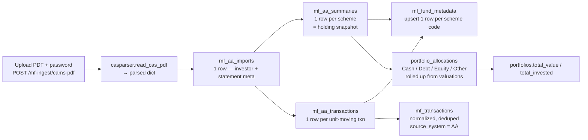

# CAMS / KFintech CAS PDF → DB tables

> **Purpose.** When a user uploads a CAMS / KFintech *Consolidated Account
> Statement* (CAS) PDF in the frontend, the backend decodes it with `casparser`
> and lands the contents in the existing MF tables. This doc shows **exactly
> which field goes where**, and a concrete worked example of the resulting rows.
>
> This replaces the (sidelined) Finvu account-aggregator *fetch-by-mobile* flow.
>
> Endpoint: `POST /api/v1/mf-ingest/cams-pdf` (multipart `file` + `password`).
> Code: `app/services/cams_cas_ingest.py` → `app/services/mf_aa_normalizer.py`.

> ⚠️ **The "worked example" rows below are illustrative placeholders.** Once you
> upload a real statement, this section will be regenerated with the actual
> extracted values from your CAS.

---

## 1. Flow



1. **Parse** — `casparser.read_cas_pdf(BytesIO(pdf), password, output="dict")`
   (run in a worker thread). Wrong password → HTTP 400; not a CAS / no folios →
   HTTP 422.
2. **Raw audit rows** — one `mf_aa_imports` row (investor identity + statement
   period), one `mf_aa_summaries` row per scheme, one `mf_aa_transactions` row
   per *unit-moving* transaction. Committed first, so a later normalization
   failure still leaves a retry-able `RECEIVED` row.
3. **Normalize** — `normalize_single_import` upserts `mf_fund_metadata` for each
   scheme code, then inserts deduped `mf_transactions` (`source_system = AA`,
   `source_import_id` = the import id, `source_txn_fingerprint` = SHA-256 of the
   key fields).
4. **Portfolio roll-up** — the scheme valuations are bucketed into
   **Cash / Debt / Equity / Other** (asset class resolved by
   `_resolve_asset_bucket` — see §3.6) and written to `portfolio_allocations`;
   `portfolios.total_value` = sum of market values, `portfolios.total_invested` =
   sum of cost values (falls back to market value when cost is absent). One
   `portfolio_holdings` row is also written per scheme so the app can list each fund.
5. **Profile back-fill** — `_backfill_user_profile` fills *blank* identity fields
   on the `users` row from the CAS investor block: `first_name` / `middle_name` /
   `last_name` (split from `investor_info.name`), `email`, `address`, and `pan`
   (from the first folio's `PAN`). It only fills blanks — anything the user
   already entered is untouched — and skips `email` / `pan` if another user
   already holds that value (both columns are unique). The fields it filled are
   echoed back in the response as `profile_fields_filled` and appended to the
   `message`. This is why `GET /auth/me` / `/profile` are populated after the first
   upload by a phone-only signup.
6. `maybe_recalculate_effective_risk(reason="cams_pdf_ingest")`, then commit.

---

## 2. What `casparser` gives us (the parsed dict)

```jsonc
{
  "statement_period": { "from": "2023-04-01", "to": "2024-03-31" },
  "investor_info":    { "name": "...", "email": "...", "address": "...", "mobile": "..." },
  "cas_type":  "DETAILED",        // or "SUMMARY" (no transactions)
  "file_type": "CAMS",            // or "KARVY" / "CAMS_KARVY"
  "folios": [
    {
      "folio": "12345678 / 0",
      "amc":   "Some AMC Mutual Fund",
      "PAN":   "ABCDE1234F", "KYC": "OK", "PANKYC": "OK",
      "schemes": [
        {
          "scheme":  "Some Equity Fund - Direct Growth",
          "advisor": "DIRECT", "rta_code": "XYZ123", "rta": "CAMS",
          "type":    "EQUITY",                       // EQUITY / DEBT / HYBRID / LIQUID / MONEY_MARKET / OTHER
          "isin":    "INF123A01ABC", "amfi": "120503",
          "open": 0.0, "close": 123.456, "close_calculated": 123.456,
          "valuation": { "date": "2024-03-31", "nav": 45.6789, "cost": 5000.00, "value": 5639.12 },
          "transactions": [
            { "date": "2023-05-15", "description": "Purchase",            "amount": 5000.00, "units": 109.514, "nav": 45.6566, "balance": 109.514, "type": "PURCHASE",          "dividend_rate": null },
            { "date": "2023-06-15", "description": "Stamp Duty",          "amount": 0.25,    "units": null,    "nav": null,    "balance": 109.514, "type": "STAMP_DUTY_TAX",    "dividend_rate": null },
            { "date": "2023-12-15", "description": "*** Reinvest of IDCW","amount": 200.00,  "units": 13.942,  "nav": 14.345,  "balance": 123.456, "type": "DIVIDEND_REINVEST", "dividend_rate": 1.5  }
          ]
        }
      ]
    }
  ]
}
```

Transaction `type` values from casparser: `PURCHASE`, `PURCHASE_SIP`,
`REDEMPTION`, `SWITCH_IN`, `SWITCH_IN_MERGER`, `SWITCH_OUT`, `SWITCH_OUT_MERGER`,
`DIVIDEND_REINVEST`, `DIVIDEND_PAYOUT`, `STT_TAX`, `STAMP_DUTY_TAX`, `TDS_TAX`,
`SEGREGATION`, `MISC`, `REVERSAL`, `UNKNOWN`.

**Only unit-moving types are kept** as `mf_aa_transactions` rows; the rest
(`DIVIDEND_PAYOUT`, `*_TAX`, `SEGREGATION`, `MISC`, `REVERSAL`, `UNKNOWN`) are
skipped so they don't pollute `mf_transactions`.

| casparser `type` | kept? | `mf_aa_transactions.trxn_type_flag` | → `mf_transactions.transaction_type` |
|---|---|---|---|
| `PURCHASE`, `PURCHASE_SIP` | ✅ | `P` | `BUY` |
| `REDEMPTION` | ✅ | `R` | `SELL` |
| `SWITCH_IN`, `SWITCH_IN_MERGER` | ✅ | `SI` | `SWITCH_IN` |
| `SWITCH_OUT`, `SWITCH_OUT_MERGER` | ✅ | `SO` | `SWITCH_OUT` |
| `DIVIDEND_REINVEST` | ✅ | `DR` | `DIVIDEND_REINVEST` |
| `DIVIDEND_PAYOUT`, `STT_TAX`, `STAMP_DUTY_TAX`, `TDS_TAX`, `SEGREGATION`, `MISC`, `REVERSAL`, `UNKNOWN` | ❌ skipped | — | — |

---

## 3. Field → column mapping

### 3.1 `mf_aa_imports` — one row per uploaded statement

| Column | Source | Transform |
|---|---|---|
| `id` | generated | `uuid4` |
| `user_id` | request | the authenticated (effective) user |
| `pan` | `folios[].PAN` (first non-empty) | trimmed, ≤ 20 chars |
| `pekrn` | — | `NULL` (not in a CAS) |
| `email` | `investor_info.email` | trimmed, ≤ 320 |
| `mobile` | `investor_info.mobile` | trimmed, ≤ 20 (often masked in a CAS) |
| `from_date` | `statement_period.from` | string, ≤ 20 (e.g. `2023-04-01`) |
| `to_date` | `statement_period.to` | string, ≤ 20 |
| `req_id` | generated | `uuid4().hex` — synthetic; satisfies `uq_mf_aa_import_req_email` for uploads |
| `investor_first_name` / `investor_middle_name` / `investor_last_name` | `investor_info.name` | split on whitespace: first / middle (everything between) / last |
| `address_line_1` | `investor_info.address` | trimmed, ≤ 255 (line 2/3 left `NULL` — casparser gives one string) |
| `city` / `district` / `state` / `pincode` / `country` | — | `NULL` (not separately parsed) |
| `source_file` | upload filename | ≤ 255, default `cams_cas.pdf` |
| `status` | — | `RECEIVED` → `NORMALIZING` → `NORMALIZED` (or `FAILED`) |
| `normalized_at` | — | set when normalization succeeds |
| `failure_reason` | — | set on `FAILED` |
| `imported_at` / `created_at` | — | `now()` |

### 3.2 `mf_aa_summaries` — one row per scheme (holding snapshot)

| Column | Source (`folios[].schemes[]` unless noted) | Transform |
|---|---|---|
| `id` | generated | `uuid4` |
| `aa_import_id` | parent | FK → `mf_aa_imports.id` |
| `row_no` | running counter | 1-based across all schemes in the statement |
| `amc` | — | `NULL` (CAS gives a name, not a short code) |
| `amc_name` | `folios[].amc` | ≤ 200 |
| `asset_type` | `scheme.type` | ≤ 30 (`EQUITY` / `DEBT` / `HYBRID` / `LIQUID` / …) |
| `broker_code` / `broker_name` | — | `NULL` |
| `closing_balance` | `scheme.close` | units held at statement end |
| `cost_value` | `scheme.valuation.cost` | `NULL` if casparser didn't extract it |
| `decimal_*` | — | `NULL` |
| `folio` | `folios[].folio` | ≤ 40 |
| `is_demat` | — | `NULL` |
| `isin` | `scheme.isin` | ≤ 20 |
| `kyc_status` | — | `NULL` (folio-level `KYC` not copied here) |
| `last_nav_date` | `scheme.valuation.date` | string, ≤ 20 |
| `last_trxn_date` | date of the last entry in `scheme.transactions` | string, ≤ 20 (`NULL` for SUMMARY CAS) |
| `market_value` | `scheme.valuation.value` | INR value at statement end |
| `nav` | `scheme.valuation.nav` | latest NAV |
| `nominee_status` | — | `NULL` |
| `opening_bal` | — | `NULL` (casparser gives `open`; not currently copied) |
| `rta_code` | `scheme.rta_code` | ≤ 30 |
| `scheme` | `scheme.amfi` (fallback `scheme.isin`) | ≤ 20 — **this becomes the canonical `scheme_code`** |
| `scheme_name` | `scheme.scheme` | ≤ 255 |
| `tax_status` | — | `NULL` |
| `created_at` | — | `now()` |

### 3.3 `mf_aa_transactions` — one row per unit-moving transaction

| Column | Source (`...schemes[].transactions[]` unless noted) | Transform |
|---|---|---|
| `id` | generated | `uuid4` |
| `aa_import_id` | parent | FK → `mf_aa_imports.id` |
| `row_no` | running counter | 1-based across all kept transactions |
| `amc` | — | `NULL` |
| `amc_name` | `folios[].amc` | ≤ 200 |
| `check_digit` | — | `NULL` |
| `folio` | `folios[].folio` | ≤ 40 |
| `isin` | `scheme.isin` | ≤ 20 |
| `posted_date` | `txn.date` | string, ≤ 20 |
| `purchase_price` | `txn.nav` | NAV at the transaction |
| `scheme` | `scheme.amfi` (fallback `scheme.isin`) | ≤ 20 |
| `scheme_name` | `scheme.scheme` | ≤ 255 |
| `stamp_duty` / `stt_tax` / `tax` / `total_tax` / `trxn_charge` | — | `NULL` (CAS line items don't carry these per-txn) |
| `trxn_amount` | `txn.amount` | INR amount (negative for redemptions / switch-out) |
| `trxn_date` | `txn.date` | string, ≤ 20 |
| `trxn_desc` | `txn.description` | ≤ 100 |
| `trxn_mode` | — | `NULL` |
| `trxn_type_flag` | `txn.type` → mapped | `P` / `R` / `SI` / `SO` / `DR` (see §2 table) |
| `trxn_units` | `txn.units` | units moved |
| `created_at` | — | `now()` |

### 3.4 `mf_fund_metadata` — upserted per scheme code (by `normalize_single_import`)

Only filled for **new** scheme codes; existing rows (e.g. from the mfapi.in
ingest) are left as-is — at most blank fields are back-filled.

| Column | Source | Notes |
|---|---|---|
| `scheme_code` (PK) | `mf_aa_summaries.scheme` (= AMFI code, or ISIN fallback) | |
| `scheme_name` | `mf_aa_summaries.scheme_name` | |
| `amc_name` | `mf_aa_summaries.amc_name` (fallback `"Unknown AMC"`) | |
| `category` | `mf_aa_summaries.asset_type` (fallback `"OTHER"`) | |
| `sub_category` | — | `NULL` |
| `plan_type` | — | defaults to `REGULAR` for newly-created rows |
| `option_type` | — | defaults to `GROWTH` for newly-created rows |
| `isin` | (mirrored from existing metadata when present) | the AA `isin` is *not* written here directly; `POST /mf-ingest/mfapi/backfill-isin` reconciles |
| `is_active` | — | `true` |

### 3.5 `mf_transactions` — normalized, deduped (the canonical ledger)

| Column | Source | Transform |
|---|---|---|
| `id` | generated | `uuid4` |
| `user_id` | the import's `user_id` | |
| `scheme_code` | `mf_aa_transactions.scheme` | FK → `mf_fund_metadata.scheme_code` |
| `sip_mandate_id` | — | `NULL` |
| `folio_number` | `mf_aa_transactions.folio` (fallback `"UNKNOWN"`) | ≤ 30 |
| `transaction_type` | `trxn_type_flag` + `trxn_desc` + sign of amount | `BUY` / `SELL` / `SWITCH_IN` / `SWITCH_OUT` / `DIVIDEND_REINVEST` |
| `transaction_date` | `trxn_date` (fallback `posted_date`) | parsed `date` (`%d-%b-%Y` / `%d-%m-%Y` / `%Y-%m-%d` / …; today if unparseable) |
| `units` | `trxn_units` | `0.0` if blank |
| `nav` | `purchase_price` | `0.0` if blank |
| `amount` | `trxn_amount` | `0.0` if blank |
| `isin` | from `mf_fund_metadata` if known | else `NULL` |
| `fund_name` / `category` / `sub_category` | from `mf_fund_metadata` if known | else `NULL` |
| `stamp_duty` | `mf_aa_transactions.stamp_duty` | `0.0` |
| `source_system` | constant | `AA` |
| `source_import_id` | the `mf_aa_imports.id` | FK |
| `source_txn_fingerprint` | SHA-256 of `user_id \| scheme_code \| folio \| type \| date \| units \| nav \| amount` | unique with `source_system` → re-upload of the same statement is idempotent |
| `created_at` | — | `now()` |

### 3.6 `portfolio_allocations` / `portfolios` — bucket roll-up

Per scheme the asset class is resolved in two passes (`cams_cas_ingest._resolve_asset_bucket`):

1. **Trust `casparser`'s `scheme.type`** when it actually classified the scheme —
   `EQUITY → Equity`, `LIQUID/MONEY_MARKET/OVERNIGHT/CASH → Cash`,
   `DEBT/BOND/GILT/INCOME/DURATION → Debt`, `HYBRID/BALANCED/ARBITRAGE/FOF/GOLD/COMMODITY → Other`.
2. **Fall back to the scheme *name*** when `casparser` returned `N/A` / `UNKNOWN` /
   blank (common for ETFs, index funds, international funds and recent NFOs that
   aren't in `casparser`'s bundled MFCentral ISIN list). Name hints, checked
   most-specific first: commodity (`gold`, `silver`, …) → Other; hybrid
   (`hybrid`, `balanced advantage`, `arbitrage`, `equity savings`, `equity & debt`, …) → Other;
   debt (`bond`, `gilt`, `corporate bond`, `short duration`, `fmp`, …) → Debt;
   cash (`liquid`, `overnight`, `money market`, …) → Cash; equity
   (`equity`, `flexi cap`, `large/mid/small cap`, `index`, `nifty`, `sensex`, `elss`,
   `etf`, sector names, …) → Equity.
3. Only if **both** passes fail does the scheme land in **Other** (and an `INFO`
   log line records the unrecognised scheme name so the hint lists can be extended).

This two-pass resolution is what stopped an all-equity statement from showing up
on the frontend as e.g. *Equity 95% / Other 5%* — the "Other" slice was simply
schemes `casparser` couldn't tag from its ISIN list. The resolved class is also
written back to `mf_aa_summaries.asset_type` (and thus `mf_fund_metadata.category`)
when `casparser`'s own type was blank, so downstream modules don't see `N/A`.

| `portfolio_allocations` column | Source |
|---|---|
| `portfolio_id` | the user's primary portfolio (created if missing) |
| `asset_class` | `Cash` / `Debt` / `Equity` / `Other` (rows with 0 amount are omitted) |
| `amount` | Σ `scheme.valuation.value` in that bucket |
| `allocation_percentage` | `amount / total × 100`, 2 dp |

| `portfolios` column | Source |
|---|---|
| `total_value` | Σ all `scheme.valuation.value` |
| `total_invested` | Σ all `scheme.valuation.cost` (→ falls back to `total_value` when cost is absent) |

The previous `portfolio_allocations` rows for that portfolio are **replaced** on
each upload (same behaviour SimBanks/Finvu sync had).

---

## 4. Worked example *(illustrative — pending a real upload)*

Given a CAS PDF for **John A Doe** (PAN `ABCDE1234F`), statement period
`2023-04-01 → 2024-03-31`, with **1 folio** at *Some AMC* holding **2 schemes**:

- *Some Equity Fund - Direct Growth* (ISIN `INF123A01ABC`, AMFI `120503`, type `EQUITY`) — 1 purchase + 1 stamp-duty line + 1 IDCW-reinvest; end value ₹5,639.12 (cost ₹5,000).
- *Some Liquid Fund - Direct Growth* (ISIN `INF999B02XYZ`, AMFI `987654`, type `LIQUID`) — 1 purchase; end value ₹5,000.00 (cost ₹5,000).

### `mf_aa_imports` (1 row)

| id | user_id | pan | email | mobile | from_date | to_date | req_id | investor_first_name | investor_middle_name | investor_last_name | address_line_1 | source_file | status | normalized_at |
|---|---|---|---|---|---|---|---|---|---|---|---|---|---|---|
| `a1…` | `u1…` | `ABCDE1234F` | `john@example.com` | `99XXXXXX99` | `2023-04-01` | `2024-03-31` | `7a3a9d8e…` (hex) | `JOHN` | `A` | `DOE` | `Addr, City` | `cams.pdf` | `NORMALIZED` | `2026-05-11T…Z` |

### `mf_aa_summaries` (2 rows)

| id | aa_import_id | row_no | amc_name | asset_type | folio | isin | scheme | scheme_name | closing_balance | cost_value | market_value | nav | last_nav_date | last_trxn_date | rta_code |
|---|---|---|---|---|---|---|---|---|---|---|---|---|---|---|---|
| `s1…` | `a1…` | 1 | `Some AMC Mutual Fund` | `EQUITY` | `12345678 / 0` | `INF123A01ABC` | `120503` | `Some Equity Fund - Direct Growth` | `123.456` | `5000.00` | `5639.12` | `45.6789` | `2024-03-31` | `2023-12-15` | `XYZ123` |
| `s2…` | `a1…` | 2 | `Some AMC Mutual Fund` | `LIQUID` | `12345678 / 0` | `INF999B02XYZ` | `987654` | `Some Liquid Fund - Direct Growth` | `50.000` | `5000.00` | `5000.00` | `100.0000` | `2024-03-31` | `2023-07-01` | `LIQ999` |

### `mf_aa_transactions` (3 rows — the `STAMP_DUTY_TAX` line is skipped)

| id | aa_import_id | row_no | amc_name | folio | isin | scheme | scheme_name | posted_date | trxn_date | trxn_amount | trxn_units | purchase_price | trxn_desc | trxn_type_flag |
|---|---|---|---|---|---|---|---|---|---|---|---|---|---|---|
| `t1…` | `a1…` | 1 | `Some AMC Mutual Fund` | `12345678 / 0` | `INF123A01ABC` | `120503` | `Some Equity Fund - Direct Growth` | `2023-05-15` | `2023-05-15` | `5000.00` | `109.514` | `45.6566` | `Purchase` | `P` |
| `t2…` | `a1…` | 2 | `Some AMC Mutual Fund` | `12345678 / 0` | `INF123A01ABC` | `120503` | `Some Equity Fund - Direct Growth` | `2023-12-15` | `2023-12-15` | `200.00` | `13.942` | `14.3450` | `*** Reinvest of IDCW` | `DR` |
| `t3…` | `a1…` | 3 | `Some AMC Mutual Fund` | `12345678 / 0` | `INF999B02XYZ` | `987654` | `Some Liquid Fund - Direct Growth` | `2023-07-01` | `2023-07-01` | `5000.00` | `50.000` | `100.0000` | `Purchase` | `P` |

### `mf_fund_metadata` (2 rows upserted, if not already present)

| scheme_code | scheme_name | amc_name | category | sub_category | plan_type | option_type | is_active |
|---|---|---|---|---|---|---|---|
| `120503` | `Some Equity Fund - Direct Growth` | `Some AMC Mutual Fund` | `EQUITY` | `NULL` | `REGULAR` | `GROWTH` | `true` |
| `987654` | `Some Liquid Fund - Direct Growth` | `Some AMC Mutual Fund` | `LIQUID` | `NULL` | `REGULAR` | `GROWTH` | `true` |

### `mf_transactions` (3 rows — `source_system = AA`, deduped by fingerprint)

| id | user_id | scheme_code | folio_number | transaction_type | transaction_date | units | nav | amount | isin | fund_name | category | source_system | source_import_id | source_txn_fingerprint |
|---|---|---|---|---|---|---|---|---|---|---|---|---|---|---|
| `m1…` | `u1…` | `120503` | `12345678 / 0` | `BUY` | `2023-05-15` | `109.514` | `45.6566` | `5000.00` | `INF123A01ABC`* | `Some Equity Fund - Direct Growth`* | `EQUITY`* | `AA` | `a1…` | `sha256(…)` |
| `m2…` | `u1…` | `120503` | `12345678 / 0` | `DIVIDEND_REINVEST` | `2023-12-15` | `13.942` | `14.3450` | `200.00` | `INF123A01ABC`* | `Some Equity Fund - Direct Growth`* | `EQUITY`* | `AA` | `a1…` | `sha256(…)` |
| `m3…` | `u1…` | `987654` | `12345678 / 0` | `BUY` | `2023-07-01` | `50.000` | `100.0000` | `5000.00` | `INF999B02XYZ`* | `Some Liquid Fund - Direct Growth`* | `LIQUID`* | `AA` | `a1…` | `sha256(…)` |

\* `isin` / `fund_name` / `category` are copied from `mf_fund_metadata` only if
that row already carried them; for a freshly-created metadata row `isin` may be
`NULL` until `POST /mf-ingest/mfapi/backfill-isin` runs.

### `portfolio_allocations` (rolled up from valuations — total ₹10,639.12)

| portfolio_id | asset_class | amount | allocation_percentage |
|---|---|---|---|
| `p1…` | `Equity` | `5639.12` | `53.00` |
| `p1…` | `Cash` | `5000.00` | `47.00` |

### `portfolios` (primary, updated)

| id | user_id | name | is_primary | total_value | total_invested |
|---|---|---|---|---|---|
| `p1…` | `u1…` | `Primary` | `true` | `10639.12` | `10000.00` |

### API response (`POST /mf-ingest/cams-pdf`)

```jsonc
{
  "import_id": "a1…",
  "status": "NORMALIZED",
  "cas_file_type": "CAMS",
  "cas_type": "DETAILED",
  "statement_period_from": "2023-04-01",
  "statement_period_to": "2024-03-31",
  "folios": 1,
  "schemes": 2,
  "aa_transactions_parsed": 3,
  "mf_transactions_inserted": 3,
  "mf_transactions_skipped_duplicate": 0,
  "portfolio_allocation_rows": 2,
  "total_value_inr": 10639.12,
  "normalize_error": null,
  "message": "Imported 2 scheme(s) across 1 folio(s); 3 transaction(s) added (0 duplicate(s) skipped). Portfolio value updated to INR 10,639.12."
}
```

---

## 5. Edge cases & notes

- **SUMMARY-type CAS** (no transaction detail): you still get `mf_aa_imports` +
  `mf_aa_summaries` + `mf_fund_metadata` + `portfolio_allocations`, but
  `mf_aa_transactions` and `mf_transactions` will be empty
  (`aa_transactions_parsed = 0`, `mf_transactions_inserted = 0`).
- **Re-uploading the same statement** is idempotent for `mf_transactions`
  (fingerprint dedup → `mf_transactions_skipped_duplicate` rises, `inserted` is
  0). A *new* `mf_aa_imports` / `mf_aa_summaries` / `mf_aa_transactions` set is
  still created each time (raw audit trail), and `portfolio_allocations` is
  replaced with the latest valuations.
- **Wrong password** → HTTP 400 `"Incorrect PDF password."`; **not a CAS / no
  folios** → HTTP 422; **`casparser` not installed** → HTTP 422 with a clear
  message (it's a lazy import).
- **Normalization failure** (e.g. an FK problem) → the `mf_aa_imports` row stays
  at `FAILED` with `failure_reason` set and the raw rows preserved;
  `status` in the response is `FAILED`, `normalize_error` is populated, and you
  can retry with `POST /mf-ingest/normalize/{import_id}`.
- **NSDL / CDSL e-CAS** (the demat-account statement variant) is *not* supported
  here — only the MF CAS from CAMS / KFintech. Uploading one returns HTTP 422.
- The PDF password is used only to open the file and is never persisted.

---

## 6. Inspecting a real upload

After you upload a statement, dump the rows it produced with the dev script:

```bash
python scripts/show_cams_import.py                    # latest mf_aa_imports row
python scripts/show_cams_import.py <import_id>        # a specific import (from the API response)
python scripts/show_cams_import.py --user <user_id>   # latest import for a user
```

It prints every table touched (`mf_aa_imports`, `mf_aa_summaries`,
`mf_aa_transactions`, `mf_fund_metadata`, `mf_transactions`,
`portfolio_allocations`, `portfolios`) against the same `DATABASE_URL` the app
uses. Paste that output here and the §4 worked example above will be replaced
with the real extraction.

---

## 7. The MF holding detail page

A holding row produced here (`portfolio_holdings.ticker_symbol` = the AMFI scheme
code, or the ISIN when the AMFI code wasn't on the statement) can be opened on a
fund-detail screen via a single call:

```
GET /api/v1/mf/funds/{scheme_code}/holding-detail   # scheme_code may be an AMFI code or an ISIN
    ?date_from=YYYY-MM-DD&date_to=YYYY-MM-DD         # optional; default = last ~5 years of NAVs
```

Returns (`MfHoldingDetailResponse`):

- **scheme facts** — `scheme_name`, `amc_name`, `category`, `sub_category`,
  `isin`, `plan_type`, `option_type`, and `metadata_id` (use it with
  `GET /mf/fund-metadata/{metadata_id}/investor-detail` for rolling-window
  returns + a downsampled performance chart).
- **NAV series** — `latest_nav` / `latest_nav_date` plus `nav_history` (ascending
  `{nav_date, nav}` points from `mf_nav_history`, capped at 4 000 rows —
  `nav_history_truncated` flags an over-cap range). If nothing is stored yet a
  `notes[]` line says so; trigger a NAV sync (`/mf/nav-history` or the mfapi
  ingest) to fill it.
- **position** — the user's units / units-weighted average cost / current value /
  portfolio weight / invested amount / unrealised gain, summed across folios.
- **transactions** — the user's ledger in this scheme (from `mf_transactions`),
  each row carrying `transaction_type` (`BUY` / `SELL` / `SWITCH_IN` /
  `SWITCH_OUT` / `DIVIDEND_REINVEST`), `is_inflow` (true for BUY / SWITCH_IN /
  DIVIDEND_REINVEST → tint green; false → red) and a ready-to-render
  `signed_amount` (`+amount` for inflows, `-amount` for outflows).

Code: `app/routers/mf/holding_detail.py` → `app/services/mf/mf_holding_detail_service.py`
→ schemas in `app/schemas/mf/holding_detail.py`.
