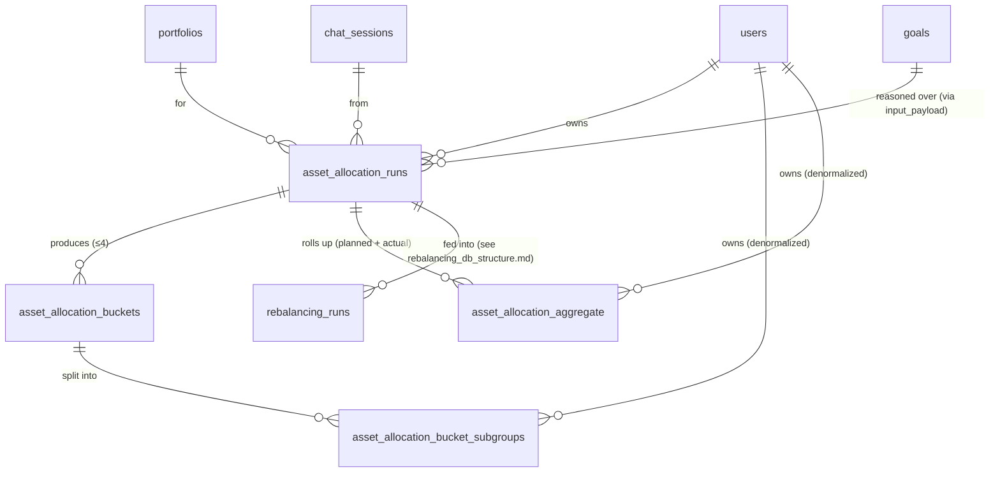

# Asset Allocation — DB Schema

> **Purpose.** Persist the output of the **asset-allocation** AI pipeline
> (`AI_Agents/src/asset_allocation_pydantic`) in a clean, fully normalized,
> query-friendly schema. The pipeline answers: *"Given my corpus, risk score,
> and goals — what % should I put in equity, debt, others, and how does that
> split across my time-horizon buckets?"*
>
> The rebalancing engine (`AI_Agents/src/Rebalancing`) consumes an
> `asset_allocation_runs` row as its target — that schema lives in
> [`rebalancing_db_structure.md`](./rebalancing_db_structure.md).

---

## 1. What the pipeline emits (and where it lands)

| Output | Table |
|---|---|
| One audit row per pipeline execution (inputs, rationale, totals) | `asset_allocation_runs` |
| Four time-horizon buckets per run (emergency / short / medium / long term) | `asset_allocation_buckets` |
| Subgroup amounts inside each bucket (`low_beta_equities`, `debt_subgroup`, `gold`, …), planned + actual | `asset_allocation_bucket_subgroups` |
| Run-level equity / debt / others roll-up, planned + actual | `asset_allocation_aggregate` |

**Goals are not snapshotted per run.** The goals the pipeline reasons over are
the user's canonical rows in the central `goals` table (see §5). The exact
inputs are also frozen verbatim in `asset_allocation_runs.input_payload` for
replay.

---

## 2. ER diagram



---

## 3. Tables — `asset_allocation_*` (4 tables)

### 3.1 `asset_allocation_runs` *(master)*

One row **per execution** of the allocation pipeline. A user re-running with a
nudged risk score creates a new row — old rows stay (audit history). Re-runs
chain via `supersedes_id`.

| Column | Type | Notes |
|---|---|---|
| `id` | UUID PK | |
| `user_id` | UUID FK → `users` | CASCADE |
| `portfolio_id` | UUID FK → `portfolios` | nullable, SET NULL |
| `chat_session_id` | UUID FK → `chat_sessions` | nullable, SET NULL |
| `supersedes_id` | UUID self-FK | nullable — chains re-runs |
| `status` | enum `pending / approved / superseded / rejected` | |
| `pipeline_source` | str | e.g. `asset_allocation_pydantic` |
| `spine_mode` | str | nullable — e.g. `full`, `ideal_asset_allocation` |
| `user_question` | text | nullable — original chat prompt |
| `rationale` | text | nullable — top-level rationale |
| `input_payload` | JSONB | full `AllocationInput` (incl. goals) for replay |
| `client_age` | int | snapshot at run-time |
| `client_occupation` | str | nullable |
| `client_effective_risk_score` | numeric | |
| `total_corpus` | numeric | input corpus |
| `grand_total` | numeric | total amount allocated |
| `all_amounts_in_multiples_of_100` | bool | |
| `created_at`, `updated_at` | timestamptz | |

> **Removed (vs. the old `goal_allocation_runs`):**
> `equity_total / debt_total / others_total` and
> `equity_total_pct / debt_total_pct / others_total_pct` — these were a
> duplicate of the run-level roll-up, which now lives in
> `asset_allocation_aggregate` (one `actual` row per run).

### 3.2 `asset_allocation_buckets` *(≤ 4 per run)*

One row per time-horizon bucket. Unchanged from the prior schema apart from the
table name.

| Column | Type | Notes |
|---|---|---|
| `id` | UUID PK | |
| `run_id` | UUID FK → `asset_allocation_runs` | CASCADE |
| `bucket_name` | enum `emergency / short_term / medium_term / long_term` | |
| `total_goal_amount` | numeric | how much the goals in this bucket need |
| `allocated_amount` | numeric | how much we actually allocated |
| `rationale` | text | nullable — LLM-written |
| `future_investment_amount` | numeric | gap to be funded via SIP |
| `future_investment_message` | text | nullable — e.g. "Top-up via SIP recommended" |
| `created_at` | timestamptz | |

`UNIQUE (run_id, bucket_name)` — no duplicate buckets per run.

### 3.3 `asset_allocation_bucket_subgroups` *(subgroup amounts inside a bucket)*

Example rows for `bucket_name = 'long_term'`:

| subgroup | planned_amount | actual_amount | actual_pct_of_bucket |
|---|---|---|---|
| `medium_beta_equities` | 240 000 | 240 000 | 40.0 |
| `low_beta_equities` | 180 000 | 180 000 | 30.0 |
| `us_equities` | 60 000 | 60 000 | 10.0 |
| `debt_subgroup` | 80 000 | 80 000 | 13.3 |
| `gold` | 40 000 | 40 000 | 6.7 |

| Column | Type | Notes |
|---|---|---|
| `id` | UUID PK | |
| `bucket_id` | UUID FK → `asset_allocation_buckets` | CASCADE |
| `user_id` | UUID FK → `users` | CASCADE — denormalized so a user's subgroups query needs no join |
| `subgroup` | str | e.g. `low_beta_equities`, `debt_subgroup`, `gold` |
| `planned_amount` | numeric | pre-guardrail |
| `actual_amount` | numeric | post-guardrail |
| `planned_pct_of_bucket` | numeric | nullable |
| `actual_pct_of_bucket` | numeric | nullable |
| `created_at` | timestamptz | |

`UNIQUE (bucket_id, subgroup)`.

> This single table replaces three things in the old schema: `subgroup_amounts`,
> `aggregated_subgroups`, and the planned-vs-actual subgroup breakdown.
> Aggregations across buckets become a SQL view (see §6).

### 3.4 `asset_allocation_aggregate` *(equity / debt / others, run level)*

Two rows per run: one `planned` (pre-guardrail), one `actual` (post-guardrail).
Replaces the per-bucket `goal_allocation_bucket_asset_classes` **and** the
equity/debt/others columns that used to sit on the run row.

| Column | Type | Notes |
|---|---|---|
| `id` | UUID PK | |
| `run_id` | UUID FK → `asset_allocation_runs` | CASCADE |
| `user_id` | UUID FK → `users` | CASCADE — denormalized |
| `split_kind` | enum `planned / actual` | |
| `equity_amount`, `debt_amount`, `others_amount` | numeric | |
| `equity_pct`, `debt_pct`, `others_pct` | numeric | |
| `created_at` | timestamptz | |

`UNIQUE (run_id, split_kind)`.

---

## 4. Removed tables (vs. the old `goal_allocation_*` family)

| Old table | Status | Why |
|---|---|---|
| `goal_allocation_goals` | ➡️ **MOVED** | Goal data is no longer snapshotted per run — it now lives in the central `goals` table (see §5). Exact pipeline inputs are still captured in `asset_allocation_runs.input_payload`. |
| `goal_allocation_bucket_goals` | ❌ **DROPPED** | Goal ↔ bucket join with a per-pair rationale — never surfaced on the frontend, not worth the extra table. |
| `goal_allocation_bucket_asset_classes` | 🔀 **REPLACED** | Folded into the run-level `asset_allocation_aggregate` (planned + actual). |

---

## 5. The central `goals` table (gains AI-pipeline columns)

`goal_allocation_goals` was a per-run snapshot of the goals the pipeline saw.
Those fields are now added directly to the canonical `goals` table
(`FinancialGoal`), so there is **one** source of truth for a user's goals:

| New column on `goals` | Type | Notes |
|---|---|---|
| `time_to_goal_months` | int | nullable — horizon as the pipeline consumes it |
| `amount_needed` | numeric | nullable — target corpus the pipeline solves for |
| `goal_priority` | str | nullable — `HIGH` / `MEDIUM`/ ` LOW`|
| `investment_goal` | str | nullable — `wealth_creation` / `safety` / etc. |

Existing `goals` columns are untouched (`goal_name`, `present_value_amount`,
`inflation_rate`, `target_date`, `priority`, `status`, `notes`, …).

---

## 6. Quick-reference: SQL examples

**"Show me the latest allocation for user X with full breakdown."**
```sql
SELECT r.id, r.grand_total,
       agg.split_kind, agg.equity_pct, agg.debt_pct, agg.others_pct,
       b.bucket_name, b.allocated_amount, b.rationale,
       s.subgroup, s.actual_amount, s.actual_pct_of_bucket
FROM   asset_allocation_runs r
LEFT   JOIN asset_allocation_aggregate agg
            ON agg.run_id = r.id AND agg.split_kind = 'actual'
JOIN   asset_allocation_buckets b           ON b.run_id = r.id
JOIN   asset_allocation_bucket_subgroups s  ON s.bucket_id = b.id
WHERE  r.user_id = $1
ORDER  BY r.created_at DESC, b.bucket_name, s.subgroup;
```

**"Aggregate subgroups across buckets for one allocation run (the old `aggregated_subgroups` view)."**
```sql
SELECT s.subgroup,
       SUM(CASE WHEN b.bucket_name = 'emergency'   THEN s.actual_amount ELSE 0 END) AS emergency,
       SUM(CASE WHEN b.bucket_name = 'short_term'  THEN s.actual_amount ELSE 0 END) AS short_term,
       SUM(CASE WHEN b.bucket_name = 'medium_term' THEN s.actual_amount ELSE 0 END) AS medium_term,
       SUM(CASE WHEN b.bucket_name = 'long_term'   THEN s.actual_amount ELSE 0 END) AS long_term,
       SUM(s.actual_amount) AS total
FROM   asset_allocation_bucket_subgroups s
JOIN   asset_allocation_buckets b ON b.id = s.bucket_id
WHERE  b.run_id = $1
GROUP  BY s.subgroup
ORDER  BY total DESC;
```

---

## 7. Integrity guarantees

1. **`asset_allocation_runs.input_payload` is the replay record.** Every run
   carries the exact `AllocationInput` it was given (including the goals as the
   pipeline saw them) — so a recommendation stays interpretable even after the
   canonical goals are edited.
2. **`supersedes_id` chains.** Re-runs (user nudges risk, tweaks a goal) form a
   linked list — old data is never overwritten.
3. **Buckets are first-class rows.** Every bucket-level metric (rationale,
   totals, future-investment, subgroup splits) hangs off
   `asset_allocation_buckets.id`. Adding a fifth bucket later = no schema change.
4. **`asset_allocation_aggregate` has exactly two rows per run** (`planned`,
   `actual`) — enforced by `UNIQUE (run_id, split_kind)`.
5. **`user_id` is denormalized** onto `asset_allocation_bucket_subgroups` and
   `asset_allocation_aggregate` purely for query convenience; it must always
   match `asset_allocation_runs.user_id` for the same `run_id`.
6. **No JSONB-as-database.** Every analytics field has a typed column. JSONB is
   reserved for `input_payload` (replay) only.

---

## 8. Summary — at a glance

| Table | Rows per run | Stores |
|---|---|---|
| `asset_allocation_runs` | 1 | audit: inputs, rationale, corpus, grand total |
| `asset_allocation_buckets` | ≤ 4 | per-bucket totals, rationale, SIP top-up |
| `asset_allocation_bucket_subgroups` | n (per bucket × subgroup) | planned + actual subgroup amounts |
| `asset_allocation_aggregate` | 2 | equity / debt / others roll-up — `planned` + `actual` |

Plus: the central `goals` table gains `time_to_goal_months`, `amount_needed`,
`goal_priority`, `investment_goal`.

**Linkage out:** `rebalancing_runs.source_allocation_run_id` →
`asset_allocation_runs.id` (NOT NULL) — see
[`rebalancing_db_structure.md`](./rebalancing_db_structure.md).
