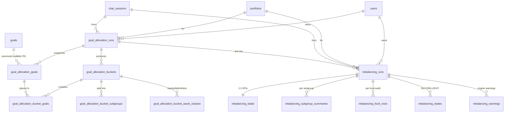

# Goal Allocation & Rebalancing — DB Schema

> **Purpose.** Persist the output of two AI pipelines — the **goal-based asset
> allocation** pipeline and the **rebalancing engine** — in a clean, fully
> normalized, query-friendly schema. Replaces a tangled mix of JSONB blobs and
> mis-named tables with two clearly separated families.

---

## 1. The two AI pipelines (and what each emits)

| Pipeline | Source folder | What it answers | Key outputs we persist |
|---|---|---|---|
| **Goal-based allocation** | `AI_Agents/src/asset_allocation_pydantic` | *"Given my corpus, risk score, and goals — what % should I put in equity, debt, others?"* | Buckets (emergency / short / medium / long term), subgroup splits, asset-class splits, future investments |
| **Rebalancing engine** | `AI_Agents/src/Rebalancing` | *"Given the target allocation, which specific funds do I buy/sell to get there — accounting for tax, exit-load, and caps?"* | Per-fund audit, BUY/SELL/EXIT trades, totals, warnings |

The rebalancing engine **always consumes** the allocation engine's output as
its target — this is enforced in the schema by a NOT NULL FK.

---

## 2. ER diagram



---

## 3. Family A — `goal_allocation_*` (6 tables)

### 3.1 `goal_allocation_runs` *(master)*

One row **per execution** of the allocation pipeline. A user re-running with a
nudged risk score creates a new row — old rows stay (audit history).

| Column | Type | Notes |
|---|---|---|
| `id` | UUID PK | |
| `user_id` | UUID FK → `users` | CASCADE |
| `portfolio_id` | UUID FK → `portfolios` | nullable, SET NULL |
| `chat_session_id` | UUID FK → `chat_sessions` | nullable |
| `supersedes_id` | UUID self-FK | nullable — chains re-runs |
| `status` | enum `pending / approved / superseded / rejected` | |
| `pipeline_source` | str | e.g. `asset_allocation_pydantic` |
| `spine_mode` | str | e.g. `full`, `ideal_asset_allocation` |
| `user_question` | text | original chat prompt |
| `rationale` | text | top-level rationale |
| `input_payload` | JSONB | full `AllocationInput` for replay |
| `client_age` | int | snapshot at run-time |
| `client_occupation` | str | |
| `client_effective_risk_score` | numeric | |
| `total_corpus` | numeric | input corpus |
| `grand_total` | numeric | sum allocated |
| `equity_total / debt_total / others_total` | numeric | actual amounts | --> DUPLICATE
| `equity_total_pct / debt_total_pct / others_total_pct` | numeric | actual % | --> DUPLICATE
| `all_amounts_in_multiples_of_100` | bool | |
| `created_at`, `updated_at` | timestamptz | |

### 3.2 `goal_allocation_goals` *(goal snapshots — frozen at run time)*n --> CENTRAL 

The pipeline saw goals X, Y, Z when it ran. If the user later edits goal Y,
this row preserves what was true on day 1.

| Column | Type | Notes |
|---|---|---|
| `id` | UUID PK | |
| `run_id` | UUID FK → `goal_allocation_runs` | CASCADE |
| `financial_goal_id` | UUID FK → `goals` | **nullable** — chat-only goals don't have a canonical row |
| `goal_name` | str | |
| `time_to_goal_months` | int | |
| `amount_needed` | numeric | |
| `goal_priority` | str | `negotiable` / `non_negotiable` |
| `investment_goal` | str | `wealth_creation` / `safety` / etc. |

### 3.3 `goal_allocation_buckets` *(4 per run)*

| Column | Type | Notes |
|---|---|---|
| `id` | UUID PK | |
| `run_id` | UUID FK | CASCADE |
| `bucket_name` | enum `emergency / short_term / medium_term / long_term` | |
| `total_goal_amount` | numeric | how much the goals in this bucket need |
| `allocated_amount` | numeric | how much we actually allocated |
| `rationale` | text | LLM-written |
| `future_investment_amount` | numeric | gap to be funded via SIP |
| `future_investment_message` | text | e.g. "Top-up via SIP recommended" |

`UNIQUE (run_id, bucket_name)` — no duplicate buckets per run.

### 3.4 `goal_allocation_bucket_goals` *(goal ↔ bucket)* --> REMOVE IT

Which snapshot-goals went into which bucket, with a **per-pair rationale**.

| Column | Type |
|---|---|
| `id` | UUID PK |
| `bucket_id` | UUID FK → `goal_allocation_buckets` |
| `goal_id` | UUID FK → `goal_allocation_goals` |
| `goal_rationale` | text | 

`UNIQUE (bucket_id, goal_id)`.

### 3.5 `goal_allocation_bucket_subgroups` *(subgroup amounts inside a bucket)*

Example rows for `bucket_name='long_term'`:
`bucket_id`-
'user_id'
| subgroup | planned_amount | actual_amount | actual_pct_of_bucket | 
|---|---|---|---|
| `medium_beta_equities` | 240 000 | 240 000 | 40.0 |
| `low_beta_equities` | 180 000 | 180 000 | 30.0 |
| `us_equities` | 60 000 | 60 000 | 10.0 |
| `debt_subgroup` | 80 000 | 80 000 | 13.3 |
| `gold` | 40 000 | 40 000 | 6.7 |

`UNIQUE (bucket_id, subgroup)`.

> This single table replaces three things in the old schema:
> `subgroup_amounts`, `aggregated_subgroups`, and the planned-vs-actual
> subgroup breakdown. Aggregations across buckets become a SQL view.

### 3.6 `goal_allocation_bucket_asset_classes` *(equity/debt/others per bucket)* --> 

Two rows per bucket: one `planned`, one `actual`.

| Column | Type |
|---|---|
| `run_id` | UUID FK |
|`user_id`
| `split_kind` | enum `planned / actual` |
| `equity_amount`, `debt_amount`, `others_amount` | numeric |
| `equity_pct`, `debt_pct`, `others_pct` | numeric |

`UNIQUE (bucket_id, split_kind)`.

---

## 4. Family B — `rebalancing_*` (6 tables)

### 4.1 `rebalancing_runs` *(master)*

Each run is **always** anchored to a `goal_allocation_runs` row.

| Column | Type | Notes |
|---|---|---|
| `id` | UUID PK | |
| `user_id` | UUID FK → `users` | CASCADE |
| `portfolio_id` | UUID FK → `portfolios` | CASCADE |
| `chat_session_id` | UUID FK | nullable |
| `source_allocation_run_id` | UUID FK → `goal_allocation_runs` | **NOT NULL**, RESTRICT |
| `supersedes_id` | UUID self-FK | nullable |
| `status` | enum `pending / approved / executed / rejected` | |
| `executed_at` | timestamptz | nullable |
| `engine_request_id` | UUID | from engine |
| `engine_version` | str | |
| `computed_at` | timestamptz | when the engine ran |
| `tax_regime` | enum `old / new` | |
| `effective_tax_rate_pct` | numeric | |
| `total_corpus` | numeric | |
| `rounding_step` | int | usually 100 |
| `stcg_offset_budget_inr` | numeric | nullable |
| `carryforward_st_loss_inr / carryforward_lt_loss_inr` | numeric | |
| `knob_snapshot` | JSONB | caps + thresholds at run time |
| `request_input` | JSONB | nullable — full request audit |
| `used_cached_allocation` | bool | nullable |
| `user_question` | str | |

### 4.2 `rebalancing_totals` *(1:1 with run)*

PK = FK = `run_id`. Pre-aggregated KPIs so dashboards / cards don't recompute.

`total_buy_inr, total_sell_inr, net_cash_flow_inr, total_stcg_realised,
total_ltcg_realised, total_stcg_net_off, total_tax_estimate_inr,
total_exit_load_inr, unrebalanced_remainder_inr, rows_count,
funds_to_buy_count, funds_to_sell_count, funds_to_exit_count, funds_held_count`

### 4.3 `rebalancing_subgroup_summaries`

One row per `(run_id, asset_subgroup)`. Mirrors `Rebalancing.models.SubgroupSummary`.

| asset_subgroup | goal_target | current | suggested_final | rebalance | total_buy | total_sell |
|---|---|---|---|---|---|---|
| `low_beta_equities` | 300 000 | 0 | 300 000 | +300 000 | 300 000 | 0 |

### 4.4 `rebalancing_fund_rows` *(per-fund full audit)*

One row per `FundRowAfterStep5` produced by the engine — **~40 numeric columns**
covering each engine pass. Indexed by `(run_id, asset_subgroup)` for the
customer-facing trade card.

Captured in groups:
- **Identity:** isin, recommended_fund, asset_subgroup, sub_category, rank, fund_rating, is_recommended
- **Targeting:** target_amount_pre_cap, max_pct, target_pre_cap_pct, target_own_capped_pct, final_target_pct, final_target_amount
- **Holding:** present_allocation_inr, invested_cost_inr, st_value_inr, st_cost_inr, lt_value_inr, lt_cost_inr
- **Exit-load:** exit_load_pct, exit_load_months, units_within_exit_load_period, current_nav, exit_load_amount
- **Decision flags:** diff, exit_flag, worth_to_change, stcg_amount, ltcg_amount
- **Pass 1 (initial trades under STCG cap):** pass1_buy_amount, pass1_sell_amount, pass1_underbuy_amount, pass1_undersell_amount, pass1_sell_lt_amount, pass1_realised_ltcg, pass1_sell_st_amount, pass1_realised_stcg, stcg_budget_remaining_after_pass1, pass1_sell_amount_no_stcg_cap, pass1_undersell_due_to_stcg_cap, pass1_blocked_stcg_value, holding_after_initial_trades
- **Pass 2 (loss-offset top-up):** stcg_offset_amount, pass2_sell_amount, pass2_undersell_amount, final_holding_amount

`UNIQUE (run_id, isin, rank)`.

### 4.5 `rebalancing_trades` *(execution-ready actions)*

| Column | Type |
|---|---|
| `id` | UUID PK |
| `run_id` | UUID FK |
| `isin`, `recommended_fund`, `asset_subgroup`, `sub_category` | str |
| `action` | enum `BUY / SELL / EXIT` |
| `amount_inr` | numeric |
| `reason_code` | str (stable analytics key) |
| `reason_title`, `reason_text` | customer card content |
| `execution_status` | enum `pending / executed / skipped / failed` |
| `executed_at` | timestamptz |
| `broker_ref` | str |

### 4.6 `rebalancing_warnings`

| Column | Type |
|---|---|
| `code` | enum: `UNREBALANCED_REMAINDER`, `BAD_FUND_DETECTED`, `STCG_BUDGET_BINDING`, `NO_HOLDINGS_FOR_RECOMMENDED_FUND` |
| `message` | text |
| `affected_isins` | text[] |

---

## 5. What this replaces (the cleanup)

| Old table | Status | Why it had to go |
|---|---|---|
| `goal_allocation_recommendations` | ❌ DROPPED | Flat row + JSONB blob; no normalized columns to query. |
| `rebalancing_recommendations` | ❌ DROPPED | Polymorphic via `recommendation_type='allocation'\|'rebalancing_trades'`. Mixed two unrelated entities into one fat JSONB. |
| `rebalancing_recommendation_summaries` | ❌ DROPPED | **Stored allocation output** despite the name. |
| `rebalancing_bucket_recommendations` | ❌ DROPPED | Same — allocation buckets, mis-named. |
| `rebalancing_bucket_goals` | ❌ DROPPED | Same. |
| `rebalancing_bucket_subgroup_allocations` | ❌ DROPPED | Same. |
| `rebalancing_asset_class_breakdowns` | ❌ DROPPED | Same. |
| `rebalancing_future_investments` | ❌ DROPPED | Same. |

> **The core insight:** the old `rebalancing_*_*` tables were all storing
> **allocation pipeline output**, while the actual rebalancing engine output
> (per-fund audit, trades, totals, warnings, knobs) had **no proper home** — it
> was stuffed into the `recommendation_data` JSONB blob. The new schema gives
> each pipeline its own family with a clear FK between them.

---

## 6. Linkage & integrity guarantees

1. **`rebalancing_runs.source_allocation_run_id` is NOT NULL.**
   Every rebalancing run is born from an allocation run. You can never have
   a trade plan without knowing what target it was aiming at.

2. **`goal_allocation_goals.financial_goal_id` is nullable.**
   Chat-driven runs may include ad-hoc goals that aren't in the canonical
   `goals` table. The `goal_name` is preserved either way.

3. **Buckets are first-class rows.**
   Every bucket-level metric (rationale, totals, future_investment, subgroup
   splits, asset-class splits) hangs off `goal_allocation_buckets.id`. Adding
   a fifth bucket later = no schema change.

4. **`supersedes_id` chains.**
   Re-runs (user nudges risk, tweaks tax regime) form a linked list — old
   data is never overwritten.

5. **No more JSONB-as-database.**
   Every analytics field has a typed column. JSONB is reserved for two
   genuine use cases: `input_payload` (replay) and `knob_snapshot` (audit).

---

## 7. Quick-reference: SQL examples

**"Show me the latest allocation for user X with full breakdown."**
```sql
SELECT r.id, r.grand_total, r.equity_total_pct, r.debt_total_pct,
       b.bucket_name, b.allocated_amount, b.rationale,
       s.subgroup, s.actual_amount, s.actual_pct_of_bucket
FROM   goal_allocation_runs r
JOIN   goal_allocation_buckets b ON b.run_id = r.id
JOIN   goal_allocation_bucket_subgroups s ON s.bucket_id = b.id
WHERE  r.user_id = $1
ORDER  BY r.created_at DESC, b.bucket_name, s.subgroup;
```

**"Latest rebalancing trades pending execution for user X."**
```sql
SELECT t.action, t.recommended_fund, t.amount_inr, t.reason_title
FROM   rebalancing_trades t
JOIN   rebalancing_runs r ON r.id = t.run_id
WHERE  r.user_id = $1
  AND  t.execution_status = 'pending'
  AND  r.status = 'approved'
ORDER  BY r.created_at DESC, t.action;
```

**"Aggregate subgroups across buckets for one allocation run (the old `aggregated_subgroups` view)."**
```sql
SELECT s.subgroup,
       SUM(CASE WHEN b.bucket_name = 'emergency'   THEN s.actual_amount ELSE 0 END) AS emergency,
       SUM(CASE WHEN b.bucket_name = 'short_term'  THEN s.actual_amount ELSE 0 END) AS short_term,
       SUM(CASE WHEN b.bucket_name = 'medium_term' THEN s.actual_amount ELSE 0 END) AS medium_term,
       SUM(CASE WHEN b.bucket_name = 'long_term'   THEN s.actual_amount ELSE 0 END) AS long_term,
       SUM(s.actual_amount) AS total
FROM   goal_allocation_bucket_subgroups s
JOIN   goal_allocation_buckets b ON b.id = s.bucket_id
WHERE  b.run_id = $1
GROUP  BY s.subgroup
ORDER  BY total DESC;
```

---

## 8. Migration

A single Alembic revision (`d6e7f8a90b12_replace_allocation_and_rebalancing_with_normalized_tables.py`):

1. Drops the 8 old tables (in correct dependency order).
2. Drops the old `recommendation_type_enum` and `rebalancing_status_enum`.
3. Creates the 8 new enums.
4. Creates the 12 new tables with FKs, indexes, and uniqueness constraints.
5. Merges the two prior alembic heads (`b7e9c4f01a23` and `c9d0e1f2a3b4`)
   that had been running on parallel branches.

Down-migration recreates the old shape (without data — old rows are
discarded on the upgrade).

---

## 9. Summary table — at a glance

| Family | Tables | What it stores |
|---|---|---|
| `goal_allocation_*` | 6 | Output of the goal-based allocation pipeline (the *target*) |
| `rebalancing_*` | 6 | Output of the rebalancing engine (the *trade plan to reach the target*) |
| **Total** | **12** | One typed column per metric. No JSONB-as-database. |

**Linkage:** `rebalancing_runs.source_allocation_run_id` → `goal_allocation_runs.id` (NOT NULL). Everything else flows from these two parents.
