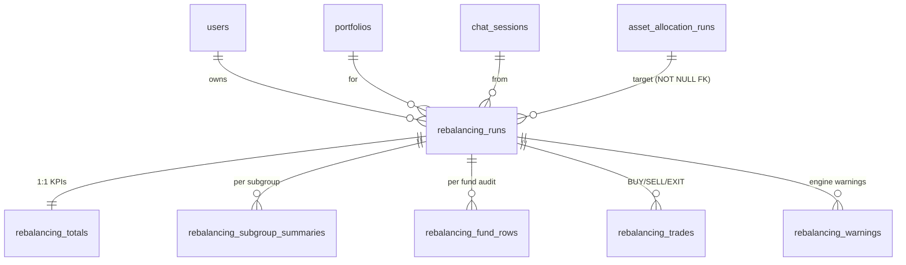

# Rebalancing Engine — DB Schema

> **Purpose.** Persist the output of the **rebalancing engine**
> (`AI_Agents/src/Rebalancing`) in a clean, fully normalized, query-friendly
> schema. The engine answers: *"Given the target allocation, which specific
> funds do I buy/sell to get there — accounting for tax, exit-load, and caps?"*
>
> The engine **always consumes** an `asset_allocation_runs` row as its target —
> enforced by a NOT NULL FK. The allocation schema lives in
> [`db_schema_asset_allocation.md`](./db_schema_asset_allocation.md).

---

## 1. What the engine emits (and where it lands)

| Output | Table |
|---|---|
| One audit row per engine execution (tax regime, knobs, corpus, request) | `rebalancing_runs` |
| Pre-aggregated KPIs (buy/sell/tax/exit-load totals + counts) | `rebalancing_totals` (1:1 with run) |
| Per-asset-subgroup aggregate (target vs current vs final) | `rebalancing_subgroup_summaries` |
| Per-fund full audit (~40 numeric columns, one row per `FundRowAfterStep5`) | `rebalancing_fund_rows` |
| Execution-ready BUY / SELL / EXIT actions | `rebalancing_trades` |
| Engine warnings (codes + messages + affected ISINs) | `rebalancing_warnings` |

---

## 2. ER diagram



---

## 3. Tables — `rebalancing_*` (6 tables)

### 3.1 `rebalancing_runs` *(master)*

Each run is **always** anchored to an `asset_allocation_runs` row.

| Column | Type | Notes |
|---|---|---|
| `id` | UUID PK | |
| `user_id` | UUID FK → `users` | CASCADE |
| `portfolio_id` | UUID FK → `portfolios` | CASCADE |
| `chat_session_id` | UUID FK → `chat_sessions` | nullable, SET NULL |
| `source_allocation_run_id` | UUID FK → `asset_allocation_runs` | **NOT NULL**, RESTRICT |
| `supersedes_id` | UUID self-FK | nullable |
| `status` | enum `pending / approved / executed / rejected` | |
| `executed_at` | timestamptz | nullable |
| `engine_request_id` | UUID | from engine |
| `engine_version` | str | |
| `computed_at` | timestamptz | when the engine ran |
| `tax_regime` | enum `old / new` | |
| `effective_tax_rate_pct` | numeric | |
| `total_corpus` | numeric | |
| `rounding_step` | int | usually 100 |
| `stcg_offset_budget_inr` | numeric | nullable |
| `carryforward_st_loss_inr / carryforward_lt_loss_inr` | numeric | |
| `knob_snapshot` | JSONB | caps + thresholds at run time |
| `request_input` | JSONB | nullable — full request audit |
| `used_cached_allocation` | bool | nullable |
| `user_question` | str | nullable |
| `created_at`, `updated_at` | timestamptz | |

### 3.2 `rebalancing_totals` *(1:1 with run)*

PK = FK = `run_id`. Pre-aggregated KPIs so dashboards / cards don't recompute.

`total_buy_inr, total_sell_inr, net_cash_flow_inr, total_stcg_realised,
total_ltcg_realised, total_stcg_net_off, total_tax_estimate_inr,
total_exit_load_inr, unrebalanced_remainder_inr, rows_count,
funds_to_buy_count, funds_to_sell_count, funds_to_exit_count, funds_held_count`

### 3.3 `rebalancing_subgroup_summaries`

One row per `(run_id, asset_subgroup)`. Mirrors `Rebalancing.models.SubgroupSummary`.

| asset_subgroup | goal_target | current | suggested_final | rebalance | total_buy | total_sell |
|---|---|---|---|---|---|---|
| `low_beta_equities` | 300 000 | 0 | 300 000 | +300 000 | 300 000 | 0 |

### 3.4 `rebalancing_fund_rows` *(per-fund full audit)*

One row per `FundRowAfterStep5` produced by the engine — **~40 numeric columns**
covering each engine pass. Indexed by `(run_id, asset_subgroup)` for the
customer-facing trade card.

Captured in groups:
- **Identity:** isin, recommended_fund, asset_subgroup, sub_category, rank, fund_rating, is_recommended
- **Targeting:** target_amount_pre_cap, max_pct, target_pre_cap_pct, target_own_capped_pct, final_target_pct, final_target_amount
- **Holding:** present_allocation_inr, invested_cost_inr, st_value_inr, st_cost_inr, lt_value_inr, lt_cost_inr
- **Exit-load:** exit_load_pct, exit_load_months, units_within_exit_load_period, current_nav, exit_load_amount
- **Decision flags:** diff, exit_flag, worth_to_change, stcg_amount, ltcg_amount
- **Pass 1 (initial trades under STCG cap):** pass1_buy_amount, pass1_sell_amount, pass1_underbuy_amount, pass1_undersell_amount, pass1_sell_lt_amount, pass1_realised_ltcg, pass1_sell_st_amount, pass1_realised_stcg, stcg_budget_remaining_after_pass1, pass1_sell_amount_no_stcg_cap, pass1_undersell_due_to_stcg_cap, pass1_blocked_stcg_value, holding_after_initial_trades
- **Pass 2 (loss-offset top-up):** stcg_offset_amount, pass2_sell_amount, pass2_undersell_amount, final_holding_amount

`UNIQUE (run_id, isin, rank)`.

### 3.5 `rebalancing_trades` *(execution-ready actions)*

| Column | Type |
|---|---|
| `id` | UUID PK |
| `run_id` | UUID FK → `rebalancing_runs` |
| `isin`, `recommended_fund`, `asset_subgroup`, `sub_category` | str |
| `action` | enum `BUY / SELL / EXIT` |
| `amount_inr` | numeric |
| `reason_code` | str (stable analytics key) |
| `reason_title`, `reason_text` | customer card content |
| `execution_status` | enum `pending / executed / skipped / failed` |
| `executed_at` | timestamptz |
| `broker_ref` | str |

### 3.6 `rebalancing_warnings`

| Column | Type |
|---|---|
| `id` | UUID PK |
| `run_id` | UUID FK → `rebalancing_runs` |
| `code` | enum: `UNREBALANCED_REMAINDER`, `BAD_FUND_DETECTED`, `STCG_BUDGET_BINDING`, `NO_HOLDINGS_FOR_RECOMMENDED_FUND` |
| `message` | text |
| `affected_isins` | text[] |

---

## 4. Quick-reference: SQL example

**"Latest rebalancing trades pending execution for user X."**
```sql
SELECT t.action, t.recommended_fund, t.amount_inr, t.reason_title
FROM   rebalancing_trades t
JOIN   rebalancing_runs r ON r.id = t.run_id
WHERE  r.user_id = $1
  AND  t.execution_status = 'pending'
  AND  r.status = 'approved'
ORDER  BY r.created_at DESC, t.action;
```

---

## 5. Integrity guarantees

1. **`rebalancing_runs.source_allocation_run_id` is NOT NULL.** Every
   rebalancing run is born from an allocation run — you can never have a trade
   plan without knowing what target it was aiming at.
2. **`rebalancing_totals` is exactly 1:1 with its run** (shared primary key).
3. **`supersedes_id` chains.** Re-runs form a linked list — old data is never
   overwritten.
4. **No JSONB-as-database.** Every analytics field has a typed column. JSONB is
   reserved for `knob_snapshot` (audit) and `request_input` (replay).

---

## 6. Summary — at a glance

| Table | Cardinality vs. run | Stores |
|---|---|---|
| `rebalancing_runs` | 1 | audit: tax regime, knobs, corpus, request |
| `rebalancing_totals` | 1:1 | pre-aggregated KPIs + counts |
| `rebalancing_subgroup_summaries` | 1:N (per subgroup) | target vs current vs final per subgroup |
| `rebalancing_fund_rows` | 1:N (per fund) | full per-fund audit, ~40 columns |
| `rebalancing_trades` | 1:N | execution-ready BUY / SELL / EXIT |
| `rebalancing_warnings` | 1:N | engine warnings |

**Linkage in:** `rebalancing_runs.source_allocation_run_id` →
`asset_allocation_runs.id` (NOT NULL) — see
[`db_schema_asset_allocation.md`](./db_schema_asset_allocation.md).
