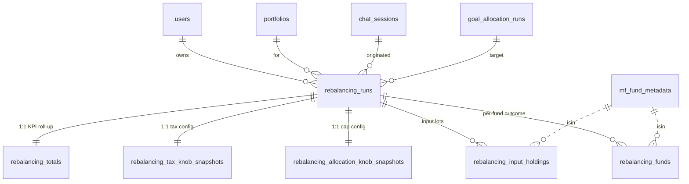

# Rebalancing — Proposed DB Schema (v2)

> **Status:** Proposal. Supersedes the rebalancing half of
> `docs/db_schema_goal_allocation_and_rebalancing.md`. The
> `goal_allocation_*` family there stays as-is; this doc redesigns
> only the `rebalancing_*` family.
>
> **Scope.** End-to-end persistence of one rebalancing pipeline
> invocation — from the *inputs the engine saw* (corpus, tax state,
> per-ISIN holding lots) through *per-fund outcomes with trade intent*
> and the *run-level KPI roll-up*.
>
> **Design goals.**
> 1. **Reproducibility.** Any run can be replayed bit-for-bit. No
>    silent dependencies on in-process state for persisted inputs.
> 2. **Immutability.** A run's outputs are write-once. Lifecycle
>    transitions (approve, reject, execute) are append-only events;
>    re-runs create a new row (no `supersedes_id` chain).
> 3. **Typed columns over JSONB.** JSONB only for two narrow uses:
>    full request replay payload, and forward-compatible knob audit.
>    Every analytics dimension is a typed column.
> 4. **Separation of tax vs allocation knobs.** Cap/spill knobs live
>    apart from tax-rate knobs so each table has a single concern.
> 5. **Per-fund row drives totals.** `rebalancing_funds` carries
>    every column that sums into `rebalancing_totals`; the totals
>    table is a denormalised 1:1 roll-up for fast card reads.
> 6. **Scale.** Hot-path queries are user-scoped and time-scoped;
>    ~20 input holdings and ~50 fund rows per run. Partition-ready
>    shapes when volume demands it.

---

## 1. What the engine actually emits — the contract we're persisting

The engine (`AI_Agents/src/Rebalancing/pipeline.py:run_rebalancing`)
consumes a `RebalancingComputeRequest` and returns a
`RebalancingComputeResponse` (`models.py:214`). The response is the
sole source of truth for what we persist:

| Engine artifact | Source class | DB family |
|---|---|---|
| Run metadata | `RebalancingRunMetadata` | `rebalancing_runs` |
| Tax knob snapshot | `KnobSnapshot` (tax fields) | `rebalancing_tax_knob_snapshots` |
| Allocation knob snapshot | `KnobSnapshot` (cap/spill fields) | `rebalancing_allocation_knob_snapshots` |
| Portfolio totals | `RebalancingTotals` | `rebalancing_totals` (1:1) |
| Per-fund outcome + trade | `TradeAction` + fund math | `rebalancing_funds` |

Plus, **upstream of the engine**, we persist the *inputs* the engine
consumed (today reconstructed on the fly from MF transactions).

| Upstream artifact | Today | Proposed DB home |
|---|---|---|
| Per-ISIN tax-aged holding lots | Rebuilt from `mf_transactions` | `rebalancing_input_holdings` |
| Engine knobs at run time | `os.getenv(...)` in `config.py` | Tax + allocation knob snapshot tables per run |

---

## 2. ER diagram

---

## 3. Table-by-table

### 3.1 `rebalancing_runs` — master row, one per pipeline invocation

One row per call to `run_rebalancing`. Write-once; lifecycle changes
go to `rebalancing_run_events` (future), not to columns on this row.

| Column | Type | Notes |
|---|---|---|
| `id` | UUID PK | Server-generated. |
| `user_id` | UUID FK → `users.id` | ON DELETE CASCADE. |
| `portfolio_id` | UUID FK → `portfolios.id` | ON DELETE CASCADE. |
| `chat_session_id` | UUID FK → `chat_sessions.id` | nullable; SET NULL. |
| `source_allocation_run_id` | UUID FK → `goal_allocation_runs.id` | **NOT NULL**, RESTRICT. The target this run was rebalancing to. |
| `status` | enum `pending / approved / rejected / executed / partially_executed / cancelled` | Denormalised tip of lifecycle events. |
| `total_corpus_inr` | numeric(18,2) | Snapshot of corpus at compute time. |
| `tax_regime` | enum `old / new` | |
| `effective_tax_rate_pct` | numeric(5,2) | |
| `rounding_step` | int | Usually 100. |
| `stcg_offset_budget_inr` | numeric(18,2) | nullable — null = unlimited. |
| `carryforward_st_loss_inr` | numeric(18,2) | |
| `carryforward_lt_loss_inr` | numeric(18,2) | |
| `used_cached_allocation` | bool | Did service.py reuse a stale allocation? |
| `user_question` | text | Original chat prompt (telemetry only). |
| `request_payload` | JSONB | **Replay-only.** Full `RebalancingComputeRequest.model_dump()`. Not queried. |
| `created_at` / `updated_at` | timestamptz | |

**Indexes**
- `(user_id, created_at DESC)` — main "show me my recent runs" query.
- `(portfolio_id, created_at DESC)`.
- `(status) WHERE status IN ('pending', 'approved')` — partial; supports approval queue.
- `(source_allocation_run_id)` — find rebalances against a given allocation.

**Why no `equity_total_pct`-style denormalised splits here?**
Anything derivable from children belongs in a view, not on the master row.

---

### 3.2 `rebalancing_tax_knob_snapshots` — 1:1 with run (tax only)

Typed snapshot of tax-related `KnobSnapshot` fields at compute time.

| Column | Type |
|---|---|
| `run_id` | UUID PK = FK → `rebalancing_runs.id` |
| `rebalance_min_change_pct` | numeric(7,4) |
| `ltcg_annual_exemption_inr` | numeric(18,2) |
| `stcg_rate_equity_pct` | numeric(7,4) |
| `ltcg_rate_equity_pct` | numeric(7,4) |
| `st_threshold_months_equity` | int |
| `st_threshold_months_debt` | int |
| `extras` | JSONB | Forward-compat for new tax knobs before the next migration. |

`CHECK` constraints: `0 <= rebalance_min_change_pct <= 100`,
`exit_floor_rating BETWEEN 1 AND 10`.

---
---> EXTRA --- AMOUL GET BACK 
### 3.3 `rebalancing_allocation_knob_snapshots` — 1:1 with run (caps & spill)

Typed snapshot of allocation-cap knobs — separate from tax so
"how often does the multi-cap cap bind?" stays a simple SQL query.

| Column | Type |
|---|---|
| `run_id` | UUID PK = FK → `rebalancing_runs.id` |
| `multi_fund_cap_pct` | numeric(7,4) |
| `others_fund_cap_pct` | numeric(7,4) |
| `multi_cap_sub_categories` | text[] |
| `extras` | JSONB | Forward-compat for new allocation knobs. |

`CHECK`: `0 <= multi_fund_cap_pct <= 100`, `0 <= others_fund_cap_pct <= 100`.

---

### 3.4 `rebalancing_input_holdings` — what the engine saw

The single biggest gap in v1: there is **no record of the holdings
that fed the engine**. They are re-derived from `mf_transactions` at
input-build time (`app/services/ai_bridge/rebalancing/holdings_ledger.py`),
and if those transactions later change (corrections, reconciliations,
late settlement), the run becomes unreproducible.

We capture the ST/LT tax-aged buckets exactly as the input builder
emitted them, per ISIN:

| Column | Type | Notes |
|---|---|---|
| `id` | UUID PK | |
| `run_id` | UUID FK → `rebalancing_runs.id` | ON DELETE CASCADE; index. |
| `isin` | varchar(20) | |
| `fund_name` | varchar(255) | |
| `asset_class` | varchar(40) | `equity` / `debt` / `other` — drives ST/LT threshold. |
| `present_allocation_inr` | numeric(18,2) | Total value at NAV-as-of. |
| `invested_cost_inr` | numeric(18,2) | |
| `st_value_inr` | numeric(18,2) | Short-term portion at NAV. |
| `st_cost_inr` | numeric(18,2) | |
| `lt_value_inr` | numeric(18,2) | Long-term portion at NAV. |
| `lt_cost_inr` | numeric(18,2) | |
| `units_within_exit_load_period` | numeric(20,6) | Sum across in-window lots. |
| `current_nav` | numeric(20,6) | NAV used by the engine for this ISIN. |
| `exit_load_pct` | numeric(7,4) | From fund metadata at run time. |
| `exit_load_months` | int | |
| `nav_as_of` | date | Trading day the NAV applies to. |
| `created_at` | timestamptz | |

`UNIQUE (run_id, isin)`.

This is the table that turns the "system" deterministic, not just
the "engine".

---

### 3.5 `rebalancing_totals` — 1:1 KPI roll-up

Mirrors `RebalancingTotals`. Every column here is the **sum** (or
count) of the matching per-fund columns on `rebalancing_funds` for
the same `run_id`. Persisted as a table (not only a view) for a
single SELECT on the customer rebalance card header.

| Column | Type | Rolled up from `rebalancing_funds` |
|---|---|---|
| `run_id` | UUID PK = FK → `rebalancing_runs.id` | |
| `total_buy_inr` | numeric(18,2) | `SUM` where `action = BUY` of `amount_inr` (or `pass1_buy_amount` where non-zero) |
| `total_sell_inr` | numeric(18,2) | `SUM` of sell/exit `amount_inr` |
| `net_cash_flow_inr` | numeric(18,2) | `total_buy_inr - total_sell_inr` |
| `total_stcg_realised` | numeric(18,2) | `SUM(pass1_realised_stcg)` |
| `total_ltcg_realised` | numeric(18,2) | `SUM(pass1_realised_ltcg)` |
| `total_stcg_net_off` | numeric(18,2) | `SUM(stcg_offset_amount)` |
| `total_tax_estimate_inr` | numeric(18,2) | derived from realised STCG/LTCG + rates at run time |
| `total_exit_load_inr` | numeric(18,2) | `SUM(exit_load_amount)` |
| `unrebalanced_remainder_inr` | numeric(18,2) | sum of `diff` where `worth_to_change = false` |
| `rows_count` | int | `COUNT(*)` |
| `funds_to_buy_count` | int | `COUNT` where `action = BUY` |
| `funds_to_sell_count` | int | `COUNT` where `action = SELL` |
| `funds_to_exit_count` | int | `COUNT` where `action = EXIT` |
| `funds_held_count` | int | `COUNT` where no trade (`action` null or `amount_inr = 0`) |

Service layer asserts totals match fund-row aggregates at persist time.

---

### 3.6 `rebalancing_funds/ trades ` — per-fund outcome (trade + roll-up keys)

One row per fund the engine touched. Combines what v1 split across
`rebalancing_fund_rows` and `rebalancing_trades`: identity, 5-step
math, trade intent, and rationale — every column needed to recompute
`rebalancing_totals` without joins to deleted audit tables.

| Column | Type | Notes |
|---|---|---|
| **Identity** | | |
| `id` | UUID PK | |
| `run_id` | UUID FK → `rebalancing_runs.id` | ON DELETE CASCADE; index. |
| `isin` | varchar(20) | Soft FK → `mf_fund_metadata.isin`. |
| `fund_name` | varchar(255) | |
| `fund_rating` | int | 1..10 |
| `asset_subgroup` | varchar(80) | |
| `sub_category` | varchar(80) | |
| `rank` | int | 0 = not in ranked list |
| `exit_floor_rating` | int | --> PLACE SHOULD BE CHANGED
| `is_recommended` | bool | |
| `recommended_fund` | bool | Engine flag for rank-1 slot. | --> NO NEED
| **Step 1 — cap & target** | | |
| `target_amount_pre_cap` | numeric(18,2) | |
| `max_pct` | numeric(7,4) | |
| `target_pre_cap_pct` | numeric(7,4) | |
| `target_own_capped_pct` | numeric(7,4) | |
| `final_target_pct` | numeric(7,4) | |
| `final_target_amount` | numeric(18,2) | |
| **Step 2 — diff & decide** | | |
| `present_allocation_inr` | numeric(18,2) | |
| `invested_cost_inr` | numeric(18,2) | |
| `diff` | numeric(18,2) | Contributes to `unrebalanced_remainder_inr` when not worth changing. |
| `exit_flag` | bool | |
| `worth_to_change` | bool | |
| **Step 3 — tax classification** | | |
| `stcg_amount` | numeric(18,2) | |
| `ltcg_amount` | numeric(18,2) | |
| `exit_load_amount` | numeric(18,2) | → `total_exit_load_inr` |
| **Step 4 — pass-1 trades** | | |
| `pass1_buy_amount` | numeric(18,2) | → `total_buy_inr` |
| `pass1_sell_amount` | numeric(18,2) | → `total_sell_inr` |
| `pass1_realised_stcg` | numeric(18,2) | → `total_stcg_realised` |
| `pass1_realised_ltcg` | numeric(18,2) | → `total_ltcg_realised` |
| `pass1_undersell_due_to_stcg_cap` | numeric(18,2) | |
| `holding_after_initial_trades` | numeric(18,2) | |
| **Step 5 — loss-offset** | | |
| `stcg_offset_amount` | numeric(18,2) | → `total_stcg_net_off` |
| `pass2_sell_amount` | numeric(18,2) | |
| `final_holding_amount` | numeric(18,2) | |
| **Trade intent (customer card)** | | |
| `action` | enum `BUY / SELL / EXIT` | nullable when hold-only row. |
| `amount_inr` | numeric(18,2) | Always ≥ 0 when set; sign is in `action`. |
| `rationale` | text | e.g. `add_to_target`, `cap_spill_buy`, `exit_low_rated`. |
| `created_at` | timestamptz | |

**Indexes**
- `(run_id, asset_subgroup)` — subgroup card.
- `(run_id, action) WHERE action IS NOT NULL` — pending buys/sells/exits.
- `(run_id, exit_flag) WHERE exit_flag` — "what would we exit?".
- `(isin, created_at DESC)` — fund-level history across runs.
- `UNIQUE (run_id, isin, rank)`.

**Constraints**
- `amount_inr > 0` when `action IS NOT NULL`.
- `rank >= 0`; `rank = 0` ⇒ `is_recommended = false`.
- `pass1_buy_amount * pass1_sell_amount = 0` (no simultaneous buy and sell on same fund).

---

## 4. Summary

**7 tables:** `rebalancing_runs`, `rebalancing_tax_knob_snapshots`,
`rebalancing_allocation_knob_snapshots`, `rebalancing_input_holdings`,
`rebalancing_totals`, `rebalancing_funds`.

Removed from v2 scope: versioned fund-ranking tables, 5-step
`rebalancing_fund_rows` audit duplicate, subgroup summaries,
rationale catalog, execution-order log, warnings, and run-events
(deferred to a later doc). `rebalancing_funds` is the single
per-fund surface; `rebalancing_totals` is the run-level roll-up
derived from it.
