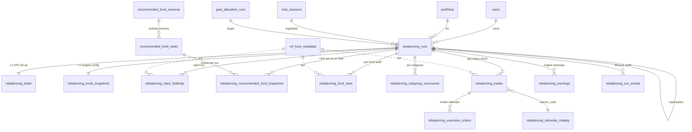

# Rebalancing — Proposed DB Schema (v2)

> **Status:** Proposal. Supersedes the rebalancing half of
> `docs/db_schema_goal_allocation_and_rebalancing.md`. The
> `goal_allocation_*` family there stays as-is; this doc redesigns
> only the `rebalancing_*` family and the supporting reference
> tables that today live in CSVs or constants.
>
> **Scope.** End-to-end persistence of one rebalancing pipeline
> invocation — from the *inputs the engine saw* (corpus, tax state,
> ranked fund list, per-ISIN holding lots) through *every
> intermediate column* of the 5-step audit trail, to the *final
> trade list with rationales* and the *broker execution log*.
>
> **Design goals.**
> 1. **Reproducibility.** Any run can be replayed bit-for-bit. No
>    silent dependencies on CSVs, env vars, or in-process state.
> 2. **Immutability.** A run's outputs are write-once. Lifecycle
>    transitions (approve, reject, execute) are append-only events;
>    re-runs create a new row chained via `supersedes_id`.
> 3. **Typed columns over JSONB.** JSONB only for two narrow uses:
>    full request replay payload, and forward-compatible knob audit.
>    Every analytics dimension is a typed column.
> 4. **Reference data is in the DB, not in code.** Fund ranking
>    (today: CSV under `fund_rank.py`), rationale text (today:
>    constant in `rationales.py`), and engine config knobs (today:
>    env vars in `Rebalancing/config.py`) are first-class tables with
>    a snapshot taken at run time.
> 5. **Separation of intent from execution.** A `rebalancing_trades`
>    row is what the engine *decided*; a `rebalancing_execution_orders`
>    row is what the broker actually *did*. One trade → many
>    execution attempts (retry, partial fill).
> 6. **Scale.** Hot-path queries are user-scoped and time-scoped;
>    tables hit ~50 fund rows per run, ~10 trades per run. At 100k
>    users × 4 runs/year × 10 years that's still <100M rows in the
>    biggest table — well within Postgres single-node limits with
>    proper indexes. Partition keys are pre-baked for when we cross
>    that bar.

---

## 1. What the engine actually emits — the contract we're persisting

The engine (`AI_Agents/src/Rebalancing/pipeline.py:run_rebalancing`)
consumes a `RebalancingComputeRequest` and returns a
`RebalancingComputeResponse` (`models.py:214`). The response is the
sole source of truth for what we persist:

| Engine artifact | Source class | DB family |
|---|---|---|
| Run metadata | `RebalancingRunMetadata` | `rebalancing_runs` |
| Knob snapshot | `KnobSnapshot` | `rebalancing_knob_snapshots` |
| Per-fund audit (5-step) | `FundRowAfterStep5` | `rebalancing_fund_rows` |
| Subgroup rollup | `SubgroupSummary` | `rebalancing_subgroup_summaries` |
| Portfolio totals | `RebalancingTotals` | `rebalancing_totals` (1:1) |
| Trade list | `TradeAction` | `rebalancing_trades` |
| Warnings | `RebalancingWarning` | `rebalancing_warnings` |

Plus, **upstream of the engine**, we need to persist the *inputs*
the engine consumed (today reconstructed on the fly from MF
transactions + a CSV fund-rank file). Without this the engine is
deterministic but the *system* is not.

| Upstream artifact | Today | Proposed DB home |
|---|---|---|
| Per-ISIN tax-aged holding lots | Rebuilt from `mf_transactions` | `rebalancing_input_holdings` |
| Ranked fund list per `asset_subgroup` | CSV in `fund_rank.py` | `recommended_fund_universe` + `recommended_fund_ranks` |
| Rationale text/title per `reason_code` | Constant in `rationales.py` | `rebalancing_rationale_catalog` |
| Engine knobs at run time | `os.getenv(...)` in `config.py` | Captured into `rebalancing_knob_snapshots` per run |

---

## 2. ER diagram

---

## 3. Table-by-table

### 3.1 `rebalancing_runs` — master row, one per pipeline invocation

One row per call to `run_rebalancing`. Write-once; lifecycle changes
go to `rebalancing_run_events`, not to columns on this row.

| Column | Type | Notes |
|---|---|---|
| `id` | UUID PK | Server-generated. |
| `user_id` | UUID FK → `users.id` | ON DELETE CASCADE. |
| `portfolio_id` | UUID FK → `portfolios.id` | ON DELETE CASCADE. |
| `chat_session_id` | UUID FK → `chat_sessions.id` | nullable; SET NULL. |
| `source_allocation_run_id` | UUID FK → `goal_allocation_runs.id` | **NOT NULL**, RESTRICT. The target this run was rebalancing to. |
| `supersedes_id` | UUID self-FK | nullable; chains re-runs.| --> TO BE REMOVED
| `status` | enum `pending / approved / rejected / executed / partially_executed / cancelled` | Denormalised tip of `rebalancing_run_events`. |
| `engine_version` | varchar(40) | Bump on logic changes — same input + version = same output. | --> TO BE REMOVED
| `engine_request_id` | UUID | The `RebalancingComputeRequest.request_id`. Useful for log correlation. | --> TO BE REMOVED
| `computed_at` | timestamptz | Wall clock when engine returned. |  --> TO BE REMOVED
| `total_corpus_inr` | numeric(18,2) | Snapshot of corpus at compute time. |
| `tax_regime` | enum `old / new` | |
| `effective_tax_rate_pct` | numeric(5,2) | |
| `rounding_step` | int | Usually 100. |
| `stcg_offset_budget_inr` | numeric(18,2) | nullable — null = unlimited. | 
| `carryforward_st_loss_inr` | numeric(18,2) | |
| `carryforward_lt_loss_inr` | numeric(18,2) | |
| `used_cached_allocation` | bool | Did service.py reuse a stale allocation? |
| `user_question` | text | Original chat prompt (telemetry only). |
| `request_payload` | JSONB | **Replay-only.** Full `RebalancingComputeRequest.model_dump()`. Not queried. |
| `created_at` / `updated_at` | timestamptz | |

**Indexes**
- `(user_id, created_at DESC)` — main "show me my recent runs" query.
- `(portfolio_id, created_at DESC)`.
- `(status) WHERE status IN ('pending', 'approved')` — partial; supports approval queue.
- `(source_allocation_run_id)` — find rebalances against a given allocation.

**Why no `equity_total_pct`-style denormalised splits here?**
The existing v1 schema doc has the user's own annotation marking
those as `DUPLICATE` for `goal_allocation_runs`. We apply the same
discipline here: anything derivable from children belongs in a view,
not on the master row.

---

### 3.2 `rebalancing_knob_snapshots` — 1:1 with run

Today: `KnobSnapshot` is dumped into a JSONB blob on
`rebalancing_runs.knob_snapshot`. We promote it: one typed column
per knob so analytics like "how often does the multi-cap cap bind?"
becomes a regular SQL query.

| Column | Type |
|---|---|
| `run_id` | UUID PK = FK → `rebalancing_runs.id` |
| `multi_fund_cap_pct` | numeric(7,4) | --> NO TAX
| `others_fund_cap_pct` | numeric(7,4) |--> NO TAX
| `rebalance_min_change_pct` | numeric(7,4) |
| `exit_floor_rating` | int |
| `ltcg_annual_exemption_inr` | numeric(18,2) |
| `stcg_rate_equity_pct` | numeric(7,4) |
| `ltcg_rate_equity_pct` | numeric(7,4) |
| `st_threshold_months_equity` | int |
| `st_threshold_months_debt` | int |
| `multi_cap_sub_categories` | text[] | --> NO TAX
| `extras` | JSONB | Forward-compat for new knobs added in code before the next migration. |

A SQL `CHECK` constraint enforces sane bounds (`0 <= *_cap_pct <= 100`,
`exit_floor_rating BETWEEN 1 AND 10`).

---

### 3.3 `rebalancing_input_holdings` — what the engine saw

The single biggest gap in v1: there is **no record of the holdings
that fed the engine**. They are re-derived from `mf_transactions` at
input-build time (`app/services/ai_bridge/rebalancing/holdings_ledger.py`),
and if those transactions later change (corrections, reconciliations,
late settlement), the run becomes unreproducible.

We capture the ST/LT tax-aged buckets exactly as the input builder
emitted them, per ISIN:

| Column | Type | Notes |
|---|---|---|
| `id` | UUID PK | |
| `run_id` | UUID FK → `rebalancing_runs.id` | ON DELETE CASCADE; index. |
| `isin` | varchar(20) | |
| `fund name` | varchar(40) | --> NEW
| `asset_class` | varchar(40) | `equity` / `debt` /  `other` — drives ST/LT threshold. |
| `present_allocation_inr` | numeric(18,2) | Total value at NAV-as-of. |
| `invested_cost_inr` | numeric(18,2) | |
| `st_value_inr` | numeric(18,2) | Short-term portion at NAV. |
| `st_cost_inr` | numeric(18,2) | |
| `lt_value_inr` | numeric(18,2) | Long-term portion at NAV. |
| `lt_cost_inr` | numeric(18,2) | |
| `units_within_exit_load_period` | numeric(20,6) | Sum across in-window lots. |
| `current_nav` | numeric(20,6) | NAV used by the engine for this ISIN. |
| `exit_load_pct` | numeric(7,4) | From fund metadata at run time. | --> JSON time month % : exit_load
| `exit_load_months` | int | |
| `nav_as_of` | date | Trading day the NAV applies to. |
| `created_at` | timestamptz | |

`UNIQUE (run_id, isin)`.

This is the table that turns the "system" deterministic, not just
the "engine".

---
------------------ NOT USEFUL  UPTO --------------------------------------------------------------
### 3.4 `recommended_fund_universe` + `recommended_fund_ranks` — fund ranking, in DB

Today `app/services/ai_bridge/rebalancing/fund_rank.py` loads a
static CSV — the source of truth for "which fund occupies rank 1 in
`flexi_cap`". Move it to the DB so research can rev rankings without
a deploy, and history is queryable.

**`recommended_fund_universe`** — versioned ranking sets.

| Column | Type |
|---|---|
| `id` | UUID PK |
| `version_label` | varchar(40) unique | e.g. `2025Q4_v1` |
| `effective_from` | date |
| `effective_to` | date NULL | NULL = currently active version |
| `published_by` | text | Research desk handle. |
| `notes` | text |
| `created_at` | timestamptz |

**`recommended_fund_ranks`** — the rows.

| Column | Type | Notes |
|---|---|---|
| `id` | UUID PK | |
| `universe_id` | UUID FK → `recommended_fund_universe.id` | |
| `asset_subgroup` | varchar(80) | |
| `sub_category` | varchar(80) | |
| `isin` | varchar(20) | FK to `mf_fund_metadata.isin` (soft FK if `mf_fund_metadata` keys on something else). |
| `rank` | int | 1..N within `(universe_id, asset_subgroup)`. |
| `fund_name` | varchar(255) | Denormalised for display stability. |
| `fund_rating` | int | 1..10 |
| `created_at` | timestamptz | |

`UNIQUE (universe_id, asset_subgroup, rank)` and
`UNIQUE (universe_id, asset_subgroup, isin)`.

Index `(asset_subgroup, rank)` on the active version is what
`fund_rank.get_fund_ranking` uses; one partial index keeps it fast:
`WHERE effective_to IS NULL`.

**`rebalancing_recommended_fund_snapshots`** — what *this run* saw.

Even with versioned universes, a run still freezes the rank set it
used so re-runs against a newer universe are an explicit, traceable
choice — not a silent change.

| Column | Type |
|---|---|
| `id` | UUID PK |
| `run_id` | UUID FK → `rebalancing_runs.id` |
| `universe_id` | UUID FK → `recommended_fund_universe.id` |
| `asset_subgroup` | varchar(80) |
| `sub_category` | varchar(80) |
| `isin` | varchar(20) |
| `rank` | int |
| `fund_name` | varchar(255) |
| `fund_rating` | int |

`UNIQUE (run_id, asset_subgroup, rank)`.

---

### 3.5 `rebalancing_fund_rows` — the 5-step audit trail

One row per `FundRowAfterStep5`. This is the existing v1 table with
two changes:

1. **FK to `mf_fund_metadata` on `isin`** for catalog enrichment in
   read queries. (Today the engine doesn't enforce this — but the
   write path can, and silent ISIN typos are worth catching.)
2. **`recommended_fund_snapshot_id` FK** linking the row back to the
   exact universe entry that produced it (rank-1 vs spillover, low-rated
   etc. — answers "why was this ISIN even in the run?").

Columns (grouped — every field on `FundRowAfterStep5` ends up as a
typed column, as in v1):

- **Identity & status:** `id`, `run_id` (FK), `isin`, `recommended_fund`,
  `asset_subgroup`, `sub_category`, `rank`, `fund_rating`,
  `is_recommended`, `recommended_fund_snapshot_id` (nullable FK).
- **Step 1 — cap & spill:** `target_amount_pre_cap`, `max_pct`,
  `target_pre_cap_pct`, `target_own_capped_pct`, `final_target_pct`,
  `final_target_amount`.
- **Step 2 — diff & decide:** `present_allocation_inr`,
  `invested_cost_inr`, `diff`, `exit_flag`, `worth_to_change`.
- **Holding tax-aging (mirror of `rebalancing_input_holdings`,
  denormalised for join-free analytics on fund rows):** `st_value_inr`,
  `st_cost_inr`, `lt_value_inr`, `lt_cost_inr`,
  `units_within_exit_load_period`, `current_nav`,
  `exit_load_pct`, `exit_load_months`.
- **Step 3 — tax classification:** `stcg_amount`, `ltcg_amount`,
  `exit_load_amount`.
- **Step 4 — pass-1 trades under STCG cap:** `pass1_buy_amount`,
  `pass1_underbuy_amount`, `pass1_sell_amount`, `pass1_undersell_amount`,
  `pass1_sell_lt_amount`, `pass1_realised_ltcg`,
  `pass1_sell_st_amount`, `pass1_realised_stcg`,
  `stcg_budget_remaining_after_pass1`,
  `pass1_sell_amount_no_stcg_cap`,
  `pass1_undersell_due_to_stcg_cap`, `pass1_blocked_stcg_value`,
  `holding_after_initial_trades`.
- **Step 5 — loss-offset top-up:** `stcg_offset_amount`,
  `pass2_sell_amount`, `pass2_undersell_amount`, `final_holding_amount`.
- **Audit:** `created_at`.

**Indexes**
- `(run_id, asset_subgroup)` — drives the customer trade card.
- `(run_id, exit_flag) WHERE exit_flag` — "what would we exit?".
- `(isin)` — fund-level analytics across runs.
- `UNIQUE (run_id, isin, rank)`.

> **Why duplicate the holding tax-aging columns here when
> `rebalancing_input_holdings` exists?** Because every customer-card
> render and every chart query touches fund rows. Joining a 50-row
> table to a 50-row table per request to fetch `current_nav` is fine;
> joining it to compute realised STCG per row twice across a million-row
> fund-row table for an analyst dashboard is not. We pay one wide table
> in exchange for join-free reads.

---
------------------  THIS  --------------------------------------------------------------
### 3.6 `rebalancing_subgroup_summaries` — per-asset_subgroup roll-up  --> delete

Unchanged from v1 — already mirrors `SubgroupSummary` cleanly.
One row per `(run_id, asset_subgroup)`. Captures
`goal_target_inr`, `current_holding_inr`, `suggested_final_holding_inr`,
`rebalance_inr`, `total_buy_inr`, `total_sell_inr`, and the three
rank counters.

`UNIQUE (run_id, asset_subgroup)`.

---

### 3.7 `rebalancing_totals` — 1:1 KPI roll-up

Unchanged from v1. `total_buy_inr`, `total_sell_inr`,
`net_cash_flow_inr`, `total_stcg_realised`, `total_ltcg_realised`,
`total_stcg_net_off`, `total_tax_estimate_inr`,
`total_exit_load_inr`, `unrebalanced_remainder_inr`, `rows_count`,
`funds_to_buy_count`, `funds_to_sell_count`, `funds_to_exit_count`,
`funds_held_count`. PK = FK = `run_id`.

This roll-up could be a view; it's a table for read latency on
"show me my last rebalance card" — a single SELECT against
`rebalancing_totals` covers the whole card header.

---
------------------  UPP 2 CAN BE GROUPED  --------------------------------------------------------------
------------------  NO USE  --------------------------------------------------------------
### 3.8 `rebalancing_rationale_catalog` — reason texts, in DB

Today `AI_Agents/src/Rebalancing/rationales.py` is a Python dict.
The engine emits `reason_code`, `reason_title`, `reason_text` on
every `TradeAction`. v1 stores all three on the trade row, which
duplicates the title and text across thousands of rows whose only
varying axis is `reason_code`.

Promote it to a catalog:

| Column | Type | Notes |
|---|---|---|
| `reason_code` | varchar(80) PK | `add_to_target`, `cap_spill_buy`, `trim_over_target`, `exit_bad_fund`, `exit_low_rated`, plus future codes. |
| `version` | int | Bump when the copy is revised — old trade rows still resolve to the historical title/text. |
| `is_active` | bool | Soft-deprecate codes without breaking history. |
| `default_action` | enum `BUY / SELL / EXIT` | Documents the action the engine emits this code with. |
| `title_template` | text | |
| `text_template` | text | One-sentence customer-card body. |
| `created_at` | timestamptz | |
| `updated_at` | timestamptz | |

The engine still produces `reason_code` and the persistence layer
resolves title/text from this table at write time (and snapshots them
onto the trade row — see next section — so display copy is stable
across catalog edits).

`UNIQUE (reason_code, version)`.

---
------------------  THIS  --------------------------------------------------------------
### 3.9 `rebalancing_trades` — the recommendation rows --> FUND 

What the engine *decided* to do. Mirrors `TradeAction` plus snapshotted
display copy + a link to the source fund row.

| Column | Type | Notes |
|---|---|---|
| `id` | UUID PK | |
| `run_id` | UUID FK → `rebalancing_runs.id` | ON DELETE CASCADE; index. |
| `fund_row_id` | UUID FK → `rebalancing_fund_rows.id` | The audit row this trade was derived from. |
| `isin` | varchar(20) | |
| `fund_name` | varchar(255) | |
| `fund rating` | --> NEW
| `asset_subgroup` | varchar(80) | |
| `sub_category` | varchar(80) | |
| `action` | enum `BUY / SELL / EXIT` | |
| `amount_inr` | numeric(18,2) | Always > 0. Sign is in `action`. |
| `reason_code` | varchar(80) FK → `rebalancing_rationale_catalog.reason_code` | |
| `rationale_version` | int | The version of the catalog row in force at run time. |
| `reason_title_snapshot` | varchar(160) | Frozen title shown to the customer. |
| `reason_text_snapshot` | text | Frozen body. |
| `priority_order` | int | Render order — biggest sells first, then biggest buys. | --> DELETE
| `created_at` | timestamptz | |
ADD ALL KEYS WHICH WILL USED TO CALCULATE TOTAL 
rationale

**Indexes**
- `(run_id, priority_order)` — render order for the customer card.
- `(run_id, action)` — partial indexes per action support "all my
  pending exits".
- `(isin, created_at DESC)` — "show me every recommendation we ever
  made for this fund".

**No execution status here.** v1 mixed intent and execution onto one
row. Pulled apart in 3.10.

---

### 3.10 `rebalancing_execution_orders` — broker-side execution log

A `rebalancing_trades` row is *what we recommended*. A broker
execution is *what was attempted*. There's a 1:many relationship —
a trade may be retried, partially filled, cancelled, or split across
brokers. Keeping them separate means we never lose history on a retry.

| Column | Type | Notes |
|---|---|---|
| `id` | UUID PK | |
| `trade_id` | UUID FK → `rebalancing_trades.id` | ON DELETE RESTRICT. |
| `attempt_number` | int | 1-indexed, monotonic per `trade_id`. |
| `broker_code` | varchar(40) | e.g. `bse_star`, `nsenmf`. |
| `broker_order_id` | varchar(120) | Returned by broker. |
| `amount_requested_inr` | numeric(18,2) | Could differ from the trade's amount on retry. |
| `amount_filled_inr` | numeric(18,2) | Final fill. |
| `units_filled` | numeric(20,6) | If broker returns it. |
| `executed_nav` | numeric(20,6) | NAV at fill. |
| `status` | enum `submitted / accepted / filled / partially_filled / rejected / cancelled / failed` | |
| `error_code` | varchar(80) | Broker error, nullable. |
| `error_message` | text | Broker error body, nullable. |
| `submitted_at` | timestamptz | |
| `settled_at` | timestamptz | nullable. |
| `raw_response` | JSONB | Full broker payload (replay-only). |
| `created_at` | timestamptz | |

`UNIQUE (trade_id, attempt_number)`.
Index `(broker_order_id) WHERE broker_order_id IS NOT NULL` for
broker-callback dedup.

**Trade lifecycle is derived,** not stored on the trade row:

- `pending` — no execution rows yet.
- `partially_filled` — at least one row with `filled` but
  `amount_filled_inr < trade.amount_inr`.
- `executed` — sum of `amount_filled_inr` across attempts ≥
  `trade.amount_inr`.
- `failed` / `cancelled` — terminal status on the most-recent attempt.

A small materialised view (`rebalancing_trade_execution_state`)
refreshed on order-write cleans up the dashboard query.

---
/// 3.11 CAN BE MERGED INTO SOMETABLE ( like main )
### 3.11 `rebalancing_warnings`

Unchanged from v1. `code` (enum), `message` (text),
`affected_isins` (text[]). Indexed on `(run_id, code)`.

---
------------------      END    --------------------------------------------------------------
### 3.12 `rebalancing_run_events` — lifecycle audit (append-only)

Replaces v1's mutable `status` column logic. The current `status`
lives on `rebalancing_runs` for fast filtering, but **every transition
also writes an event row** so we can answer "who approved this and
when".

| Column | Type | Notes |
|---|---|---|
| `id` | UUID PK | |
| `run_id` | UUID FK → `rebalancing_runs.id` | |
| `event_type` | enum `created / approved / rejected / executed / partially_executed / cancelled / superseded / failed` | |
| `actor_user_id` | UUID FK → `users.id` | nullable for system events. |
| `actor_kind` | enum `customer / advisor / system / scheduler` | |
| `from_status` | varchar(40) | nullable for `created`. |
| `to_status` | varchar(40) | |
| `notes` | text | nullable. |
| `metadata` | JSONB | nullable — execution batch id, broker reference, scheduler id. |
| `created_at` | timestamptz | |

Index `(run_id, created_at)`.

The denormalised `rebalancing_runs.status` is updated in the same
transaction as the event row by an `AFTER INSERT` trigger or
service-layer write — pick one and document it; do not do both.

---

## 4. Helper views (read-side ergonomics)

Views, not tables — they're cheap, always-fresh, and keep callers
out of multi-table joins they'd otherwise hand-roll.

**`v_rebalancing_run_summary`** — one row per run, joining
`rebalancing_runs + rebalancing_totals + knob_snapshots`. The card
the customer sees on the "your rebalance" page.

**`v_rebalancing_trade_with_execution`** — one row per
`rebalancing_trades` with derived `execution_status`,
`total_filled_inr`, `last_attempt_at`. Backs the trade-list UI.

**`v_rebalancing_subgroup_audit`** — joins
`rebalancing_subgroup_summaries` with the
`rebalancing_recommended_fund_snapshots` rows for that subgroup, so
"show me every ranked fund in this subgroup and what we did with
each" is a single query.

---

## 5. Constraints, integrity, and invariants enforced by the schema

| Invariant | How enforced |
|---|---|
| Every run targets exactly one allocation. | `source_allocation_run_id NOT NULL` + FK RESTRICT. |
| A run can't be deleted if it has executed trades. | FK from `rebalancing_execution_orders.trade_id` is RESTRICT. |
| Trade actions are exactly one of BUY/SELL/EXIT. | DB enum. |
| `amount_inr > 0` on trades. | CHECK constraint. |
| `rank >= 0` on fund rows; rank 0 ⇔ `is_recommended = false`. | CHECK constraint. |
| `final_target_amount >= 0` and ≤ `total_corpus_inr × max_pct%`. | CHECK constraint (with tolerance for rounding). |
| `pass1_buy_amount * pass1_sell_amount = 0` (a fund either buys or sells per run, never both). | CHECK constraint. |
| Trade `amount_inr` matches its source `fund_row` math. | Service-layer assertion at persist time + unit-test in the bridge — too dynamic for a DB CHECK. |
| `executed_at` set ⇒ `status IN ('executed','partially_executed','failed')`. | CHECK constraint on `rebalancing_runs`. |
| Engine version captured. | `engine_version NOT NULL`. |

---

## 6. Indexing strategy (hot-path queries)

| Query | Index |
|---|---|
| Latest 10 rebalances for a user | `rebalancing_runs (user_id, created_at DESC)` |
| Approval queue (advisor) | partial `(status) WHERE status='pending'` |
| "All my pending BUYs across runs" | `rebalancing_trades (run_id, action)` joined to derived state |
| Per-fund history | `rebalancing_fund_rows (isin)` + `rebalancing_trades (isin, created_at DESC)` |
| Broker callback dedup | `rebalancing_execution_orders (broker_order_id) WHERE broker_order_id IS NOT NULL` |
| Engine cohort analytics (which knob set was in effect for a run cohort?) | `rebalancing_knob_snapshots (multi_fund_cap_pct, exit_floor_rating)` |
| Lifecycle audit | `rebalancing_run_events (run_id, created_at)` |

GIN on `request_payload`, `extras`, `metadata`, `raw_response` JSONB
columns is **not** added by default — those columns are explicitly
replay/audit-only. Add a GIN only when a real analytics query needs it.

---

## 7. Scaling notes

**Volume estimate (10-year horizon, 100k active customers).**

| Table | Rows per run | Annual rate per user | Steady-state row count |
|---|---:|---:|---:|
| `rebalancing_runs` | 1 | 4 | ~4M |
| `rebalancing_totals` | 1 | 4 | ~4M |
| `rebalancing_knob_snapshots` | 1 | 4 | ~4M |
| `rebalancing_input_holdings` | ~20 | 4 | ~80M |
| `rebalancing_fund_rows` | ~50 | 4 | ~200M |
| `rebalancing_subgroup_summaries` | ~7 | 4 | ~28M |
| `rebalancing_trades` | ~10 | 4 | ~40M |
| `rebalancing_execution_orders` | ~12 | 4 | ~48M |
| `rebalancing_warnings` | ~2 | 4 | ~8M |
| `rebalancing_run_events` | ~5 | 4 | ~20M |

`rebalancing_fund_rows` and `rebalancing_input_holdings` are the
ones that grow fastest. Two mitigations baked in:

1. **`run_id` is the natural partition key.** When we cross ~200M
   rows the tables become candidates for **range partitioning by
   `created_at`** (monthly partitions); the schema is designed to
   make that a non-breaking change (no cross-partition FKs from the
   master to the children — all FKs go *into* `rebalancing_runs`).
2. **Cold runs (> 1 year, terminal status) are archive-eligible.**
   A cold-storage move with the same shape (`rebalancing_runs_archive`
   etc.) keeps the hot tables lean. Defer until volume actually
   demands it.

**Read patterns are user-scoped.** Every customer-facing query
filters by `user_id` (directly on the master) or by `run_id`
(uniquely identifying one user's run). Sharding by `user_id` is
trivial when the day comes.

---

## 8. What this proposal changes vs v1

| Area | v1 | v2 |
|---|---|---|
| Knob audit | JSONB blob on `rebalancing_runs.knob_snapshot` | Typed `rebalancing_knob_snapshots` |
| Input holdings | Not persisted (re-derived) | `rebalancing_input_holdings` |
| Fund ranking | CSV in `fund_rank.py` | `recommended_fund_universe` + `_ranks`, snapshotted per run |
| Rationale strings | Constant in `rationales.py`, copied onto every trade | Catalog + snapshot on each trade |
| Trade execution | `execution_status` column on `rebalancing_trades` + single `broker_ref` | `rebalancing_execution_orders` 1:many (retries, partial fills, raw broker payload) |
| Lifecycle audit | mutable `status` column only | mutable `status` *plus* `rebalancing_run_events` append-only log |
| FK to `mf_fund_metadata` | not enforced | enforced on fund rows / trades / holdings |
| CHECK constraints | minimal | sign, bounds, mutual-exclusion (`pass1_buy * pass1_sell = 0`) baked in |
| Read views | none | `v_rebalancing_run_summary`, `v_rebalancing_trade_with_execution`, `v_rebalancing_subgroup_audit` |

---

## 9. Migration phasing

Designed as three independent Alembic revisions so each can land,
soak, and be rolled back independently.

**Phase 1 — backfill-safe additions (zero-downtime).**
- New tables: `rebalancing_knob_snapshots`, `rebalancing_input_holdings`,
  `rebalancing_rationale_catalog`, `recommended_fund_universe`,
  `recommended_fund_ranks`, `rebalancing_recommended_fund_snapshots`,
  `rebalancing_run_events`.
- Seed `rebalancing_rationale_catalog` from the constant in
  `rationales.py`.
- Seed `recommended_fund_universe` + `recommended_fund_ranks` from
  the current CSV; mark this version `effective_to = NULL`.
- New columns on `rebalancing_runs` and `rebalancing_fund_rows`
  (`recommended_fund_snapshot_id`, etc.) — nullable; the writer
  starts populating them. Existing reads ignore them.

**Phase 2 — switch the writer.**
- Service-layer `rebalancing_recommendation_persist.py` starts
  writing the new tables alongside the old ones.
- `fund_rank.py` and `rationales.py` continue to work, but their
  reads are now backed by DB queries (with a CSV/constant fallback
  while migration is rolling).

**Phase 3 — drop / split.**
- Move `execution_status / executed_at / broker_ref` off
  `rebalancing_trades` into `rebalancing_execution_orders` (1
  attempt per existing row at migration time).
- Drop `rebalancing_runs.knob_snapshot` JSONB after data is in the
  typed table.
- Drop the `status_enum` value on `rebalancing_runs` that no longer
  fits (e.g. add `partially_executed` and `cancelled`).

Each phase has its own down-migration that puts the data back into
the old shape (modulo deleted history, which is preserved by phase
boundaries — nothing destructive happens before its down-migration
exists).

---

## 10. Open questions for the team

1. **Multi-leg execution.** Some recommended trades may span more
   than one broker (e.g. one ISIN is direct, another is regular plan).
   Is `rebalancing_execution_orders` per-broker-attempt sufficient,
   or do we need an explicit `execution_batch` parent?
2. **SIP-vs-lump-sum** dimension on trades. Today the engine emits a
   single `amount_inr`. If we ever recommend "spread this over 6
   months via SIP", we need a `cadence` field on the trade — leave a
   nullable `execution_cadence` column even if it's unused on day 1?
3. **NAV-as-of vs trade date.** A trade approved today and executed
   tomorrow uses a different NAV. We capture both (`current_nav` on
   the fund row at compute time; `executed_nav` on the execution
   order) — confirm this is enough for reconciliation.
4. **GST + brokerage estimates.** The engine emits `total_tax_estimate_inr`
   but no transaction-cost estimate. Worth adding a `costs_estimate`
   sub-block to `rebalancing_totals` (brokerage, GST, stamp duty) or
   defer until the broker rate card is available?
5. **Goal-level attribution.** A rebalance touches the bucket
   targets, which are themselves goal-tagged in
   `goal_allocation_bucket_goals`. Do we need a
   `rebalancing_trade_goal_attribution` table that splits each trade
   across the contributing goals? Useful for the "which goals are we
   funding with this rebalance?" view; not required for execution.

---

## 11. Summary

13 tables (vs v1's 6), three views. The expansion is concentrated in
inputs (holdings, ranked fund universe, rationale catalog) and
execution (broker orders, lifecycle events) — not in the engine's
audit trail, which v1 already captures correctly. The result is a
system that is **reproducible** (every byte of engine input is
persisted), **observable** (every state transition is logged), and
**scalable** (typed columns, hot-path indexes, partition-ready row
shapes) — without trading away the relational discipline that made
v1 a clean replacement for the old JSONB-as-database tables.
