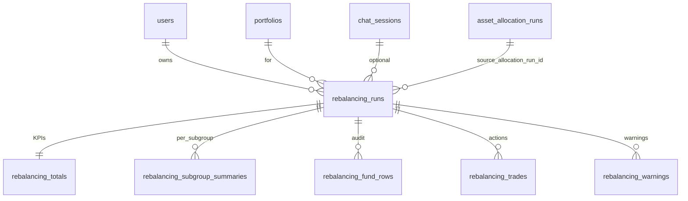
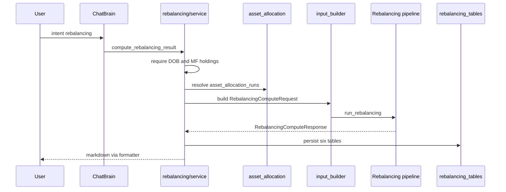

# Rebalancing — database structure

> **Purpose.** Persist the output of the rebalancing engine (`AI_Agents/src/Rebalancing`) in six normalized PostgreSQL tables. The engine answers: *given a goal-based target allocation and current holdings, which funds do we buy, sell, or exit — accounting for per-fund caps, tax, and exit load?*
>
> **ORM reference:** `app/models/rebalancing/`  
> **Persist layer:** `app/services/rebalancing_recommendation_persist.py`  
> **Engine I/O:** `RebalancingComputeRequest` → `RebalancingComputeResponse`

This document defines **rebalancing output tables only**. It does not duplicate schemas for upstream inputs.

---

## Upstream dependencies (read at compute time)

Rebalancing **writes** only the six `rebalancing_*` tables below. At runtime it **reads** these external sources (not documented here in full):

| Role | Source | What is consumed |
|------|--------|------------------|
| Target allocation | `asset_allocation_runs`, `asset_allocation_bucket_subgroups` | Approved run header; per–`asset_subgroup` INR targets (sum `actual_amount` by `subgroup`) |
| Fund picks (rank 1–3) | `mf_recommended_funds` *(planned)* | ISIN + fund name per `(asset_subgroup, rank)`; ingest from `Prozpr_fund_ranking.csv` / `mf_ranking_final.xlsx` until an automated rating pipeline exists |
| Fund quality (exit floor) | `mf_fund_ratings` via `mf_fund_metadata` | Map `our_rating_parameter_*` → engine `fund_rating` (1–10); rating &lt; floor → forced exit |
| Holdings & pricing | `mf_transactions`, `mf_nav_history`, `mf_fund_metadata` | FIFO lots, latest NAV, exit-load fields |
| Tax & aging | `tax_profiles`, `users.date_of_birth` | Regime, carryforward losses, STCG budget, lot ST/LT classification |

**Hard link:** every `rebalancing_runs` row must reference the allocation run it rebalanced toward:

`rebalancing_runs.source_allocation_run_id` → `asset_allocation_runs.id` (**NOT NULL**, `ON DELETE RESTRICT`).

Allocation table reference: `app/models/asset_allocation/TABLES.md`.

---

## ER diagram



---

## Postgres enums

| Enum name | Values | Used on |
|-----------|--------|---------|
| `rebalancing_run_status_enum` | `pending`, `approved`, `executed`, `rejected` | `rebalancing_runs.status` |
| `rebalancing_tax_regime_enum` | `old`, `new` | `rebalancing_runs.tax_regime` |
| `rebalancing_trade_action_enum` | `BUY`, `SELL`, `EXIT` | `rebalancing_trades.action` |
| `rebalancing_trade_execution_status_enum` | `pending`, `executed`, `skipped`, `failed` | `rebalancing_trades.execution_status` |
| `rebalancing_warning_code_enum` | `UNREBALANCED_REMAINDER`, `BAD_FUND_DETECTED`, `STCG_BUDGET_BINDING`, `NO_HOLDINGS_FOR_RECOMMENDED_FUND` | `rebalancing_warnings.code` |

---

## Table 1 — `rebalancing_runs`

One row per engine execution (master / audit header).

| Column | Type | Nullable | Notes |
|--------|------|----------|-------|
| `id` | `UUID` | PK | |
| `user_id` | `UUID` | NOT NULL | FK → `users.id`, `ON DELETE CASCADE` |
| `portfolio_id` | `UUID` | NOT NULL | FK → `portfolios.id`, `ON DELETE CASCADE` |
| `chat_session_id` | `UUID` | YES | FK → `chat_sessions.id`, `ON DELETE SET NULL` |
| `source_allocation_run_id` | `UUID` | NOT NULL | FK → `asset_allocation_runs.id`, `ON DELETE RESTRICT` |
| `supersedes_id` | `UUID` | YES | Self-FK → `rebalancing_runs.id`, `ON DELETE SET NULL` |
| `status` | `rebalancing_run_status_enum` | NOT NULL | Default `pending` |
| `executed_at` | `timestamptz` | YES | Set when status → `executed` |
| `engine_request_id` | `UUID` | NOT NULL | Correlates with engine `request_id` |
| `engine_version` | `varchar(40)` | NOT NULL | Semver of `AI_Agents/src/Rebalancing` |
| `computed_at` | `timestamptz` | NOT NULL | UTC timestamp from engine |
| `tax_regime` | `rebalancing_tax_regime_enum` | NOT NULL | |
| `effective_tax_rate_pct` | `numeric(5,2)` | NOT NULL | |
| `total_corpus` | `numeric(18,2)` | NOT NULL | Sum of held market values at compute |
| `rounding_step` | `integer` | NOT NULL | Default `100` |
| `stcg_offset_budget_inr` | `numeric(18,2)` | YES | Optional STCG cap for Pass 1 |
| `carryforward_st_loss_inr` | `numeric(18,2)` | NOT NULL | Default `0` |
| `carryforward_lt_loss_inr` | `numeric(18,2)` | NOT NULL | Default `0` |
| `knob_snapshot` | `jsonb` | NOT NULL | Caps, thresholds, tax rates at run time |
| `request_input` | `jsonb` | YES | Full `RebalancingComputeRequest` replay |
| `used_cached_allocation` | `boolean` | YES | `true` if allocation was reused vs re-run |
| `user_question` | `varchar(2000)` | YES | Chat prompt that triggered the run |
| `created_at` | `timestamptz` | NOT NULL | Server default `now()` |
| `updated_at` | `timestamptz` | NOT NULL | Server default `now()`, on update |

**Indexes**

| Name | Columns |
|------|---------|
| `ix_rebalancing_runs_user_id` | `user_id` |
| `ix_rebalancing_runs_portfolio_id` | `portfolio_id` |
| `ix_rebalancing_runs_chat_session_id` | `chat_session_id` |
| `ix_rebalancing_runs_source_allocation_run_id` | `source_allocation_run_id` |

---

## Table 2 — `rebalancing_totals`

Strict **1:1** with `rebalancing_runs` — primary key is also the foreign key.

| Column | Type | Nullable | Notes |
|--------|------|----------|-------|
| `run_id` | `UUID` | PK, FK | → `rebalancing_runs.id`, `ON DELETE CASCADE` |
| `total_buy_inr` | `numeric(18,2)` | NOT NULL | |
| `total_sell_inr` | `numeric(18,2)` | NOT NULL | |
| `net_cash_flow_inr` | `numeric(18,2)` | NOT NULL | ≈ 0 in v1 (closed system) |
| `total_stcg_realised` | `numeric(18,2)` | NOT NULL | |
| `total_ltcg_realised` | `numeric(18,2)` | NOT NULL | |
| `total_stcg_net_off` | `numeric(18,2)` | NOT NULL | Losses applied |
| `total_tax_estimate_inr` | `numeric(18,2)` | NOT NULL | |
| `total_exit_load_inr` | `numeric(18,2)` | NOT NULL | |
| `unrebalanced_remainder_inr` | `numeric(18,2)` | NOT NULL | Cap/spill overflow not placed |
| `rows_count` | `integer` | NOT NULL | Fund rows in engine output |
| `funds_to_buy_count` | `integer` | NOT NULL | |
| `funds_to_sell_count` | `integer` | NOT NULL | |
| `funds_to_exit_count` | `integer` | NOT NULL | |
| `funds_held_count` | `integer` | NOT NULL | No trade (`worth_to_change = false`) |

---

## Table 3 — `rebalancing_subgroup_summaries`

One row per `(run_id, asset_subgroup)` — roll-up for dashboards and chat facts.

| Column | Type | Nullable | Notes |
|--------|------|----------|-------|
| `id` | `UUID` | PK | |
| `run_id` | `UUID` | NOT NULL | FK → `rebalancing_runs.id`, `ON DELETE CASCADE` |
| `asset_subgroup` | `varchar(80)` | NOT NULL | e.g. `low_beta_equities` |
| `goal_target_inr` | `numeric(18,2)` | NOT NULL | From allocation subgroup target |
| `current_holding_inr` | `numeric(18,2)` | NOT NULL | |
| `suggested_final_holding_inr` | `numeric(18,2)` | NOT NULL | After engine sizing |
| `rebalance_inr` | `numeric(18,2)` | NOT NULL | Signed gap |
| `total_buy_inr` | `numeric(18,2)` | NOT NULL | |
| `total_sell_inr` | `numeric(18,2)` | NOT NULL | |
| `ranks_total` | `integer` | NOT NULL | Recommended rank slots |
| `ranks_with_holding` | `integer` | NOT NULL | |
| `ranks_with_action` | `integer` | NOT NULL | |
| `created_at` | `timestamptz` | NOT NULL | |

**Constraints & indexes**

| Name | Definition |
|------|------------|
| `uq_rebalancing_subgroup_summaries_run_subgroup` | `UNIQUE (run_id, asset_subgroup)` |
| `ix_rebalancing_subgroup_summaries_run_id` | Index on `run_id` |

---

## Table 4 — `rebalancing_fund_runs`

Full per-fund audit trail — one row per `FundRowAfterStep5` (`run_id`, `isin`, `rank`).

### Identity & policy

| Column | Type | Notes |
|--------|------|-------|
| `id` | `UUID` PK | |
| `run_id` | `UUID` FK | → `rebalancing_runs.id`, `CASCADE` |
| `isin` | `varchar(20)` | |
| `recommended_fund` | `varchar(255)` | Display name |
| `asset_subgroup` | `varchar(80)` | |
| `sub_category` | `varchar(80)` | |
| `rank` | `integer` | ≥1 recommended; `0` = held but not recommended (BAD) |
| `fund_rating` | `integer` | 1–10; default `10` |
| `is_recommended` | `boolean` | `false` for BAD rows |

### Targeting (steps 1–2)

| Column | Type |
|--------|------|
| `target_amount_pre_cap` | `numeric(18,2)` |
| `max_pct` | `numeric(7,4)` |
| `target_pre_cap_pct` | `numeric(7,4)` |
| `target_own_capped_pct` | `numeric(7,4)` |
| `final_target_pct` | `numeric(7,4)` |
| `final_target_amount` | `numeric(18,2)` |

### Holdings & exit load

| Column | Type |
|--------|------|
| `present_allocation_inr` | `numeric(18,2)` |
| `invested_cost_inr` | `numeric(18,2)` |
| `st_value_inr`, `st_cost_inr` | `numeric(18,2)` |
| `lt_value_inr`, `lt_cost_inr` | `numeric(18,2)` |
| `exit_load_pct` | `numeric(7,4)` |
| `exit_load_months` | `integer` |
| `units_within_exit_load_period` | `numeric(20,6)` |
| `current_nav` | `numeric(20,6)` |
| `exit_load_amount` | `numeric(18,2)` |

### Decision flags

| Column | Type |
|--------|------|
| `diff` | `numeric(18,2)` |
| `exit_flag` | `boolean` |
| `worth_to_change` | `boolean` |
| `stcg_amount`, `ltcg_amount` | `numeric(18,2)` |

### Pass 1 — trades under STCG cap

| Column | Type |
|--------|------|
| `pass1_buy_amount` | `numeric(18,2)` |
| `pass1_underbuy_amount` | `numeric(18,2)` |
| `pass1_sell_amount` | `numeric(18,2)` |
| `pass1_undersell_amount` | `numeric(18,2)` |
| `pass1_sell_lt_amount` | `numeric(18,2)` |
| `pass1_realised_ltcg` | `numeric(18,2)` |
| `pass1_sell_st_amount` | `numeric(18,2)` |
| `pass1_realised_stcg` | `numeric(18,2)` |
| `stcg_budget_remaining_after_pass1` | `numeric(18,2)` |
| `pass1_sell_amount_no_stcg_cap` | `numeric(18,2)` |
| `pass1_undersell_due_to_stcg_cap` | `numeric(18,2)` |
| `pass1_blocked_stcg_value` | `numeric(18,2)` |
| `holding_after_initial_trades` | `numeric(18,2)` |

### Pass 2 — loss-offset top-up

| Column | Type |
|--------|------|
| `stcg_offset_amount` | `numeric(18,2)` |
| `pass2_sell_amount` | `numeric(18,2)` |
| `pass2_undersell_amount` | `numeric(18,2)` |
| `final_holding_amount` | `numeric(18,2)` |

| Column | Type | Notes |
|--------|------|-------|
| `created_at` | `timestamptz` | |

**Constraints & indexes**

| Name | Definition |
|------|------------|
| `uq_rebalancing_fund_rows_run_isin_rank` | `UNIQUE (run_id, isin, rank)` |
| `ix_rebalancing_fund_rows_run_id` | Index on `run_id` |
| `ix_rebalancing_fund_rows_run_subgroup` | Index on `(run_id, asset_subgroup)` |

---

## Table 5 — `rebalancing_trades`

Customer-facing execution list — derived from engine `trade_list` (non-zero actions only).

| Column | Type | Nullable | Notes |
|--------|------|----------|-------|
| `id` | `UUID` | PK | |
| `run_id` | `UUID` | NOT NULL | FK → `rebalancing_runs.id`, `CASCADE` |
| `isin` | `varchar(20)` | NOT NULL | |
| `recommended_fund` | `varchar(255)` | NOT NULL | |
| `asset_subgroup` | `varchar(80)` | NOT NULL | |
| `sub_category` | `varchar(80)` | NOT NULL | |
| `action` | `rebalancing_trade_action_enum` | NOT NULL | |
| `amount_inr` | `numeric(18,2)` | NOT NULL | |
| `reason_code` | `varchar(80)` | NOT NULL | Stable analytics key |
| `reason_title` | `varchar(160)` | NOT NULL | Card headline |
| `reason_text` | `text` | NOT NULL | Card body |
| `execution_status` | `rebalancing_trade_execution_status_enum` | NOT NULL | Default `pending` |
| `executed_at` | `timestamptz` | YES | |
| `broker_ref` | `varchar(120)` | YES | Post-execution reference |
| `created_at` | `timestamptz` | NOT NULL | |

**Indexes**

| Name | Columns |
|------|---------|
| `ix_rebalancing_trades_run_id` | `run_id` |
| `ix_rebalancing_trades_run_action` | `(run_id, action)` |

---

## Table 6 — `rebalancing_warnings`

Engine warnings surfaced to advisors and support.

| Column | Type | Nullable | Notes |
|--------|------|----------|-------|
| `id` | `UUID` | PK | |
| `run_id` | `UUID` | NOT NULL | FK → `rebalancing_runs.id`, `CASCADE` |
| `code` | `rebalancing_warning_code_enum` | NOT NULL | |
| `message` | `text` | NOT NULL | Human-readable |
| `affected_isins` | `varchar(20)[]` | NOT NULL | Default `{}` |
| `created_at` | `timestamptz` | NOT NULL | |

**Indexes**

| Name | Columns |
|------|---------|
| `ix_rebalancing_warnings_run_id` | `run_id` |
| `ix_rebalancing_warnings_code` | `code` |

### Warning codes

| Code | Meaning |
|------|---------|
| `UNREBALANCED_REMAINDER` | Cap/spill could not place full subgroup target |
| `BAD_FUND_DETECTED` | Held ISIN not on recommended list |
| `STCG_BUDGET_BINDING` | Pass 1 stopped by STCG offset budget |
| `NO_HOLDINGS_FOR_RECOMMENDED_FUND` | Buy recommended but client holds none yet |

---

## Integrity rules

1. **No orphan rebalance.** `source_allocation_run_id` is always set; deleting an allocation run that is still referenced is blocked (`RESTRICT`).
2. **Strict 1:1 totals.** `rebalancing_totals.run_id` is both PK and FK; deleting a run cascades to totals.
3. **Immutable history.** Re-runs set `supersedes_id` to the prior run; prior rows are never updated in place.
4. **Typed analytics.** Every KPI and trade field has a column; JSONB is limited to `knob_snapshot` and optional `request_input` replay.
5. **Child cascade.** Deleting `rebalancing_runs` cascades to all five child tables.

---

## Engine output → table mapping

| `RebalancingComputeResponse` | Table |
|------------------------------|-------|
| Run metadata + tax context | `rebalancing_runs` |
| `totals` | `rebalancing_totals` |
| `subgroups[]` | `rebalancing_subgroup_summaries` |
| `rows[]` (`FundRowAfterStep5`) | `rebalancing_fund_rows` |
| `trade_list[]` | `rebalancing_trades` |
| `warnings[]` | `rebalancing_warnings` |

---

## End-to-end data flow (summary)



| Step | Layer | Action |
|------|-------|--------|
| 1 | `intent_classifier` → `ChatBrain` | Route to `rebalancing/chat.py` |
| 2 | `service.compute_rebalancing_result` | Gate on DOB and `mf_transactions` |
| 3 | Asset allocation | Load latest approved `asset_allocation_runs` + subgroup sums; re-run engine if missing or stale |
| 4 | `input_builder` | Join allocation targets, `mf_recommended_funds`, ratings, NAV, FIFO lots → `FundRowInput[]` |
| 5 | `run_rebalancing` | Steps 1–6 (cap/spill → compare → tax → pass1 → pass2 → presentation) |
| 6 | `persist_rebalancing_recommendation` | Insert all six `rebalancing_*` tables |
| 7 | `formatter` + `answer_formatter` | Markdown chat reply |
| 8 | `GET /api/v1/rebalancing/{run_id}` | Structured JSON via `app/schemas/rebalancing.py` |

---

## Example query

Latest pending trades for an approved run:

```sql
SELECT t.action,
       t.recommended_fund,
       t.amount_inr,
       t.reason_title
FROM   rebalancing_trades t
JOIN   rebalancing_runs r ON r.id = t.run_id
WHERE  r.user_id = $1
  AND  r.status = 'approved'
  AND  t.execution_status = 'pending'
ORDER  BY r.created_at DESC, t.action;
```

---

## Summary

| Table | Cardinality vs run | Stores |
|-------|-------------------|--------|
| `rebalancing_runs` | 1 | Run header, tax context, engine audit |
| `rebalancing_totals` | 1:1 | Dashboard KPIs |
| `rebalancing_subgroup_summaries` | 1:N | Per–asset-subgroup roll-up |
| `rebalancing_fund_rows` | 1:N | Full per-fund audit (~40 metrics) |
| `rebalancing_trades` | 1:N | BUY / SELL / EXIT for execution |
| `rebalancing_warnings` | 1:N | Engine warnings |
