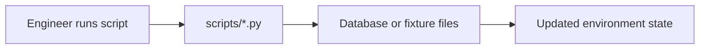

# Scripts Guide

This folder contains maintenance and utility scripts.

## What this folder does
- Seeds local or test data.
- Applies one-time fix scripts.
- Supports backend housekeeping tasks.

## Data Flow

