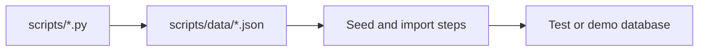

# Scripts Data Guide

This folder stores fixed JSON input files used by scripts.

## What this folder does
- Provides sample users and market data.
- Keeps seeding and testing deterministic.
- Supports quick local/demo setup.

## Included datasets
- `users.json`
- `banks.json`
- `stocks.json`
- `mf_funds.json`

## Data Flow

