# AI Modules — intent → flow → domain → agent

Every chat turn resolves to **one intent**. The intent picks **one flow**. The flow calls **domains** in order. Each domain calls **one agent** under `AI_Agents/src`.

**Choose your intent in §3** — each opens to its own diagram.

---

## 1. The chain, once

```mermaid
flowchart LR
    Q["customer question"] --> IC["intent_classifier<br/><i>Haiku, structured output</i>"]
    IC --> IN{"intent"}
    IN --> FL["FLOWS[intent]<br/>ai_engine/services/flow.py"]
    FL --> DS["&lt;domain&gt;/services/<br/>&lt;domain&gt;_module_service.run"]
    DS --> AG["AI_Agents/src/&lt;agent&gt;"]
    AG --> FP["facts pack"]
    FP --> AF["answer_formatter<br/><i>writes EVERY reply</i>"]
    AF --> OUT["ModuleOutput.text"]

    classDef hot fill:#d1ecf1,stroke:#0c5460,color:#000
    class AF hot
```

> **Adding an intent = one `flow_*` function + one `FLOWS` row.** The brain never changes.

---

## 2. The four invariants

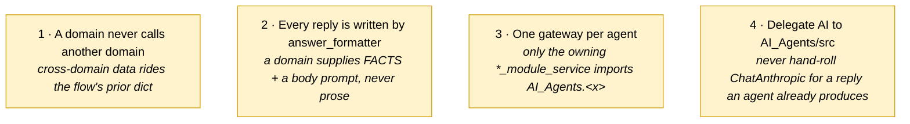

**Why #2 exists:** domains once each owned their reply LLM call — the house rules got copy-pasted into three prompts and token-streaming had to land in four places.

**Corollary:** the formatter's tool may gain non-prose fields (booleans, enums, short control strings) but **never a second prose field** — one competes with `answer` and returns nothing about half the time on long replies.

---

## 3. Pick an intent

<b>▸ asset_allocation</b> — "what mix should I be in?"

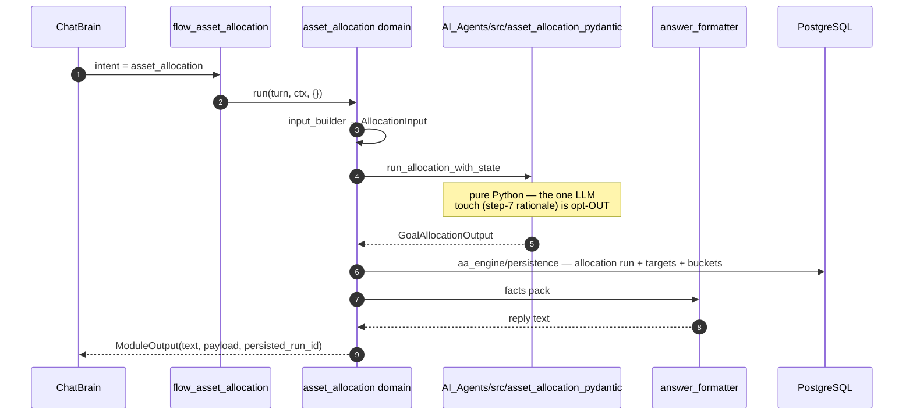

`sequence = [asset_allocation]` · agent is **pure Python**, not an LLM pipeline.

<b>▸ rebalancing</b> — "what should I buy and sell?"

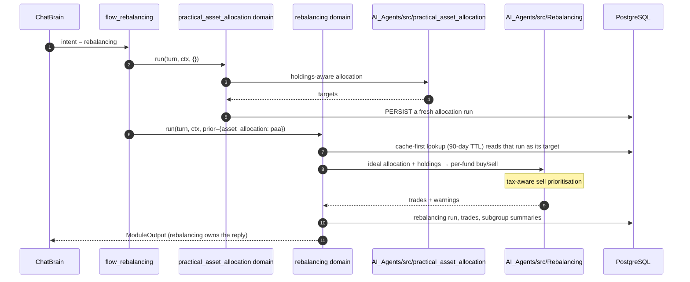

> **Coupling is via the DB, not `prior`.** The `prior` dict here is informational — `rebalancing_module_service` does not read it. Dropping the PAA step would not save compute; it would silently rebalance against an allocation up to 90 days stale.

<b>▸ goal_planning</b> — "can I afford this goal?"

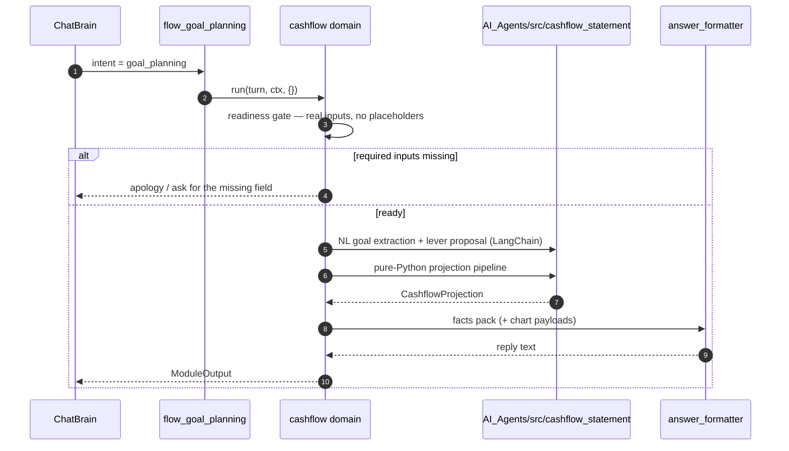

Uses `financial_primitives/` — the shared numeric kernel (pure functions, no LLM, no I/O).

<b>▸ additional_investment</b> — "I have fresh money to deploy"

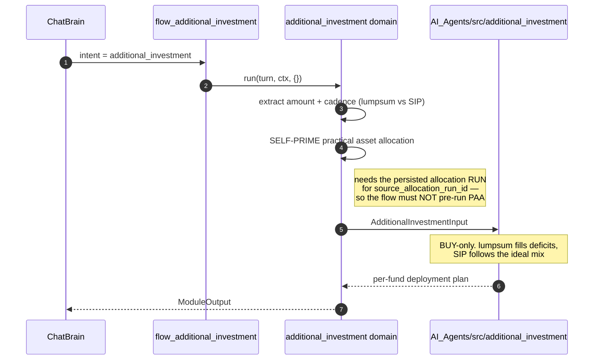

The one flow that deliberately does **not** pre-run PAA — doing so would compute the allocation twice.

<b>▸ portfolio_query</b> — "how is my portfolio doing?" (read-only)

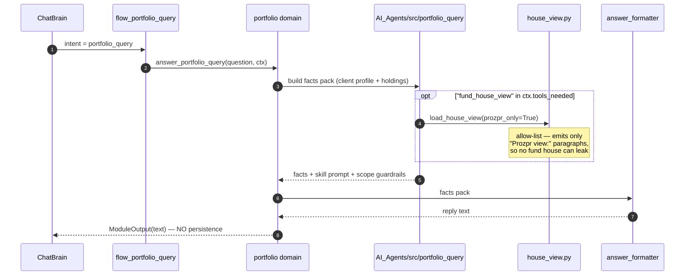

<b>▸ mutual_fund_query</b> — "is this a good fund?" (read-only)

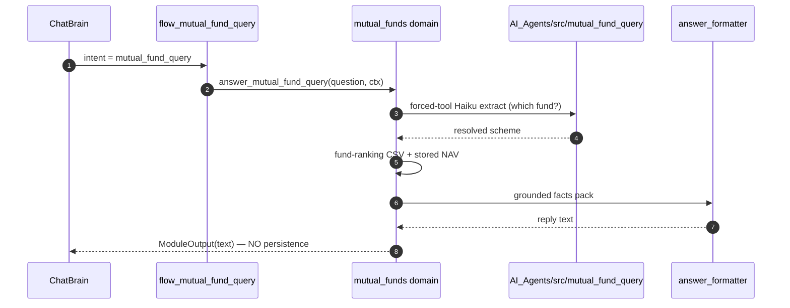

About **funds themselves**, held or not — the agent is DB-agnostic; the domain supplies the data.

<b>▸ general_market_query</b> — "what are the markets doing?"

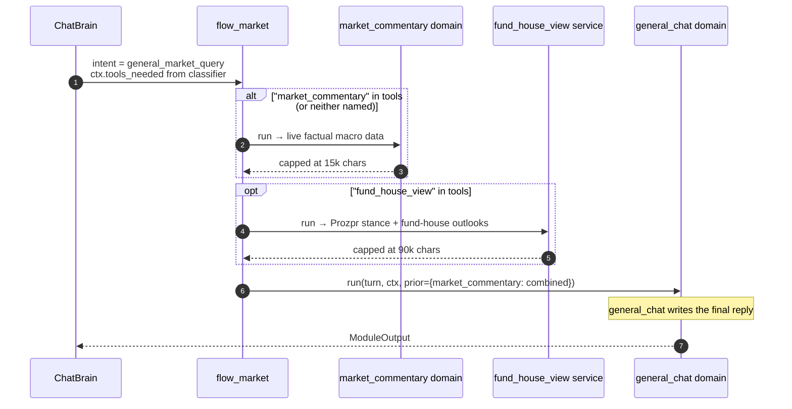

> `tools_needed` is a **fetch list, not routing**. Empty means the customer's own record suffices. Loading commentary unconditionally used to make the model compare an allocation % against a P/E.

<b>▸ general_chat</b> — fallback when no specialist owns the intent

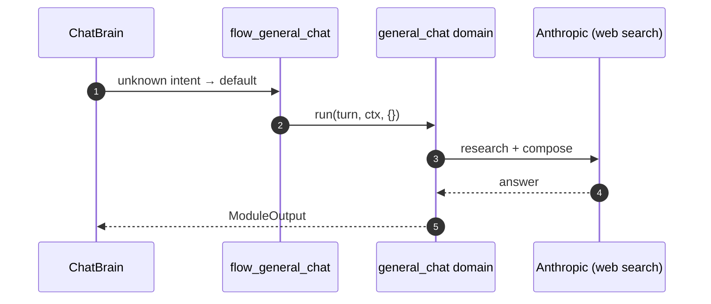

Also the landing spot for any intent name not present in `FLOWS`.

<b>▸ out_of_scope / stock_advice</b> — classifier-only, short-circuits

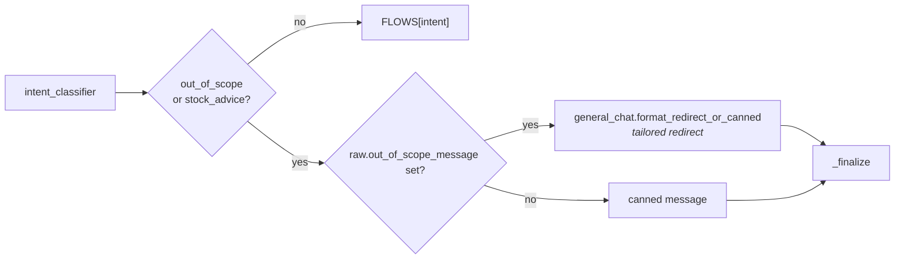

Subreasons: `gibberish · identity_or_meta · security_or_credentials · chat_summary · off_topic · other`.
**No flow runs, no domain is touched.**

---

## 4. Two gates before any flow runs

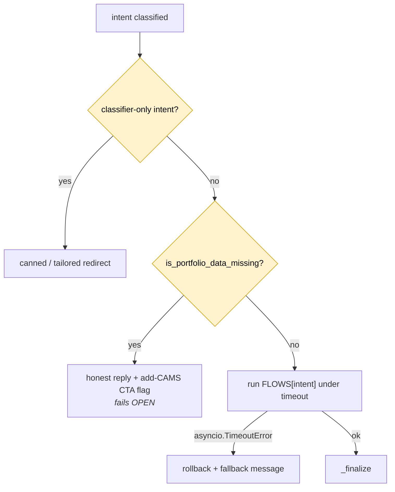

CAMS is skippable at onboarding, so a customer can reach chat with nothing imported. Running a holdings-driven engine over an empty portfolio yields either a technical blocking message or example numbers the customer reads as their own.

---

## 5. Intent → domain → agent

| Intent | Flow | Domain(s), in order | `AI_Agents/src` | Writes? |
| --- | --- | --- | --- | --- |
| `asset_allocation` | `flow_asset_allocation` | asset_allocation | `asset_allocation_pydantic` | ✅ |
| `rebalancing` | `flow_rebalancing` | practical_asset_allocation → rebalancing | `practical_asset_allocation`, `Rebalancing` | ✅ |
| `goal_planning` | `flow_goal_planning` | cashflow | `cashflow_statement`, `financial_primitives` | ✅ |
| `additional_investment` | `flow_additional_investment` | additional_investment | `additional_investment` | ✅ |
| `portfolio_query` | `flow_portfolio_query` | portfolio | `portfolio_query`, `house_view` | ❌ |
| `mutual_fund_query` | `flow_mutual_fund_query` | mutual_funds | `mutual_fund_query` | ❌ |
| `general_market_query` | `flow_market` | market_commentary (+fund_house_view) → general_chat | `market_commentary`, `house_view` | ❌ |
| `general_chat` | `flow_general_chat` | general_chat | — (Anthropic web search) | ❌ |
| `out_of_scope`, `stock_advice` | — | — | — | ❌ |

---

## 6. The shared kernel (`ai_engine/`, package root)

```mermaid
flowchart LR
    subgraph K["ai_engine/ — orchestration only, no domain logic"]
      T["types.py<br/>ModuleOutput · IntentDecision · AIModule"]
      CT["chat_types.py<br/>ChatTurnInput · ChatBrainResult"]
      TC["turn_context.py<br/>history · last runs · active intent"]
      CD["chat_dispatcher.py<br/>per-intent handler registry"]
      CL["classifier_llm.py<br/>Haiku structured output"]
      CM["common.py<br/>ensure_ai_agents_path() · money fmt"]
      ST["streaming.py<br/>re-exports token_stream"]
      TH["thinking.py<br/>live 'thinking aloud' feed"]
      LD["logic_docs.py<br/>module → thesis doc"]
      UT["usage_tracking.py + posthog_tracing.py"]
      AFM["answer_formatter/<br/><b>THE answer stage</b>"]
    end

    classDef hot fill:#d1ecf1,stroke:#0c5460,color:#000
    class AFM hot
```

| File | Why it matters |
| --- | --- |
| `answer_formatter/` | every customer-facing reply is written here — add a facts pack, never a reply call |
| `common.ensure_ai_agents_path()` | the `sys.path` injection that makes `from Rebalancing… import` work |
| `streaming.py` | canonical def lives in `AI_Agents/src` because agents cannot import `app/` |
| `thinking.py` | polled by `GET /chat/sessions/{id}/thinking`; vanishes on reply |
| `usage_tracking.py` | wraps the **whole** turn — one PostHog `$ai_trace`, a generation per LLM call |
| `routers/` | **debug endpoints, not the live chat path** — never wire production behaviour here |

---

## 7. Adding a new intent

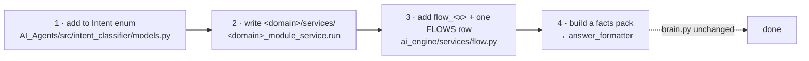

**Do not:** hand-roll a `ChatAnthropic` reply call · import another domain · add a second prose field to the formatter tool · omit a literal `temperature=`.
