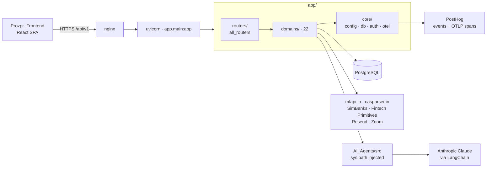
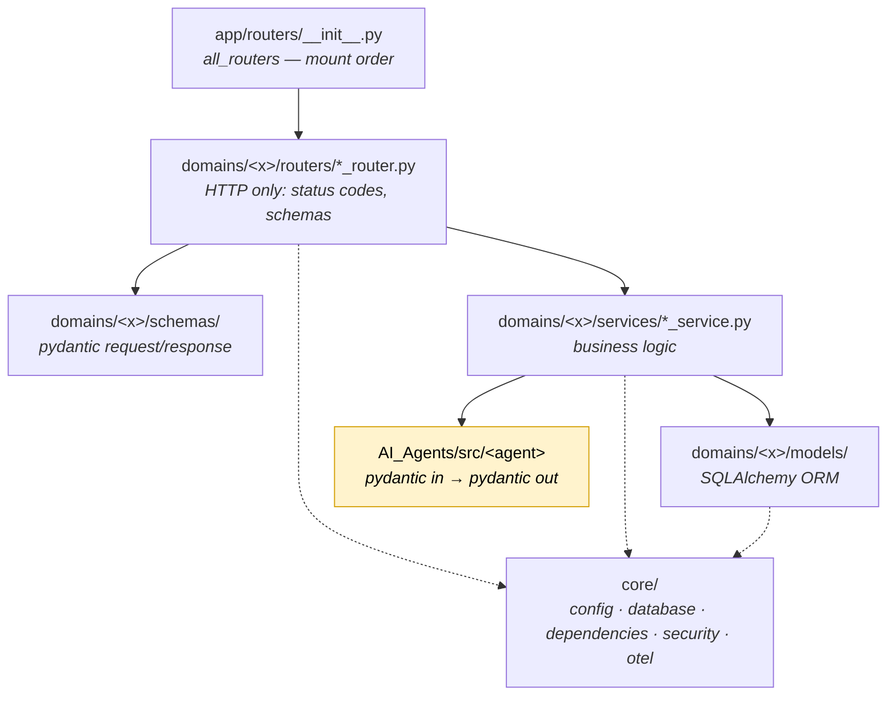
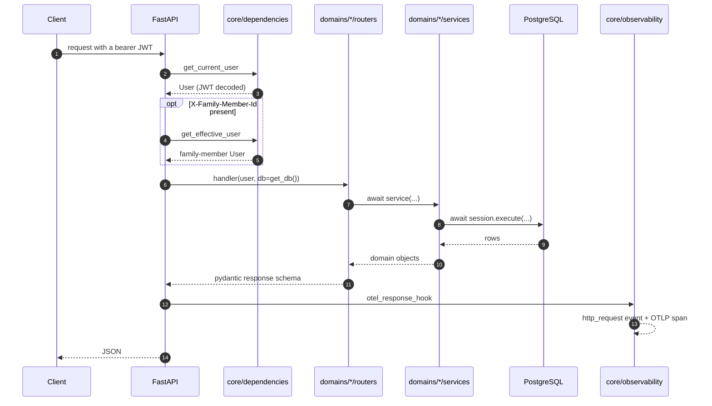
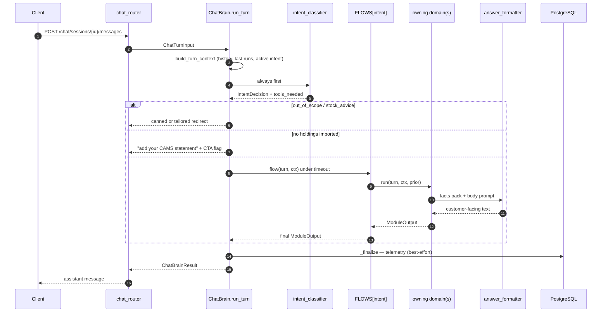
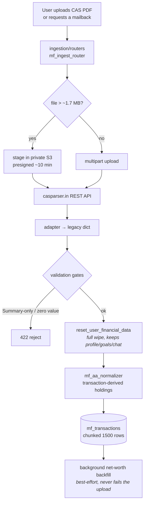
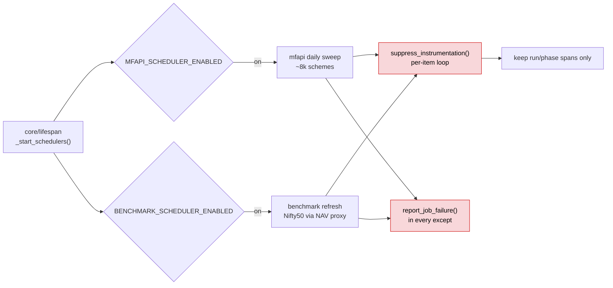
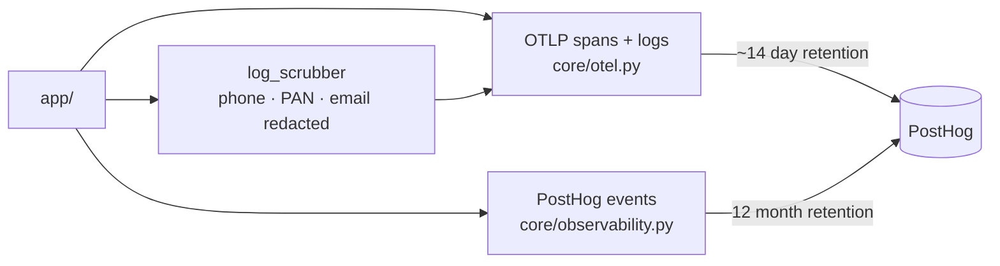
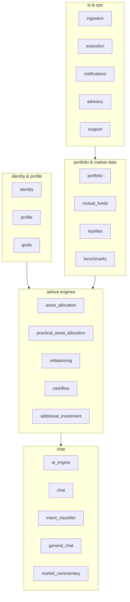
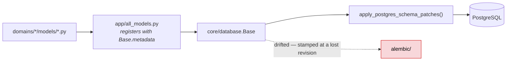

# Prozpr Backend — Architecture

FastAPI · SQLAlchemy async · PostgreSQL · Claude via LangChain.
Pick a lane below; each opens to its own diagram.

---

## 1. The whole system

---

## 2. Layers — where code is allowed to live

**Two rules that keep it flat**

| Rule | Consequence |
| --- | --- |
| A domain never imports another domain | cross-domain data travels via a flow's `prior` dict, never a reach-in |
| Only the owning `*_module_service.py` may import its `AI_Agents` orchestrator | one gateway per agent; see [AI_MODULES.md](./AI_MODULES.md) |

---

## 3. Pick an entry point

<b>▸ A. Authenticated HTTP request</b> — the default path for every REST call

> `path` recorded is always the **route template**, never the raw URL — 58 of 222 routes are parameterised.
> Only paths under `API_V1_PREFIX` are observable; scanner traffic is dropped at the sampler.

<b>▸ B. Chat turn</b> — the AI hot path

Full intent-by-intent breakdown → **[AI_MODULES.md](./AI_MODULES.md)**

<b>▸ C. CAMS / CAS ingest</b> — how a portfolio gets into the system

<b>▸ D. Background jobs & schedulers</b>

> Both guards are load-bearing: without `suppress_instrumentation()` one sweep emits ~25k spans;
> without `report_job_failure()` a crashed job stays green (schedulers swallow their own exceptions).

<b>▸ E. Observability — two pipelines, on purpose</b>

`http_request` and `$ai_generation` are **events**, not spans, because they need long history. Do not consolidate.

---

## 4. Domain map

Each domain carries **only** the sub-folders it needs — `general_chat/` and `market_commentary/` are services-only; `asset_allocation/` has no `routers/`. Check before assuming a layer exists.

---

## 5. Persistence & migrations

| Action | Do this |
| --- | --- |
| New ORM model | register in `app/all_models.py` **and** the domain's `models/__init__.py` |
| New column | add via `apply_postgres_schema_patches()` — **not** `alembic upgrade` |
| sqlite test | `Base.metadata.create_all` fails (a model uses a Postgres `ARRAY`); create only the table under test |

---

## 6. Conventions worth not relearning

| Area | Rule |
| --- | --- |
| LLM calls | LangChain only (`ChatAnthropic`). Raw `anthropic` imports allowed **only** for exception classes. |
| Temperature | Every `ChatAnthropic(...)` pins `temperature` as a **literal** — a scan test enforces it. |
| Async | `get_db()` yields `AsyncSession`; every DB call is awaited. |
| Naming | routers end `_router.py`; services end `_service.py`. |
| Observability | PostHog only. Never add a second APM agent alongside the OTel SDK. |
| Reference docs | `AI_Agents/Reference_docs/` refresh **manually**, never as a side effect of a code change. |
